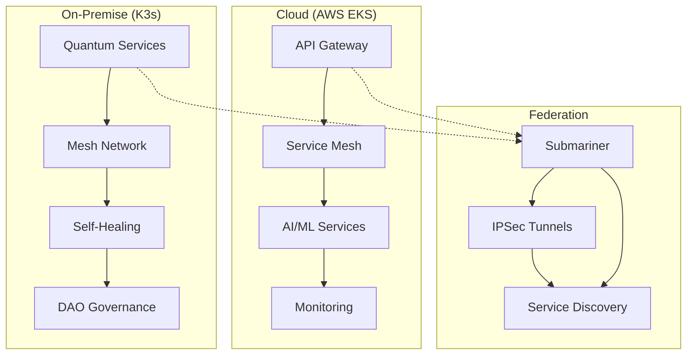

# Deployment Guide - x0tta6bl4

## Обзор

Данное руководство описывает процесс развёртывания x0tta6bl4 в production окружении. Платформа поддерживает гибридное развёртывание с облачными и локальными кластерами, обеспечивая высокую доступность и безопасность.

## Системные требования

### Минимальные требования

| Компонент | CPU | RAM | Storage | Network |
|-----------|-----|-----|---------|---------|
| Control Plane | 4 cores | 8 GB | 100 GB SSD | 1 Gbps |
| Worker Node | 2 cores | 4 GB | 50 GB SSD | 1 Gbps |
| Gateway Node | 4 cores | 8 GB | 100 GB SSD | 10 Gbps |
| Database | 8 cores | 16 GB | 500 GB SSD | 1 Gbps |

### Рекомендуемые требования

| Компонент | CPU | RAM | Storage | Network |
|-----------|-----|-----|---------|---------|
| Control Plane | 8 cores | 16 GB | 200 GB NVMe | 10 Gbps |
| Worker Node | 4 cores | 8 GB | 100 GB NVMe | 10 Gbps |
| Gateway Node | 8 cores | 16 GB | 200 GB NVMe | 25 Gbps |
| Database | 16 cores | 32 GB | 1 TB NVMe | 10 Gbps |

## Архитектура развёртывания

### Гибридная архитектура



### Компоненты

1. **Cloud Cluster (EKS)**
   - API Gateway
   - Service Mesh (Istio)
   - AI/ML Services
   - Monitoring (Prometheus, Grafana)

2. **On-Premise Cluster (K3s)**
   - Quantum Services
   - Mesh Network (BATMAN-adv)
   - Self-Healing (MAPE-K)
   - DAO Governance

3. **Federation Layer**
   - Submariner
   - IPSec Tunnels
   - Service Discovery

## Подготовка окружения

### 1. Установка зависимостей

#### Cloud (AWS EKS)

```bash
# Установка AWS CLI
curl "https://awscli.amazonaws.com/awscli-exe-linux-x86_64.zip" -o "awscliv2.zip"
unzip awscliv2.zip
sudo ./aws/install

# Установка eksctl
curl --silent --location "https://github.com/weaveworks/eksctl/releases/latest/download/eksctl_$(uname -s)_amd64.tar.gz" | tar xz -C /tmp
sudo mv /tmp/eksctl /usr/local/bin

# Установка kubectl
curl -LO "https://dl.k8s.io/release/$(curl -L -s https://dl.k8s.io/release/stable.txt)/bin/linux/amd64/kubectl"
sudo install -o root -g root -m 0755 kubectl /usr/local/bin/kubectl

# Установка Helm
curl https://raw.githubusercontent.com/helm/helm/main/scripts/get-helm-3 | bash
```

#### On-Premise (K3s)

```bash
# Установка K3s
curl -sfL https://get.k3s.io | sh -s - --write-kubeconfig-mode 644

# Установка дополнительных инструментов
sudo apt-get update
sudo apt-get install -y curl wget git jq

# Установка Helm
curl https://raw.githubusercontent.com/helm/helm/main/scripts/get-helm-3 | bash
```

### 2. Настройка сети

#### Firewall правила

```bash
# Cloud Gateway
ufw allow 443/tcp    # HTTPS
ufw allow 80/tcp     # HTTP
ufw allow 500/udp    # IKE
ufw allow 4500/udp   # IPSec NAT-T
ufw allow 8080/tcp   # API
ufw allow 9090/tcp   # Prometheus

# On-Premise Gateway
ufw allow 443/tcp    # HTTPS
ufw allow 500/udp    # IKE
ufw allow 4500/udp   # IPSec NAT-T
ufw allow 8080/tcp   # API
ufw allow 15000/tcp  # Istio Pilot
ufw allow 15020/tcp  # Istio Telemetry
```

#### DNS настройки

```bash
# /etc/hosts
10.0.1.10 api.x0tta6bl4.com
10.0.1.11 kiali.x0tta6bl4.com
10.0.1.12 grafana.x0tta6bl4.com
10.0.1.13 prometheus.x0tta6bl4.com
```

## Развёртывание Cloud Cluster (EKS)

### 1. Создание EKS кластера

```bash
# Создание кластера
eksctl create cluster \
  --name x0tta6bl4-cloud \
  --region us-east-1 \
  --version 1.28 \
  --nodegroup-name workers \
  --node-type t3.large \
  --nodes 3 \
  --nodes-min 2 \
  --nodes-max 5 \
  --managed \
  --with-oidc \
  --ssh-access \
  --ssh-public-key ~/.ssh/id_rsa.pub

# Настройка kubeconfig
aws eks update-kubeconfig --region us-east-1 --name x0tta6bl4-cloud
```

### 2. Установка Istio Service Mesh

```bash
# Скачивание Istio
curl -L https://istio.io/downloadIstio | sh -
cd istio-1.19.0
export PATH=$PWD/bin:$PATH

# Установка Istio
istioctl install --set values.pilot.env.EXTERNAL_ISTIOD=false

# Включение sidecar injection
kubectl label namespace default istio-injection=enabled
```

### 3. Развёртывание компонентов

```bash
# Создание namespace
kubectl create namespace x0tta6bl4-system

# Применение манифестов
kubectl apply -f k8s-manifests/istio-service-mesh-config.yaml
kubectl apply -f k8s-manifests/cilium-zero-trust-policies.yaml

# Ожидание готовности
kubectl wait --for=condition=ready pod -l app=istio-pilot -n istio-system --timeout=300s
```

### 4. Настройка мониторинга

```bash
# Установка Prometheus
helm repo add prometheus-community https://prometheus-community.github.io/helm-charts
helm repo update

helm install prometheus prometheus-community/kube-prometheus-stack \
  --namespace monitoring \
  --create-namespace \
  --set grafana.adminPassword=admin123

# Установка Jaeger
kubectl apply -f https://raw.githubusercontent.com/jaegertracing/jaeger-operator/main/deploy/crds/jaegertracing.io_jaegers_crd.yaml
kubectl apply -f https://raw.githubusercontent.com/jaegertracing/jaeger-operator/main/deploy/service_account.yaml
kubectl apply -f https://raw.githubusercontent.com/jaegertracing/jaeger-operator/main/deploy/role.yaml
kubectl apply -f https://raw.githubusercontent.com/jaegertracing/jaeger-operator/main/deploy/role_binding.yaml
kubectl apply -f https://raw.githubusercontent.com/jaegertracing/jaeger-operator/main/deploy/operator.yaml

# Создание Jaeger instance
kubectl apply -f - <<EOF
apiVersion: jaegertracing.io/v1
kind: Jaeger
metadata:
  name: jaeger
  namespace: istio-system
spec:
  strategy: allInOne
EOF
```

## Развёртывание On-Premise Cluster (K3s)

### 1. Настройка K3s

```bash
# Создание конфигурации K3s
sudo mkdir -p /etc/rancher/k3s
sudo tee /etc/rancher/k3s/config.yaml > /dev/null <<EOF
cluster-cidr: "10.100.0.0/16"
service-cidr: "10.96.0.0/12"
cluster-dns: "10.96.0.10"
disable:
  - traefik
  - servicelb
  - local-storage
  - metrics-server
kube-apiserver-arg:
  - "enable-admission-plugins=NodeRestriction,MutatingAdmissionWebhook,ValidatingAdmissionWebhook"
  - "audit-log-path=/var/log/audit.log"
  - "audit-log-maxage=30"
  - "audit-log-maxbackup=3"
  - "audit-log-maxsize=100"
kubelet-arg:
  - "feature-gates=EphemeralContainers=true"
EOF

# Перезапуск K3s
sudo systemctl restart k3s
```

### 2. Установка Cilium

```bash
# Установка Cilium
helm repo add cilium https://helm.cilium.io/
helm repo update

helm install cilium cilium/cilium \
  --namespace kube-system \
  --set cluster.name=x0tta6bl4-onprem \
  --set cluster.id=1 \
  --set ipam.mode=kubernetes \
  --set hubble.relay.enabled=true \
  --set hubble.ui.enabled=true \
  --set prometheus.enabled=true \
  --set operator.prometheus.enabled=true \
  --set hubble.metrics.enabled="{dns,drop,tcp,flow,port-distribution,icmp,http}"

# Ожидание готовности
kubectl wait --for=condition=ready pod -l k8s-app=cilium -n kube-system --timeout=300s
```

### 3. Развёртывание Quantum Services

```bash
# Создание namespace
kubectl create namespace x0tta6bl4-quantum

# Применение манифестов
kubectl apply -f k8s-manifests/quantum-services/
kubectl apply -f k8s-manifests/ai-services/

# Ожидание готовности
kubectl wait --for=condition=ready pod -l app=quantum-service -n x0tta6bl4-quantum --timeout=300s
```

## Настройка Federation (Submariner)

### 1. Установка Submariner

#### На Cloud кластере

```bash
# Установка Submariner CLI
curl -Ls https://get.submariner.io | bash
export PATH=$PATH:~/.local/bin

# Создание broker
subctl deploy-broker --kubeconfig ~/.kube/config

# Получение broker info
subctl show-broker-info --kubeconfig ~/.kube/config
```

#### На On-Premise кластере

```bash
# Присоединение к broker
subctl join broker-info.subm --kubeconfig ~/.kube/config \
  --clusterid k3s-moscow-dc1 \
  --clustercidr 10.100.0.0/16 \
  --servicecidr 10.96.0.0/12

# Проверка соединения
subctl show connections --kubeconfig ~/.kube/config
```

### 2. Настройка Service Discovery

```bash
# На Cloud кластере
subctl export service --kubeconfig ~/.kube/config \
  --namespace x0tta6bl4-system \
  --name api-gateway

# На On-Premise кластере
subctl export service --kubeconfig ~/.kube/config \
  --namespace x0tta6bl4-quantum \
  --name quantum-service
```

## Развёртывание приложений

### 1. API Gateway

```bash
# Создание конфигурации
kubectl apply -f - <<EOF
apiVersion: apps/v1
kind: Deployment
metadata:
  name: api-gateway
  namespace: x0tta6bl4-system
spec:
  replicas: 3
  selector:
    matchLabels:
      app: api-gateway
  template:
    metadata:
      labels:
        app: api-gateway
    spec:
      containers:
      - name: api-gateway
        image: x0tta6bl4/api-gateway:latest
        ports:
        - containerPort: 8080
        env:
        - name: DATABASE_URL
          valueFrom:
            secretKeyRef:
              name: database-secret
              key: url
        - name: REDIS_URL
          valueFrom:
            secretKeyRef:
              name: redis-secret
              key: url
        resources:
          requests:
            cpu: 100m
            memory: 256Mi
          limits:
            cpu: 500m
            memory: 512Mi
---
apiVersion: v1
kind: Service
metadata:
  name: api-gateway
  namespace: x0tta6bl4-system
spec:
  selector:
    app: api-gateway
  ports:
  - port: 8080
    targetPort: 8080
  type: ClusterIP
EOF
```

### 2. Quantum Services

```bash
# Создание конфигурации
kubectl apply -f - <<EOF
apiVersion: apps/v1
kind: Deployment
metadata:
  name: quantum-service
  namespace: x0tta6bl4-quantum
spec:
  replicas: 2
  selector:
    matchLabels:
      app: quantum-service
  template:
    metadata:
      labels:
        app: quantum-service
    spec:
      containers:
      - name: quantum-service
        image: x0tta6bl4/quantum-service:latest
        ports:
        - containerPort: 8080
        env:
        - name: PQC_ALGORITHM
          value: "Kyber1024"
        - name: SIGNATURE_ALGORITHM
          value: "Dilithium5"
        resources:
          requests:
            cpu: 200m
            memory: 512Mi
          limits:
            cpu: 1000m
            memory: 2Gi
---
apiVersion: v1
kind: Service
metadata:
  name: quantum-service
  namespace: x0tta6bl4-quantum
spec:
  selector:
    app: quantum-service
  ports:
  - port: 8080
    targetPort: 8080
  type: ClusterIP
EOF
```

### 3. AI/ML Services

```bash
# Создание конфигурации
kubectl apply -f - <<EOF
apiVersion: apps/v1
kind: Deployment
metadata:
  name: ai-services
  namespace: x0tta6bl4-system
spec:
  replicas: 2
  selector:
    matchLabels:
      app: ai-services
  template:
    metadata:
      labels:
        app: ai-services
    spec:
      containers:
      - name: ai-services
        image: x0tta6bl4/ai-services:latest
        ports:
        - containerPort: 8080
        env:
        - name: ML_MODEL_PATH
          value: "/models"
        - name: ANOMALY_THRESHOLD
          value: "0.1"
        volumeMounts:
        - name: ml-models
          mountPath: /models
        resources:
          requests:
            cpu: 500m
            memory: 1Gi
          limits:
            cpu: 2000m
            memory: 4Gi
      volumes:
      - name: ml-models
        persistentVolumeClaim:
          claimName: ml-models-pvc
---
apiVersion: v1
kind: PersistentVolumeClaim
metadata:
  name: ml-models-pvc
  namespace: x0tta6bl4-system
spec:
  accessModes:
    - ReadWriteOnce
  resources:
    requests:
      storage: 10Gi
EOF
```

## Настройка безопасности

### 1. SPIFFE/SPIRE

```bash
# Установка SPIRE
kubectl apply -f - <<EOF
apiVersion: v1
kind: Namespace
metadata:
  name: spire-system
---
apiVersion: apps/v1
kind: Deployment
metadata:
  name: spire-server
  namespace: spire-system
spec:
  replicas: 3
  selector:
    matchLabels:
      app: spire-server
  template:
    metadata:
      labels:
        app: spire-server
    spec:
      containers:
      - name: spire-server
        image: gcr.io/spiffe-io/spire-server:1.6.0
        args:
        - -config
        - /run/spire/config/server.conf
        volumeMounts:
        - name: spire-config
          mountPath: /run/spire/config
        - name: spire-data
          mountPath: /run/spire/data
      volumes:
      - name: spire-config
        configMap:
          name: spire-server-config
      - name: spire-data
        persistentVolumeClaim:
          claimName: spire-server-data
EOF
```

### 2. mTLS сертификаты

```bash
# Создание CA сертификата
openssl genrsa -out ca.key 4096
openssl req -new -x509 -days 365 -key ca.key -out ca.crt \
  -subj "/C=US/ST=CA/L=San Francisco/O=x0tta6bl4/CN=x0tta6bl4 CA"

# Создание server сертификата
openssl genrsa -out server.key 4096
openssl req -new -key server.key -out server.csr \
  -subj "/C=US/ST=CA/L=San Francisco/O=x0tta6bl4/CN=api.x0tta6bl4.com"

openssl x509 -req -days 365 -in server.csr -CA ca.crt -CAkey ca.key \
  -out server.crt -CAcreateserial

# Создание Kubernetes secret
kubectl create secret tls api-tls-cert \
  --cert=server.crt \
  --key=server.key \
  --namespace=x0tta6bl4-system
```

### 3. Network Policies

```bash
# Применение network policies
kubectl apply -f k8s-manifests/cilium-zero-trust-policies.yaml

# Проверка policies
kubectl get ciliumnetworkpolicies -A
```

## Мониторинг и логирование

### 1. Настройка Prometheus

```bash
# Создание ServiceMonitor
kubectl apply -f - <<EOF
apiVersion: monitoring.coreos.com/v1
kind: ServiceMonitor
metadata:
  name: x0tta6bl4-services
  namespace: monitoring
spec:
  selector:
    matchLabels:
      app: api-gateway
  endpoints:
  - port: metrics
    interval: 30s
    path: /metrics
EOF
```

### 2. Настройка Grafana

```bash
# Создание dashboard
kubectl apply -f - <<EOF
apiVersion: v1
kind: ConfigMap
metadata:
  name: x0tta6bl4-dashboard
  namespace: monitoring
data:
  dashboard.json: |
    {
      "dashboard": {
        "title": "x0tta6bl4 System Dashboard",
        "panels": [
          {
            "title": "Request Rate",
            "type": "graph",
            "targets": [
              {
                "expr": "rate(http_requests_total[5m])",
                "legendFormat": "{{service}}"
              }
            ]
          }
        ]
      }
    }
EOF
```

### 3. Настройка логирования

```bash
# Установка Fluentd
helm repo add fluent https://fluent.github.io/helm-charts
helm install fluentd fluent/fluentd \
  --namespace logging \
  --create-namespace \
  --set config.output.elasticsearch.host=elasticsearch.logging.svc.cluster.local
```

## Тестирование развёртывания

### 1. Health Check

```bash
# Проверка статуса кластеров
kubectl get nodes
kubectl get pods -A

# Проверка сервисов
kubectl get services -A

# Проверка ingress
kubectl get ingress -A
```

### 2. Тестирование API

```bash
# Получение токена
TOKEN=$(curl -s -X POST https://api.x0tta6bl4.com/oauth/token \
  -d "grant_type=client_credentials&client_id=api-gateway&client_secret=secret" \
  | jq -r '.access_token')

# Тестирование health endpoint
curl -H "Authorization: Bearer $TOKEN" \
  https://api.x0tta6bl4.com/api/v1/health

# Тестирование mesh status
curl -H "Authorization: Bearer $TOKEN" \
  https://api.x0tta6bl4.com/api/v1/mesh/status
```

### 3. Тестирование Federation

```bash
# Проверка Submariner соединения
subctl show connections

# Тестирование cross-cluster communication
kubectl run test-pod --image=busybox --rm -it --restart=Never -- \
  wget -qO- http://quantum-service.x0tta6bl4-quantum.svc.cluster.local:8080/health
```

## Обслуживание и обновления

### 1. Обновление приложений

```bash
# Rolling update
kubectl set image deployment/api-gateway \
  api-gateway=x0tta6bl4/api-gateway:v1.2.4 \
  --namespace=x0tta6bl4-system

# Проверка статуса
kubectl rollout status deployment/api-gateway --namespace=x0tta6bl4-system
```

### 2. Backup и восстановление

```bash
# Backup etcd
kubectl get all --all-namespaces -o yaml > backup.yaml

# Backup persistent volumes
kubectl get pv -o yaml > pv-backup.yaml

# Восстановление
kubectl apply -f backup.yaml
```

### 3. Мониторинг производительности

```bash
# Проверка ресурсов
kubectl top nodes
kubectl top pods -A

# Проверка событий
kubectl get events --sort-by=.metadata.creationTimestamp
```

## Troubleshooting

### Частые проблемы

1. **Pod не запускается**
   ```bash
   kubectl describe pod <pod-name> -n <namespace>
   kubectl logs <pod-name> -n <namespace>
   ```

2. **Service недоступен**
   ```bash
   kubectl get endpoints <service-name> -n <namespace>
   kubectl get service <service-name> -n <namespace>
   ```

3. **Network policy блокирует трафик**
   ```bash
   kubectl get ciliumnetworkpolicies -A
   kubectl describe ciliumnetworkpolicy <policy-name> -n <namespace>
   ```

### Логи и отладка

```bash
# Логи Istio
kubectl logs -l app=istio-pilot -n istio-system

# Логи Cilium
kubectl logs -l k8s-app=cilium -n kube-system

# Логи Submariner
kubectl logs -l app=submariner-gateway -n submariner-operator
```

## Безопасность

### Рекомендации

1. **Регулярно обновляйте компоненты**
2. **Мониторьте логи безопасности**
3. **Используйте least privilege принцип**
4. **Регулярно ротируйте сертификаты**
5. **Проводите penetration testing**

### Compliance

- **SOC 2 Type II**
- **ISO 27001**
- **GDPR**
- **HIPAA**

## Поддержка

- **Documentation**: https://docs.x0tta6bl4.com
- **GitHub**: https://github.com/x0tta6bl4/deployment
- **Discord**: https://discord.gg/x0tta6bl4
- **Email**: deployment-support@x0tta6bl4.com