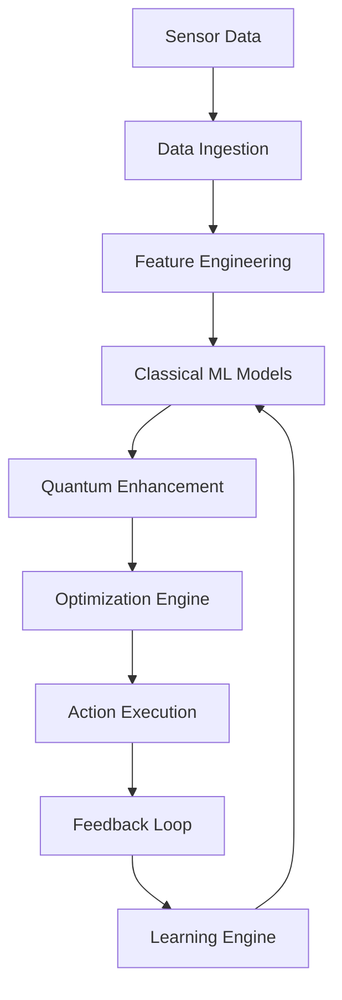

# Phase 3: Advanced AI Features Architecture for x0tta6bl4

## Overview

Phase 3 extends x0tta6bl4 with advanced AI capabilities, integrating quantum-classical hybrid optimization, predictive maintenance, anomaly root cause analysis, and autonomous optimization loops. This phase builds upon Phase 2's reliability framework and existing ML components (Phi Predictor, Quantum Sprint) to create a self-learning, predictive platform.

## Core AI Components

### 1. ML-Powered Predictive Maintenance System

#### Architecture Overview
```python
class PredictiveMaintenanceEngine:
    def __init__(self):
        self.failure_prediction_model = FailurePredictionModel()
        self.maintenance_scheduler = IntelligentScheduler()
        self.resource_predictor = ResourceUsagePredictor()
        self.quantum_optimizer = QuantumClassicalOptimizer()

    async def predict_and_schedule_maintenance(self, system_metrics: Dict) -> MaintenancePlan:
        # Multi-modal prediction using classical ML + quantum enhancement
        predictions = await self.failure_prediction_model.predict_failures(system_metrics)

        # Quantum-classical optimization for maintenance scheduling
        optimized_schedule = await self.quantum_optimizer.optimize_schedule(
            predictions, system_metrics
        )

        # Intelligent resource allocation
        resource_allocation = await self.resource_predictor.allocate_resources(
            optimized_schedule
        )

        return MaintenancePlan(
            predictions=predictions,
            schedule=optimized_schedule,
            resources=resource_allocation
        )
```

#### Key Features
- **Multi-Modal Failure Prediction:** Combines time-series analysis, anomaly detection, and quantum-enhanced pattern recognition
- **Quantum-Classical Hybrid Models:** Classical ML for pattern recognition, quantum algorithms for optimization
- **Self-Learning Adaptation:** Continuous model improvement based on prediction accuracy and maintenance outcomes
- **Proactive Resource Allocation:** Predictive scaling of maintenance resources before failures occur

#### Integration Points
- **Phase 2 Reliability Orchestrator:** Enhanced with predictive capabilities
- **Intelligent Routing:** Maintenance-aware routing decisions
- **Enterprise Dashboard:** Real-time maintenance insights and scheduling visualization

### 2. Quantum-Classical Hybrid Optimization Engine

#### Architecture Overview
```python
class QuantumClassicalOptimizer:
    def __init__(self):
        self.classical_optimizer = ClassicalOptimizationEngine()
        self.quantum_processor = QuantumAnnealingProcessor()
        self.hybrid_scheduler = HybridComputationScheduler()
        self.phi_harmonizer = PhiHarmonyOptimizer()

    async def optimize_system_performance(self, objectives: Dict, constraints: Dict) -> OptimizationResult:
        # Classical preprocessing and problem formulation
        classical_solution = await self.classical_optimizer.preprocess_problem(
            objectives, constraints
        )

        # Quantum enhancement for complex optimization
        if self.should_use_quantum(classical_solution):
            quantum_enhancement = await self.quantum_processor.enhance_solution(
                classical_solution
            )
            classical_solution = self.hybrid_scheduler.merge_solutions(
                classical_solution, quantum_enhancement
            )

        # quantum_harmony optimization for natural flow
        phi_optimized = await self.phi_harmonizer.apply_phi_harmony(
            classical_solution
        )

        return OptimizationResult(
            solution=phi_optimized,
            confidence_score=self.calculate_confidence(phi_optimized),
            quantum_contribution=self.quantum_processor.get_contribution_ratio()
        )
```

#### Key Features
- **Adaptive Quantum-Classical Switching:** Automatic selection of computation paradigm based on problem complexity
- **quantum_harmony Integration:** Golden ratio-based optimization for natural system flows
- **Real-Time Adaptation:** Dynamic adjustment based on system state and performance metrics
- **Multi-Objective Optimization:** Simultaneous optimization of performance, cost, and reliability

### 3. Anomaly Root Cause Analysis System

#### Architecture Overview
```python
class AnomalyRootCauseAnalyzer:
    def __init__(self):
        self.anomaly_detector = AdvancedAnomalyDetector()
        self.causal_inference_engine = CausalInferenceEngine()
        self.knowledge_graph = SystemKnowledgeGraph()
        self.quantum_correlation_analyzer = QuantumCorrelationAnalyzer()

    async def analyze_anomaly_root_cause(self, anomaly: AnomalyEvent) -> RootCauseAnalysis:
        # Multi-layer anomaly detection
        anomaly_characterization = await self.anomaly_detector.characterize_anomaly(anomaly)

        # Causal inference using knowledge graph
        causal_chains = await self.causal_inference_engine.infer_causes(
            anomaly_characterization, self.knowledge_graph
        )

        # Quantum correlation analysis for hidden dependencies
        quantum_correlations = await self.quantum_correlation_analyzer.find_correlations(
            anomaly_characterization
        )

        # Root cause ranking and explanation
        root_causes = self.rank_and_explain_root_causes(
            causal_chains, quantum_correlations
        )

        return RootCauseAnalysis(
            anomaly=anomaly,
            root_causes=root_causes,
            confidence_scores=self.calculate_confidence_scores(root_causes),
            recommended_actions=self.generate_recommendations(root_causes)
        )
```

#### Key Features
- **Multi-Layer Analysis:** Statistical, ML-based, and quantum correlation analysis
- **Knowledge Graph Integration:** System topology and dependency modeling
- **Causal Inference:** Automated root cause identification using causal graphs
- **Explainable AI:** Human-understandable explanations of anomaly causes

### 4. Autonomous Optimization Loops

#### Architecture Overview
```python
class AutonomousOptimizationLoop:
    def __init__(self):
        self.performance_monitor = RealTimePerformanceMonitor()
        self.optimization_engine = QuantumClassicalOptimizer()
        self.feedback_analyzer = ReinforcementLearningFeedback()
        self.safety_validator = OptimizationSafetyValidator()
        self.self_learning_adapter = SelfLearningAdapter()

    async def run_optimization_loop(self):
        while True:
            # Monitor system performance
            current_performance = await self.performance_monitor.get_current_metrics()

            # Identify optimization opportunities
            opportunities = await self.optimization_engine.identify_opportunities(
                current_performance
            )

            # Validate safety of proposed changes
            safe_opportunities = await self.safety_validator.validate_opportunities(
                opportunities
            )

            # Apply optimizations
            for opportunity in safe_opportunities:
                optimization_result = await self.optimization_engine.apply_optimization(
                    opportunity
                )

                # Learn from results
                await self.feedback_analyzer.learn_from_result(
                    opportunity, optimization_result
                )

            # Adapt learning strategy
            await self.self_learning_adapter.adapt_strategy(
                self.feedback_analyzer.get_learning_insights()
            )

            await asyncio.sleep(self.loop_interval)
```

#### Key Features
- **Continuous Learning:** Reinforcement learning from optimization outcomes
- **Safety-First Approach:** Validation of all optimization actions
- **Adaptive Strategies:** Self-tuning optimization parameters
- **Multi-Time Scale Optimization:** Short-term tactical and long-term strategic optimization

### 5. Intelligent Resource Allocation

#### Architecture Overview
```python
class IntelligentResourceAllocator:
    def __init__(self):
        self.predictive_allocator = PredictiveResourceAllocator()
        self.quantum_scheduler = QuantumResourceScheduler()
        self.cost_optimizer = CostAwareOptimizer()
        self.sla_compliance_engine = SLAComplianceEngine()

    async def allocate_resources(self, workload_forecast: Dict, constraints: Dict) -> ResourceAllocation:
        # Predictive resource needs based on workload forecasting
        predicted_needs = await self.predictive_allocator.predict_resource_needs(
            workload_forecast
        )

        # Quantum optimization for resource scheduling
        optimal_schedule = await self.quantum_scheduler.optimize_resource_schedule(
            predicted_needs, constraints
        )

        # Cost optimization with SLA compliance
        cost_optimized = await self.cost_optimizer.optimize_costs(
            optimal_schedule, constraints
        )

        # Final SLA compliance check
        compliant_allocation = await self.sla_compliance_engine.ensure_compliance(
            cost_optimized
        )

        return ResourceAllocation(
            schedule=compliant_allocation,
            cost_projection=self.cost_optimizer.get_cost_projection(),
            sla_compliance_score=self.sla_compliance_engine.get_compliance_score()
        )
```

#### Key Features
- **Predictive Allocation:** Resource allocation based on ML workload forecasting
- **Quantum Scheduling:** Optimal resource distribution using quantum algorithms
- **Cost-SLA Balance:** Simultaneous optimization of costs and service level agreements
- **Dynamic Reallocation:** Real-time adjustment based on actual workload patterns

### 6. Self-Learning Optimization System

#### Architecture Overview
```python
class SelfLearningOptimizationSystem:
    def __init__(self):
        self.experience_collector = ExperienceCollector()
        self.learning_engine = MetaLearningEngine()
        self.strategy_evolver = StrategyEvolutionEngine()
        self.performance_predictor = PerformancePredictor()
        self.knowledge_distiller = KnowledgeDistillationEngine()

    async def learn_and_adapt(self, system_state: Dict, performance_metrics: Dict):
        # Collect experiences from system operation
        experiences = await self.experience_collector.collect_experiences(
            system_state, performance_metrics
        )

        # Meta-learning from collected experiences
        learned_patterns = await self.learning_engine.extract_patterns(experiences)

        # Evolve optimization strategies
        new_strategies = await self.strategy_evolver.evolve_strategies(
            learned_patterns, self.current_strategies
        )

        # Predict performance impact of new strategies
        performance_predictions = await self.performance_predictor.predict_impact(
            new_strategies, system_state
        )

        # Distill knowledge for efficient deployment
        distilled_knowledge = await self.knowledge_distiller.distill_knowledge(
            new_strategies, learned_patterns
        )

        # Update system with learned optimizations
        await self.update_system_strategies(distilled_knowledge, performance_predictions)
```

#### Key Features
- **Experience-Driven Learning:** Learning from actual system operation experiences
- **Meta-Learning:** Learning how to learn and adapt optimization strategies
- **Strategy Evolution:** Genetic algorithm-based evolution of optimization approaches
- **Knowledge Distillation:** Efficient transfer of learned knowledge to production systems

## Integration Architecture

### Service Mesh Integration
```yaml
apiVersion: networking.istio.io/v1beta1
kind: VirtualService
metadata:
  name: ai-services-router
spec:
  http:
  - match:
    - uri:
        prefix: "/api/v1/ai"
    route:
    - destination:
        host: predictive-maintenance-service
      weight: 40
    - destination:
        host: quantum-optimizer-service
      weight: 30
    - destination:
        host: anomaly-analyzer-service
      weight: 20
    - destination:
        host: autonomous-optimizer-service
      weight: 10
```

### API Design

#### Core AI Services API
```typescript
interface AIServiceAPI {
  // Predictive Maintenance
  predictMaintenance(window: TimeWindow): Promise<MaintenancePrediction[]>;
  scheduleMaintenance(plan: MaintenancePlan): Promise<ScheduleResult>;

  // Quantum-Classical Optimization
  optimizeSystem(objectives: OptimizationObjectives): Promise<OptimizationResult>;
  getOptimizationStatus(taskId: string): Promise<OptimizationStatus>;

  // Anomaly Analysis
  analyzeAnomaly(anomaly: AnomalyEvent): Promise<RootCauseAnalysis>;
  getAnomalyInsights(timeRange: TimeRange): Promise<AnomalyInsights>;

  // Autonomous Optimization
  startOptimizationLoop(config: LoopConfig): Promise<LoopId>;
  stopOptimizationLoop(loopId: LoopId): Promise<void>;
  getOptimizationMetrics(loopId: LoopId): Promise<OptimizationMetrics>;
}
```

### Data Pipeline Architecture

#### Real-Time AI Data Flow


### Security and Compliance

#### AI Security Framework
- **Model Encryption:** All AI models encrypted at rest and in transit
- **Inference Sandboxing:** Isolated execution environments for AI inference
- **Audit Logging:** Complete audit trail of AI decisions and actions
- **Bias Detection:** Continuous monitoring for AI bias and fairness issues

#### Compliance Integration
- **GDPR Compliance:** Right to explanation for AI decisions
- **Model Governance:** Version control and approval workflows for AI models
- **Explainability:** Human-understandable explanations for complex AI outputs

## Success Metrics

### Performance Metrics
- **Prediction Accuracy:** >95% for failure predictions (within 24 hours)
- **Optimization Efficiency:** >30% improvement in system performance
- **Root Cause Accuracy:** >90% correct root cause identification
- **Autonomous Optimization:** >50% reduction in manual optimization tasks

### Reliability Metrics
- **AI Service Availability:** >99.9% uptime for AI services
- **Inference Latency:** <100ms for real-time AI decisions
- **Model Update Frequency:** Daily model updates without service disruption
- **False Positive Rate:** <5% for anomaly detection

### Business Impact Metrics
- **Cost Reduction:** >25% reduction in maintenance and operational costs
- **MTTR Improvement:** >40% reduction in mean time to resolution
- **SLA Compliance:** >99.5% SLA achievement
- **User Satisfaction:** >4.5/5.0 user satisfaction with AI features

This architecture provides a comprehensive foundation for Phase 3 advanced AI capabilities, enabling x0tta6bl4 to become a truly autonomous, self-learning, and predictive platform.