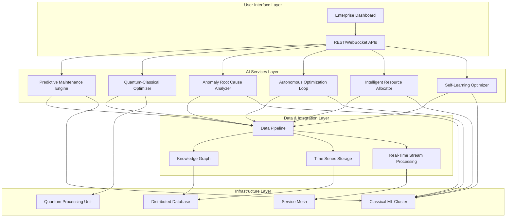
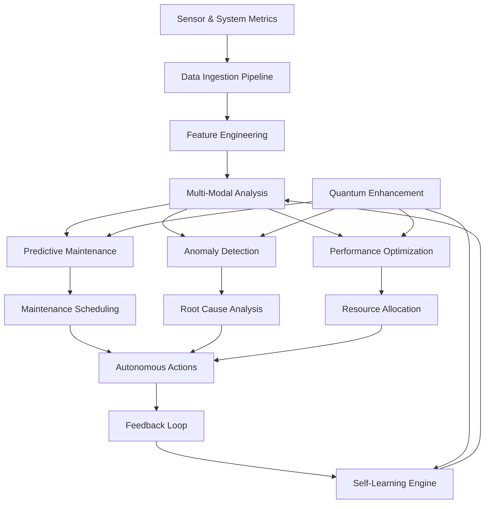
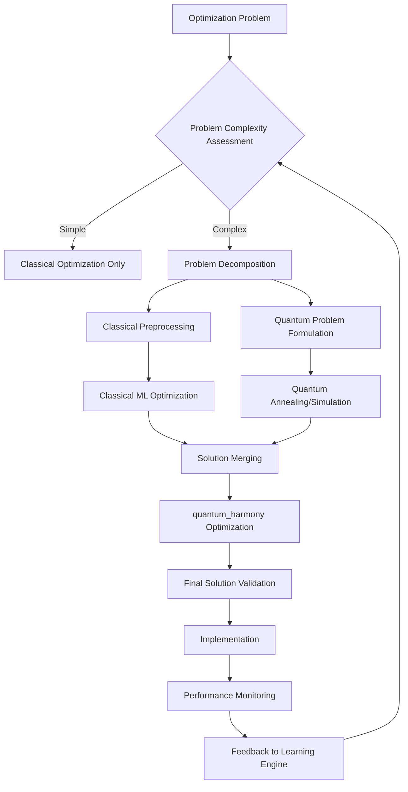
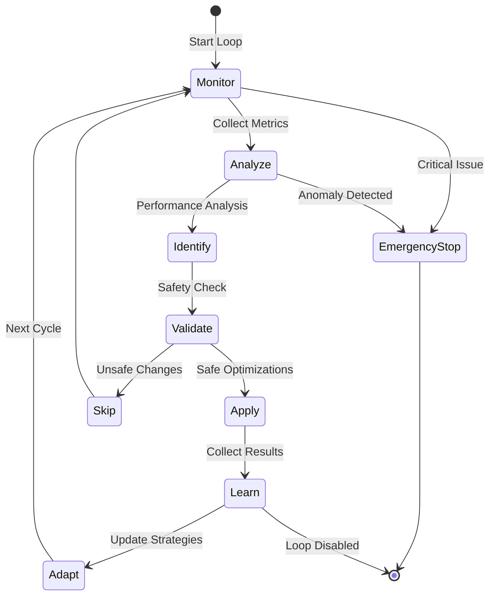
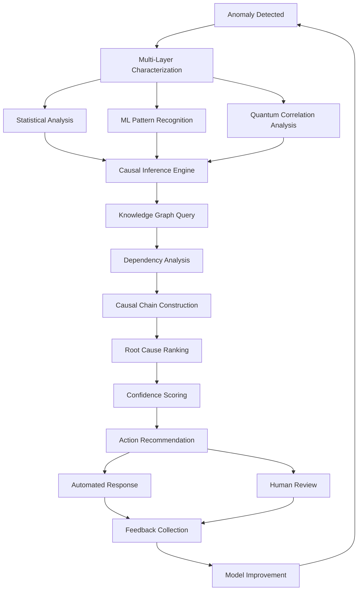
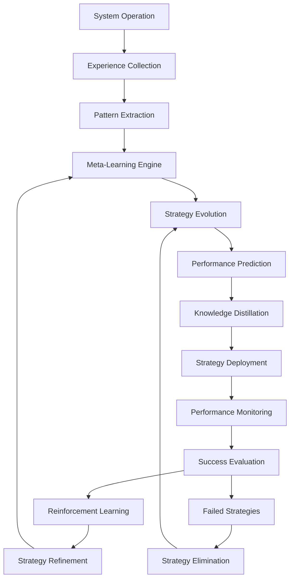
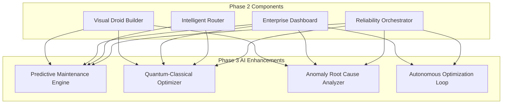
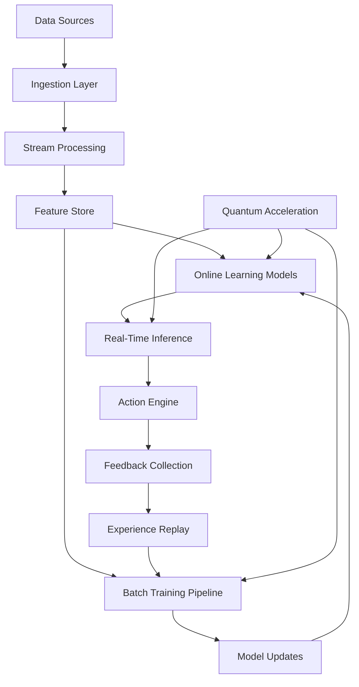
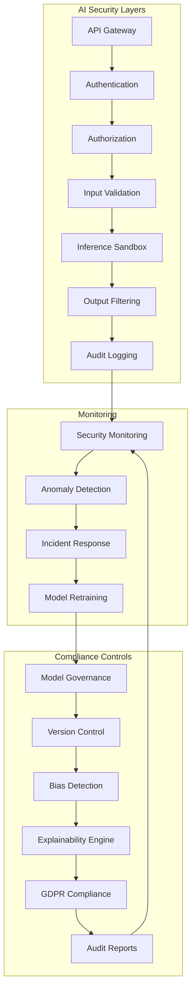

# Phase 3 AI Architecture Diagrams

## Overall System Architecture

## AI Services Data Flow

## Quantum-Classical Hybrid Optimization Flow

## Autonomous Optimization Loop

## Anomaly Root Cause Analysis Workflow

## Self-Learning Optimization System

## Integration with Existing Phase 2 Components

## Real-Time AI Data Pipeline

## Security and Compliance Architecture

These diagrams provide a comprehensive visual representation of the Phase 3 advanced AI architecture, showing how all components integrate and interact within the x0tta6bl4 quantum-AI platform.