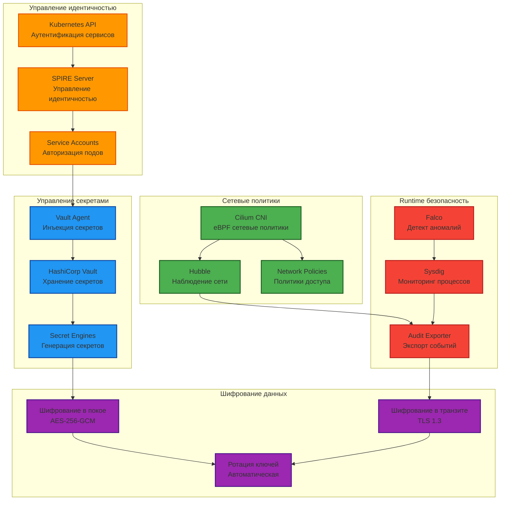
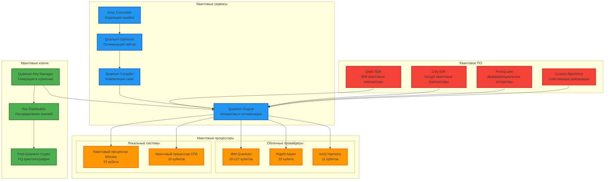
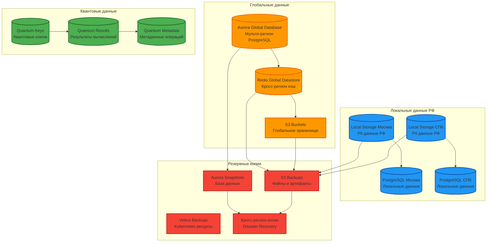
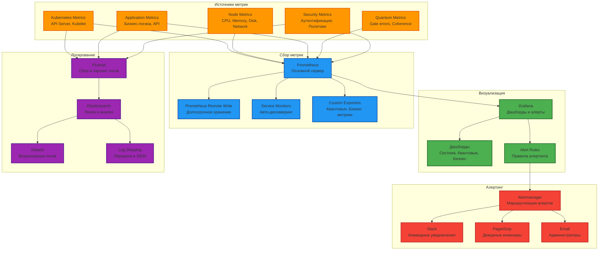

# Архитектурные диаграммы x0tta6bl4

## Обзор архитектуры системы

```mermaid
graph TB
    subgraph "Пользователи и клиенты"
        WebClients[Веб-клиенты<br/>React/Vue.js]
        MobileApps[Мобильные приложения<br/>iOS/Android]
        APIConsumers[API потребители<br/>Внешние системы]
        Developers[Разработчики<br/>SDK/Python/JS]
    end

    subgraph "Глобальный балансировщик нагрузки"
        CloudFlare[Cloudflare CDN<br/>Глобальная маршрутизация]
        Route53[AWS Route53<br/>DNS + Health Checks]
        GlobalALB[Global Application Load Balancer<br/>Cross-region routing]
    end

    subgraph "Региональные кластеры"
        subgraph "US East (us-east-1)"
            EKS1[EKS Cluster<br/>3 AZ, 6 nodes]
            ALB1[AWS ALB<br/>Региональный балансировщик]
            Aurora1[(Aurora PostgreSQL<br/>Multi-AZ)]
            Redis1[(ElastiCache Redis<br/>Global Datastore)]
        end

        subgraph "EU West (eu-west-1)"
            EKS2[EKS Cluster<br/>3 AZ, 6 nodes]
            ALB2[AWS ALB<br/>Региональный балансировщик]
            Aurora2[(Aurora PostgreSQL<br/>Multi-AZ)]
            Redis2[(ElastiCache Redis<br/>Global Datastore)]
        end

        subgraph "Asia Pacific (ap-southeast-1)"
            EKS3[EKS Cluster<br/>3 AZ, 6 nodes]
            ALB3[AWS ALB<br/>Региональный балансировщик]
            Aurora3[(Aurora PostgreSQL<br/>Multi-AZ)]
            Redis3[(ElastiCache Redis<br/>Global Datastore)]
        end

        subgraph "Россия Москва"
            K3sMoscow[K3s Cluster<br/>3 nodes]
            QuantumMoscow[Квантовые процессоры<br/>Локальные системы]
            StorageMoscow[(Local Storage<br/>PII данные РФ)]
        end

        subgraph "Россия СПб"
            K3sSPb[K3s Cluster<br/>3 nodes]
            QuantumSPb[Квантовые процессоры<br/>Резервные системы]
            StorageSPb[(Local Storage<br/>PII данные РФ)]
        end
    end

    subgraph "Системы безопасности"
        Vault[HashiCorp Vault<br/>Управление секретами]
        SPIRE[SPIRE<br/>Управление идентичностью]
        Cilium[Cilium CNI<br/>Сетевые политики]
        Falco[Falco<br/>Runtime Security]
    end

    subgraph "Мониторинг и Observability"
        Prometheus[Prometheus<br/>Сбор метрик]
        Grafana[Grafana<br/>Визуализация]
        Alertmanager[Alertmanager<br/>Управление алертами]
        ELK[ELK Stack<br/>Логи и анализ]
    end

    %% Пользовательский трафик
    WebClients --> CloudFlare
    MobileApps --> CloudFlare
    APIConsumers --> CloudFlare
    Developers --> CloudFlare

    %% Глобальная маршрутизация
    CloudFlare --> Route53
    Route53 --> GlobalALB
    GlobalALB --> ALB1
    GlobalALB --> ALB2
    GlobalALB --> ALB3

    %% Региональные кластеры
    ALB1 --> EKS1
    ALB2 --> EKS2
    ALB3 --> EKS3

    %% Локальные кластеры
    CloudFlare --> K3sMoscow
    CloudFlare --> K3sSPb

    %% Межкластерное взаимодействие
    EKS1 -.->|Submariner| EKS2
    EKS2 -.->|Submariner| EKS3
    EKS1 -.->|Submariner| K3sMoscow
    K3sMoscow -.->|Submariner| K3sSPb

    %% Федерация кластеров
    EKS1 -.->|KubeFed| EKS2
    EKS2 -.->|KubeFed| EKS3
    EKS1 -.->|KubeFed| K3sMoscow
    K3sMoscow -.->|KubeFed| K3sSPb

    %% Хранение данных
    EKS1 --> Aurora1
    EKS2 --> Aurora2
    EKS3 --> Aurora3
    EKS1 --> Redis1
    EKS2 --> Redis2
    EKS3 --> Redis3

    K3sMoscow --> StorageMoscow
    K3sSPb --> StorageSPb
    QuantumMoscow --> StorageMoscow
    QuantumSPb --> StorageSPb

    %% Кросс-региональная репликация
    Aurora1 -.->|Async Replication| Aurora2
    Aurora2 -.->|Async Replication| Aurora3
    Redis1 -.->|Global Datastore| Redis2
    Redis2 -.->|Global Datastore| Redis3

    %% Системы безопасности
    EKS1 --> Vault
    EKS2 --> Vault
    EKS3 --> Vault
    K3sMoscow --> Vault
    K3sSPb --> Vault

    EKS1 --> SPIRE
    EKS2 --> SPIRE
    EKS3 --> SPIRE
    K3sMoscow --> SPIRE
    K3sSPb --> SPIRE

    %% Мониторинг
    EKS1 --> Prometheus
    EKS2 --> Prometheus
    EKS3 --> Prometheus
    K3sMoscow --> Prometheus
    K3sSPb --> Prometheus

    Prometheus --> Grafana
    Prometheus --> Alertmanager
    EKS1 --> ELK
    EKS2 --> ELK
    EKS3 --> ELK
    K3sMoscow --> ELK
    K3sSPb --> ELK

    %% Стилизация
    classDef cloud fill:#ff9800,stroke:#e65100,stroke-width:2px
    classDef local fill:#2196f3,stroke:#0d47a1,stroke-width:2px
    classDef security fill:#f44336,stroke:#b71c1c,stroke-width:2px
    classDef monitoring fill:#9c27b0,stroke:#4a148c,stroke-width:2px
    classDef storage fill:#4caf50,stroke:#1b5e20,stroke-width:2px

    class EKS1,EKS2,EKS3,ALB1,ALB2,ALB3,CloudFlare,Route53,GlobalALB cloud
    class K3sMoscow,K3sSPb,QuantumMoscow,QuantumSPb,StorageMoscow,StorageSPb local
    class Vault,SPIRE,Cilium,Falco security
    class Prometheus,Grafana,Alertmanager,ELK monitoring
    class Aurora1,Aurora2,Aurora3,Redis1,Redis2,Redis3 storage
```

## Архитектура безопасности

## Архитектура квантовых сервисов

## Архитектура данных

## Архитектура мониторинга

## Архитектура развертывания

```mermaid
graph TB
    subgraph "CI/CD Pipeline"
        GitHub[GitHub<br/>Контроль версий]
        GitLabCI[GitLab CI<br/>Автоматизация]
        DockerRegistry[Docker Registry<br/>Хранение образов]
        HelmCharts[Helm Charts<br/>Управление релизами]
    end

    subgraph "Инфраструктура как код"
        Terraform[Terraform<br/>AWS ресурсы]
        Ansible[Ansible<br/>Конфигурация серверов]
        Kustomize[Kustomize<br/>Настройка Kubernetes]
        Crossplane[Crossplane<br/>Cloud ресурсы]
    end

    subgraph "Развертывание"
        ArgoCD[ArgoCD<br/>GitOps развертывание]
        Flux[Flux<br/>Непрерывная доставка]
        HelmDeploy[Helm Deploy<br/>Управление релизами]
        KubeApply[Kubectl Apply<br/>Прямое применение]
    end

    subgraph "Валидация"
        conftest[Conftest<br/>Проверка политик]
        OPA[OPA<br/>Авторизация политик]
        Kyverno[Kyverno<br/>Валидация ресурсов]
        ExternalSecrets[External Secrets<br/>Синхронизация секретов]
    end

    %% Поток развертывания
    GitHub --> GitLabCI
    GitLabCI --> DockerRegistry
    GitLabCI --> HelmCharts

    Terraform --> Ansible
    Ansible --> Kustomize
    Kustomize --> Crossplane

    ArgoCD --> Flux
    Flux --> HelmDeploy
    HelmDeploy --> KubeApply

    conftest --> OPA
    OPA --> Kyverno
    Kyverno --> ExternalSecrets

    %% Стилизация
    classDef cicd fill:#ff9800,stroke:#e65100,stroke-width:2px
    classDef iac fill:#2196f3,stroke:#0d47a1,stroke-width:2px
    classDef deployment fill:#4caf50,stroke:#1b5e20,stroke-width:2px
    classDef validation fill:#f44336,stroke:#b71c1c,stroke-width:2px

    class GitHub,GitLabCI,DockerRegistry,HelmCharts cicd
    class Terraform,Ansible,Kustomize,Crossplane iac
    class ArgoCD,Flux,HelmDeploy,KubeApply deployment
    class conftest,OPA,Kyverno,ExternalSecrets validation
```

## Легенда диаграмм

### Цветовая кодировка

- **Оранжевый** (#ff9800): Облачные компоненты AWS
- **Синий** (#2196f3): Локальные компоненты (Россия)
- **Зеленый** (#4caf50): Компоненты хранения данных
- **Красный** (#f44336): Компоненты безопасности
- **Фиолетовый** (#9c27b0): Компоненты мониторинга
- **Серый** (#666666): Внешние системы и сервисы

### Типы соединений

- **Сплошная линия**: Синхронное взаимодействие
- **Пунктирная линия**: Асинхронное взаимодействие
- **Двунаправленная стрелка**: Двунаправленное взаимодействие

Этот документ содержит архитектурные диаграммы для понимания структуры системы x0tta6bl4. Диаграммы обновляются при изменении архитектуры системы.