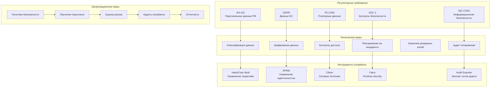

# Руководство по compliance x0tta6bl4

## Обзор compliance

Система x0tta6bl4 должна соответствовать следующим регуляторным требованиям:

- **ФЗ-152** (Россия) - Защита персональных данных
- **GDPR** (ЕС) - Общий регламент по защите данных
- **PCI DSS** - Стандарт безопасности данных индустрии платежных карт
- **ISO 27001** - Система управления информационной безопасностью
- **SOC 2** - Контроль системной и организационной безопасности

## Структура compliance



## ФЗ-152 (Защита персональных данных РФ)

### Требования ФЗ-152

#### 1. Локализация данных
- Персональные данные граждан РФ должны храниться на территории РФ
- Запрещено трансграничная передача без согласия субъекта

#### 2. Классификация данных
```yaml
# data-classification-policy.yaml
apiVersion: v1
kind: ConfigMap
metadata:
  name: data-classification-policy
  namespace: compliance
data:
  classification-levels: |
    - PUBLIC: Общедоступная информация
    - INTERNAL: Внутренняя информация компании
    - CONFIDENTIAL: Конфиденциальная информация
    - RESTRICTED: Секретная информация

  pii-data-locations: |
    - user_profiles: RESTRICTED
    - payment_data: RESTRICTED
    - quantum_results: CONFIDENTIAL
    - system_logs: INTERNAL

  russia-data-requirements: |
    - storage_location: russia-central1 (Moscow)
    - encryption_required: true
    - access_logging: true
    - retention_period: 3_years
```

#### 3. Процедуры обработки данных

```bash
#!/bin/bash
# fz152-compliance-check.sh

echo "=== Проверка соответствия ФЗ-152 ==="

# Проверка локализации данных
echo "1. Проверка локализации данных:"
kubectl --context=k3s-moscow get pvc -l data-classification=pii -o jsonpath='{.items[*].metadata.name}'

# Проверка шифрования данных
echo "2. Проверка шифрования:"
kubectl --context=k3s-moscow get secrets -l data-classification=pii --show-labels

# Проверка логов доступа
echo "3. Проверка логов доступа:"
kubectl --context=k3s-moscow logs -l app=audit-exporter --since=24h | grep -E "(access|denied|pii)"

# Проверка резервных копий
echo "4. Проверка резервных копий:"
kubectl --context=k3s-moscow exec deployment/backup-manager -- \
    velero backup get | grep pii-backup

echo "Проверка ФЗ-152 завершена"
```

### Аудит ФЗ-152

#### Ежемесячный аудит

```bash
#!/bin/bash
# fz152-monthly-audit.sh

AUDIT_DATE=$(date +%Y-%m-%d)
REPORT_FILE="fz152-audit-$AUDIT_DATE.md"

echo "# Аудит соответствия ФЗ-152 - $AUDIT_DATE" > $REPORT_FILE

# 1. Проверка локализации данных
echo -e "\n## 1. Локализация данных" >> $REPORT_FILE
kubectl --context=k3s-moscow get pvc -l data-classification=pii -o wide >> $REPORT_FILE

# 2. Проверка шифрования
echo -e "\n## 2. Шифрование данных" >> $REPORT_FILE
kubectl --context=k3s-moscow get secrets -l data-classification=pii --show-labels >> $REPORT_FILE

# 3. Проверка доступа
echo -e "\n## 3. Контроль доступа" >> $REPORT_FILE
kubectl --context=k3s-moscow get roles,rolebindings -l data-classification=pii -o wide >> $REPORT_FILE

# 4. Проверка логов
echo -e "\n## 4. Аудит логов" >> $REPORT_FILE
kubectl --context=k3s-moscow logs -l app=audit-exporter --since=30d | \
    grep -E "(pii|russia|access)" | wc -l >> $REPORT_FILE

# Отправка отчета
echo "Аудит завершен. Отчет: $REPORT_FILE"
```

## GDPR (Общий регламент по защите данных ЕС)

### Принципы GDPR

#### 1. Права субъектов данных

| Право | Реализация в x0tta6bl4 | Процедура |
|-------|---------------------|-----------|
| Право на доступ | API endpoint для получения данных | `GET /api/v1/gdpr/access/{user_id}` |
| Право на исправление | API endpoint для обновления данных | `PUT /api/v1/gdpr/rectify/{user_id}` |
| Право на удаление | API endpoint для удаления данных | `DELETE /api/v1/gdpr/erase/{user_id}` |
| Право на переносимость | Экспорт данных в JSON формате | `GET /api/v1/gdpr/export/{user_id}` |

#### 2. Data Protection Impact Assessment (DPIA)

```yaml
# dpia-template.yaml
apiVersion: v1
kind: ConfigMap
metadata:
  name: gdpr-dpia-template
  namespace: compliance
data:
  dpia-questions: |
    1. Систематическое описание обработки данных
    2. Цели обработки персональных данных
    3. Правовые основания для обработки
    4. Категории субъектов данных
    5. Категории персональных данных
    6. Получатели персональных данных
    7. Сроки хранения данных
    8. Меры технической и организационной защиты
    9. Оценка рисков для прав субъектов данных
    10. Меры по минимизации рисков
```

#### 3. Процедура реагирования на запросы субъектов

```bash
#!/bin/bash
# gdpr-subject-request.sh

REQUEST_TYPE=$1  # access, rectify, erase, export
USER_ID=$2
REQUEST_ID=$(uuidgen)

echo "=== Обработка GDPR запроса: $REQUEST_TYPE для пользователя $USER_ID ==="

case $REQUEST_TYPE in
    "access")
        # Получение всех данных пользователя
        kubectl --context=eks-eu-west-1 exec deployment/gdpr-processor -- \
            python get_user_data.py $USER_ID > gdpr-access-$REQUEST_ID.json

        # Отправка данных субъекту
        echo "Данные пользователя отправлены на email"
        ;;

    "rectify")
        # Исправление данных пользователя
        kubectl --context=eks-eu-west-1 exec deployment/gdpr-processor -- \
            python update_user_data.py $USER_ID < rectification-data.json

        # Логирование изменений
        echo "$(date): GDPR rectification for user $USER_ID - request $REQUEST_ID" >> gdpr-audit.log
        ;;

    "erase")
        # Удаление данных пользователя (right to be forgotten)
        kubectl --context=eks-eu-west-1 exec deployment/gdpr-processor -- \
            python erase_user_data.py $USER_ID

        # Анонимизация в логах
        sed -i "s/$USER_ID/[ANONYMIZED]/g" *.log

        # Логирование удаления
        echo "$(date): GDPR erasure for user $USER_ID - request $REQUEST_ID" >> gdpr-audit.log
        ;;

    "export")
        # Экспорт данных в машиночитаемом формате
        kubectl --context=eks-eu-west-1 exec deployment/gdpr-processor -- \
            python export_user_data.py $USER_ID --format=json > gdpr-export-$REQUEST_ID.json

        # Создание архива с данными
        tar -czf gdpr-export-$REQUEST_ID.tar.gz gdpr-export-$REQUEST_ID.json
        ;;
esac

echo "GDPR запрос $REQUEST_ID обработан"
```

## PCI DSS (Стандарт безопасности платежных карт)

### Требования PCI DSS

#### 1. Сегментация платежной системы

```yaml
# pci-segmentation.yaml
apiVersion: networking.k8s.io/v1
kind: NetworkPolicy
metadata:
  name: pci-payment-segmentation
  namespace: payment-system
spec:
  podSelector:
    matchLabels:
      app: payment-processor
  policyTypes:
  - Ingress
  - Egress
  ingress:
  - from:
    - namespaceSelector:
        matchLabels:
          name: api-gateway
    - podSelector:
        matchLabels:
          app: stripe-webhook
    ports:
    - protocol: TCP
      port: 8443
  egress:
  - to:
    - ipBlock:
        cidr: 0.0.0.0/0
    ports:
    - protocol: TCP
      port: 443  # Только HTTPS к Stripe
```

#### 2. Токенизация платежных данных

```bash
#!/bin/bash
# pci-tokenization.sh

echo "=== Токенизация платежных данных ==="

# Создание токенов для карт
kubectl --context=eks-us-east-1 exec deployment/payment-processor -- \
    curl -X POST https://api.stripe.com/v1/tokens \
    -H "Authorization: Bearer sk_test_..." \
    -d "card[number]=4242424242424242" \
    -d "card[exp_month]=12" \
    -d "card[exp_year]=2025" \
    -d "card[cvc]=123"

# Хранение токенов в Vault
kubectl --context=eks-us-east-1 exec vault-0 -n vault -- \
    vault kv put secret/x0tta6bl4/payment-tokens \
    stripe_token_$(uuidgen)="$STRIPE_TOKEN"

echo "Токенизация завершена"
```

#### 3. Шифрование данных карт

```yaml
# pci-encryption-policy.yaml
apiVersion: v1
kind: ConfigMap
metadata:
  name: pci-encryption-policy
  namespace: payment-system
data:
  encryption-requirements: |
    - card_numbers: AES-256-GCM
    - cvv_codes: AES-256-GCM + separate storage
    - expiry_dates: AES-256-GCM
    - cardholder_names: AES-256-GCM

  key-rotation: |
    - card_data_keys: 90_days
    - transmission_keys: 1_year
    - master_keys: 3_years

  storage-segregation: |
    - card_data: separate_encrypted_volume
    - keys: separate_hsm_storage
    - logs: separate_encrypted_volume
```

## ISO 27001 (Управление информационной безопасностью)

### Политики информационной безопасности

#### 1. Политика классификации информации

```yaml
# information-classification-policy.yaml
apiVersion: v1
kind: ConfigMap
metadata:
  name: iso27001-classification-policy
  namespace: compliance
data:
  classification-framework: |
    - PUBLIC: Нет ограничений на доступ
    - INTERNAL: Доступ только для сотрудников
    - CONFIDENTIAL: Доступ по необходимости знания
    - RESTRICTED: Доступ только для авторизованного персонала

  handling-procedures: |
    - PUBLIC: Нет специальных требований
    - INTERNAL: Стандартная защита
    - CONFIDENTIAL: Шифрование при передаче
    - RESTRICTED: Шифрование при хранении и передаче

  labeling-requirements: |
    - Все документы должны иметь метку классификации
    - Электронные документы должны иметь метаданные классификации
    - Физические носители должны иметь видимые метки
```

#### 2. Политика контроля доступа

```yaml
# access-control-policy.yaml
apiVersion: v1
kind: ConfigMap
metadata:
  name: iso27001-access-control-policy
  namespace: compliance
data:
  access-principles: |
    - Least Privilege: Минимально необходимые права
    - Need to Know: Доступ только к необходимой информации
    - Segregation of Duties: Разделение обязанностей

  authentication-requirements: |
    - Multi-Factor Authentication для всех систем
    - Password complexity requirements
    - Session timeout после 30 минут неактивности

  authorization-requirements: |
    - Role-Based Access Control (RBAC)
    - Regular access reviews
    - Immediate revocation при увольнении
```

### Процедуры аудита ISO 27001

#### Внутренний аудит

```bash
#!/bin/bash
# iso27001-internal-audit.sh

AUDIT_DATE=$(date +%Y-%m-%d)
REPORT_FILE="iso27001-audit-$AUDIT_DATE.md"

echo "# Внутренний аудит ISO 27001 - $AUDIT_DATE" > $REPORT_FILE

# Контроль A.9.1 - Политика контроля доступа
echo -e "\n## A.9.1 Политика контроля доступа" >> $REPORT_FILE
kubectl get roles,rolebindings,clusterroles,clusterrolebindings --all-namespaces >> $REPORT_FILE

# Контроль A.9.2 - Управление доступом пользователей
echo -e "\n## A.9.2 Управление доступом пользователей" >> $REPORT_FILE
kubectl get serviceaccounts --all-namespaces >> $REPORT_FILE

# Контроль A.12.4 - Логирование и мониторинг
echo -e "\n## A.12.4 Логирование и мониторинг" >> $REPORT_FILE
kubectl logs -l app=audit-exporter --since=90d | wc -l >> $REPORT_FILE

# Контроль A.18.1 - Соответствие законодательным требованиям
echo -e "\n## A.18.1 Соответствие законодательным требованиям" >> $REPORT_FILE
echo "Проверка ФЗ-152: $(./fz152-compliance-check.sh | grep -c "OK")" >> $REPORT_FILE
echo "Проверка GDPR: $(./gdpr-compliance-check.sh | grep -c "OK")" >> $REPORT_FILE

echo "Внутренний аудит завершен: $REPORT_FILE"
```

## SOC 2 (Контроль системной и организационной безопасности)

### Критерии доверия SOC 2

#### 1. Security (Безопасность)

```yaml
# soc2-security-controls.yaml
apiVersion: v1
kind: ConfigMap
metadata:
  name: soc2-security-controls
  namespace: compliance
data:
  security-controls: |
    - CC6.1: Logical and Physical Access Controls
    - CC6.2: Authentication and Authorization
    - CC6.3: Vulnerability Management
    - CC6.4: Change Management
    - CC6.5: Incident Response
    - CC6.6: Security Monitoring
    - CC6.7: Encryption
    - CC6.8: Firewall and Network Security
```

#### 2. Availability (Доступность)

```yaml
# soc2-availability-controls.yaml
apiVersion: v1
kind: ConfigMap
metadata:
  name: soc2-availability-controls
  namespace: compliance
data:
  availability-controls: |
    - A1.1: Incident Response Plan
    - A1.2: Disaster Recovery Plan
    - A1.3: Backup and Restore Procedures
    - A1.4: Performance Monitoring
    - A1.5: Environmental Controls
```

### Процедуры мониторинга SOC 2

```bash
#!/bin/bash
# soc2-monitoring.sh

echo "=== Мониторинг соответствия SOC 2 ==="

# Мониторинг безопасности (CC6)
echo "1. Мониторинг безопасности:"
kubectl --context=eks-us-east-1 get networkpolicies --all-namespaces | wc -l
kubectl --context=eks-us-east-1 get certificates --all-namespaces | wc -l
kubectl --context=eks-us-east-1 logs -l app=falco --since=1h | grep -v "ignore" | wc -l

# Мониторинг доступности (A1)
echo "2. Мониторинг доступности:"
curl -s http://prometheus:9090/api/v1/query -G -d "query=avg_over_time(up[30d]) * 100" | jq '.data.result[0].value[1]'

# Мониторинг производительности
echo "3. Мониторинг производительности:"
curl -s http://prometheus:9090/api/v1/query -G -d "query=avg_over_time(histogram_quantile(0.95, rate(http_request_duration_seconds_bucket[30d]))[1d])" | jq '.data.result[0].value[1]'

echo "Мониторинг SOC 2 завершен"
```

## Процедуры аудита и отчетности

### Ежемесячный compliance отчет

```bash
#!/bin/bash
# monthly-compliance-report.sh

MONTH=$(date +%Y-%m)
REPORT_FILE="compliance-report-$MONTH.md"

echo "# Отчет о соответствии - $MONTH" > $REPORT_FILE

# ФЗ-152 compliance
echo -e "\n## ФЗ-152 Соответствие" >> $REPORT_FILE
echo "Локализация данных: $(./fz152-compliance-check.sh | grep -c "OK")/4" >> $REPORT_FILE
echo "Шифрование данных: $(kubectl get secrets -l data-classification=pii --no-headers | wc -l)" >> $REPORT_FILE

# GDPR compliance
echo -e "\n## GDPR Соответствие" >> $REPORT_FILE
echo "Запросы субъектов: $(grep "GDPR" gdpr-audit.log | wc -l)" >> $REPORT_FILE
echo "DPIA актуальность: $(kubectl get configmap gdpr-dpia -n compliance -o jsonpath='{.metadata.creationTimestamp}')"

# PCI DSS compliance
echo -e "\n## PCI DSS Соответствие" >> $REPORT_FILE
echo "Токенизация карт: $(kubectl exec vault-0 -n vault -- vault kv list secret/x0tta6bl4/payment-tokens | wc -l)" >> $REPORT_FILE
echo "Сегментация сети: $(kubectl get networkpolicies -n payment-system --no-headers | wc -l)" >> $REPORT_FILE

# ISO 27001 compliance
echo -e "\n## ISO 27001 Соответствие" >> $REPORT_FILE
echo "Политики безопасности: $(kubectl get configmap -l iso27001=policy -n compliance --no-headers | wc -l)" >> $REPORT_FILE
echo "Аудит логи: $(kubectl logs -l app=audit-exporter --since=30d | wc -l)" >> $REPORT_FILE

# SOC 2 compliance
echo -e "\n## SOC 2 Соответствие" >> $REPORT_FILE
echo "Критерии безопасности: $(./soc2-security-check.sh | grep -c "PASS")/8" >> $REPORT_FILE
echo "Критерии доступности: $(./soc2-availability-check.sh | grep -c "PASS")/5" >> $REPORT_FILE

# Отправка отчета руководству
echo "Отчет о соответствии за $MONTH готов: $REPORT_FILE"
```

### Ежегодный аудит compliance

```bash
#!/bin/bash
# annual-compliance-audit.sh

YEAR=$(date +%Y)
AUDIT_DIR="compliance-audit-$YEAR"

echo "=== Ежегодный аудит compliance $YEAR ==="

# Создание директории аудита
mkdir -p $AUDIT_DIR

# Сбор всех политик безопасности
kubectl get configmap -l compliance=policy -n compliance -o yaml > $AUDIT_DIR/security-policies.yaml

# Сбор логов аудита за год
kubectl logs -l app=audit-exporter --since=365d > $AUDIT_DIR/audit-logs-$YEAR.log

# Сбор конфигураций безопасности
kubectl get networkpolicies --all-namespaces -o yaml > $AUDIT_DIR/network-policies.yaml
kubectl get roles,rolebindings --all-namespaces -o yaml > $AUDIT_DIR/rbac-policies.yaml

# Проверка соответствия каждого стандарта
./fz152-compliance-check.sh > $AUDIT_DIR/fz152-audit.txt
./gdpr-compliance-check.sh > $AUDIT_DIR/gdpr-audit.txt
./pci-compliance-check.sh > $AUDIT_DIR/pci-audit.txt
./iso27001-compliance-check.sh > $AUDIT_DIR/iso27001-audit.txt
./soc2-compliance-check.sh > $AUDIT_DIR/soc2-audit.txt

# Генерация финального отчета
echo "# Ежегодный аудит compliance $YEAR" > $AUDIT_DIR/README.md
echo "- ФЗ-152: $(grep -c "COMPLIANT" $AUDIT_DIR/fz152-audit.txt)" >> $AUDIT_DIR/README.md
echo "- GDPR: $(grep -c "COMPLIANT" $AUDIT_DIR/gdpr-audit.txt)" >> $AUDIT_DIR/README.md
echo "- PCI DSS: $(grep -c "COMPLIANT" $AUDIT_DIR/pci-audit.txt)" >> $AUDIT_DIR/README.md
echo "- ISO 27001: $(grep -c "COMPLIANT" $AUDIT_DIR/iso27001-audit.txt)" >> $AUDIT_DIR/README.md
echo "- SOC 2: $(grep -c "COMPLIANT" $AUDIT_DIR/soc2-audit.txt)" >> $AUDIT_DIR/README.md

echo "Ежегодный аудит завершен: $AUDIT_DIR/"
```

## Инструменты compliance

### Автоматизированные проверки

```bash
#!/bin/bash
# automated-compliance-check.sh

echo "=== Автоматизированные проверки compliance ==="

# Проверка ФЗ-152
echo "Проверка ФЗ-152..."
FZ152_SCORE=0
FZ152_TOTAL=4

# Локализация данных
if kubectl --context=k3s-moscow get pvc -l data-classification=pii | grep -q pii; then ((FZ152_SCORE++)); fi

# Шифрование данных
if kubectl --context=k3s-moscow get secrets -l data-classification=pii | grep -q pii; then ((FZ152_SCORE++)); fi

# Логи доступа
if kubectl --context=k3s-moscow logs -l app=audit-exporter --since=1h | grep -q access; then ((FZ152_SCORE++)); fi

# Резервные копии
if kubectl --context=k3s-moscow exec deployment/backup-manager -- velero backup get | grep -q pii; then ((FZ152_SCORE++)); fi

echo "ФЗ-152: $FZ152_SCORE/$FZ152_TOTAL"

# Проверка GDPR
echo "Проверка GDPR..."
GDPR_SCORE=0
GDPR_TOTAL=3

# DPIA документ
if kubectl get configmap gdpr-dpia -n compliance; then ((GDPR_SCORE++)); fi

# Процедуры обработки запросов
if [ -f gdpr-subject-request.sh ]; then ((GDPR_SCORE++)); fi

# Логи GDPR активности
if grep -q "GDPR" gdpr-audit.log; then ((GDPR_SCORE++)); fi

echo "GDPR: $GDPR_SCORE/$GDPR_TOTAL"

# Проверка PCI DSS
echo "Проверка PCI DSS..."
PCI_SCORE=0
PCI_TOTAL=3

# Сегментация сети
if kubectl get networkpolicies -n payment-system | grep -q pci; then ((PCI_SCORE++)); fi

# Токенизация
if kubectl exec vault-0 -n vault -- vault kv list secret/x0tta6bl4/payment-tokens; then ((PCI_SCORE++)); fi

# Шифрование
if kubectl get configmap pci-encryption-policy -n payment-system; then ((PCI_SCORE++)); fi

echo "PCI DSS: $PCI_SCORE/$PCI_TOTAL"

echo "Автоматизированные проверки завершены"
```

### Мониторинг compliance

```yaml
# compliance-monitoring-alerts.yaml
apiVersion: monitoring.coreos.com/v1
kind: PrometheusRule
metadata:
  name: compliance-monitoring-alerts
  namespace: monitoring
spec:
  groups:
  - name: compliance
    rules:
    - alert: FZ152Violation
      expr: increase(fz152_violations_total[1h]) > 0
      for: 5m
      labels:
        severity: critical
        compliance: fz152
      annotations:
        summary: "Нарушение ФЗ-152"
        description: "Обнаружено нарушение требований ФЗ-152"

    - alert: GDPRBreach
      expr: increase(gdpr_breaches_total[1h]) > 0
      for: 1m
      labels:
        severity: critical
        compliance: gdpr
      annotations:
        summary: "Нарушение GDPR"
        description: "Обнаружено нарушение требований GDPR"

    - alert: PCIComplianceDrift
      expr: pci_compliance_score < 100
      for: 1h
      labels:
        severity: warning
        compliance: pci-dss
      annotations:
        summary: "Отклонение от PCI DSS"
        description: "Уровень соответствия PCI DSS ниже 100%"
```

## Контакты команды compliance

- **Compliance Officer**: compliance@x0tta6bl4.com
- **Data Protection Officer**: dpo@x0tta6bl4.com
- **Security Team**: security@x0tta6bl4.com
- **Legal Team**: legal@x0tta6bl4.com

## Процедура реагирования на нарушения

1. **Обнаружение нарушения** - Через мониторинг или аудит
2. **Оценка воздействия** - Определить масштаб и последствия
3. **Сдерживание** - Изолировать проблемную область
4. **Устранение** - Исправить нарушение
5. **Восстановление** - Восстановить нормальную работу
6. **Документирование** - Зафиксировать инцидент
7. **Уведомление** - Сообщить регуляторам при необходимости

Этот документ обновляется при изменении регуляторных требований или процедур compliance. Последнее обновление: 2025-09-30.