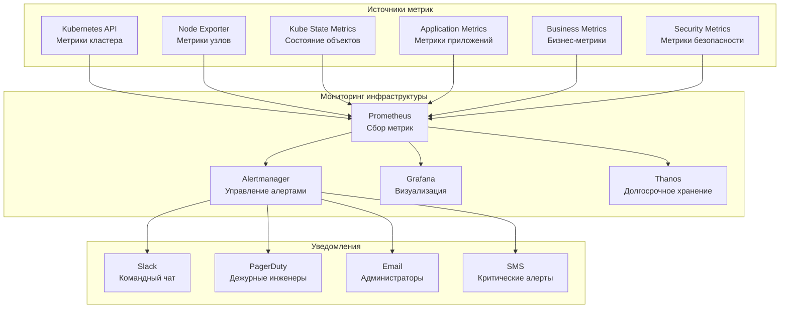

# Документация по мониторингу x0tta6bl4

## Обзор системы мониторинга

Система мониторинга x0tta6bl4 построена на базе Prometheus и Grafana с использованием Prometheus Operator для управления конфигурацией. Мониторинг охватывает все уровни системы: инфраструктуру, приложения, бизнес-метрики и безопасность.

## Архитектура мониторинга



## Метрики инфраструктуры

### Метрики Kubernetes кластера

#### Узлы кластера (Node Exporter)

| Метрика | Описание | Пороги алерта |
|---------|----------|---------------|
| `node_cpu_seconds_total` | Использование CPU узлами | > 80% для warning, > 95% для critical |
| `node_memory_MemTotal_bytes` | Общая память узлов | Мониторинг трендов |
| `node_filesystem_avail_bytes` | Доступное место на дисках | < 10% для warning, < 5% для critical |
| `node_network_receive_bytes_total` | Входящий сетевой трафик | Мониторинг аномалий |
| `node_disk_io_time_seconds_total` | Время I/O операций диска | > 80% для warning |

#### Состояние объектов Kubernetes (Kube State Metrics)

| Метрика | Описание | Пороги алерта |
|---------|----------|---------------|
| `kube_node_status_condition` | Состояние узлов | Ready != true для critical |
| `kube_pod_status_phase` | Фаза подов | Pending > 5 мин для warning |
| `kube_deployment_status_replicas_available` | Доступные реплики | < желаемого количества для warning |
| `kube_service_info` | Информация о сервисах | Мониторинг доступности |

### Метрики сети

#### Cilium Hubble метрики

```yaml
# cilium-hubble-servicemonitor.yaml
apiVersion: monitoring.coreos.com/v1
kind: ServiceMonitor
metadata:
  name: cilium-hubble-monitor
  namespace: cilium-system
spec:
  selector:
    matchLabels:
      app: hubble
  endpoints:
  - port: hubble-metrics
    path: /metrics
    interval: 30s
```

| Метрика | Описание | Пороги алерта |
|---------|----------|---------------|
| `hubble_drop_total` | Отброшенные пакеты | > 100 в минуту для warning |
| `hubble_forward_total` | Пересланные пакеты | Мониторинг трендов |
| `hubble_policy_verdict` | Результаты политик | Deny > 10% для warning |

## Метрики приложений

### API Gateway метрики

#### Основные метрики производительности

| Метрика | Описание | Пороги алерта |
|---------|----------|---------------|
| `http_requests_total` | Общее количество запросов | Мониторинг трендов |
| `http_request_duration_seconds` | Время обработки запросов | 95% > 2с для warning |
| `http_requests_in_flight` | Активные запросы | > 100 для warning |
| `http_request_size_bytes` | Размер запросов | Мониторинг аномалий |

#### Метрики ошибок

| Метрика | Описание | Пороги алерта |
|---------|----------|---------------|
| `http_requests_total{status=~"5.."}` | HTTP ошибки 5xx | > 5% от общего количества для warning |
| `http_requests_total{status="429"}` | Rate limiting | > 100 в минуту для warning |
| `http_request_duration_seconds{quantile="0.95"}` | 95-й перцентиль задержки | > 5с для critical |

### Агентские сервисы метрики

#### Культурные агенты

| Метрика | Описание | Пороги алерта |
|---------|----------|---------------|
| `cultural_agents_processing_total` | Обработанные запросы | Мониторинг трендов |
| `cultural_agents_processing_duration_seconds` | Время обработки | > 30с для warning |
| `cultural_agents_memory_usage_bytes` | Использование памяти | > 80% лимита для warning |
| `cultural_agents_active_connections` | Активные соединения | Мониторинг трендов |

#### Бизнес-агенты

| Метрика | Описание | Пороги алерта |
|---------|----------|---------------|
| `business_agents_transactions_total` | Обработанные транзакции | Мониторинг трендов |
| `business_agents_revenue_total` | Сумма транзакций | Мониторинг трендов |
| `business_agents_error_rate` | Коэффициент ошибок | > 1% для warning |

### Квантовые сервисы метрики

#### Метрики квантовых вычислений

| Метрика | Описание | Пороги алерта |
|---------|----------|---------------|
| `quantum_operations_total` | Выполненные операции | Мониторинг трендов |
| `quantum_gate_error_rate` | Коэффициент ошибок гейтов | > 0.01 для warning |
| `quantum_coherence_time_seconds` | Время когерентности | < 100μs для warning |
| `quantum_fidelity` | Верность операций | < 0.95 для warning |

#### Метрики квантового оборудования

| Метрика | Описание | Пороги алерта |
|---------|----------|---------------|
| `quantum_temperature_kelvin` | Температура оборудования | > 0.1K для warning |
| `quantum_readout_fidelity` | Качество считывания | < 0.90 для warning |
| `quantum_calibration_drift` | Дрейф калибровки | > 5% для warning |

## Бизнес-метрики

### Пользовательские метрики

| Метрика | Описание | Пороги алерта |
|---------|----------|---------------|
| `x0tta6bl4_users_active_total` | Активные пользователи | Резкое падение для warning |
| `x0tta6bl4_sessions_total` | Активные сессии | Мониторинг трендов |
| `x0tta6bl4_api_calls_total` | Вызовы API | Мониторинг использования |

### Финансовые метрики

| Метрика | Описание | Пороги алерта |
|---------|----------|---------------|
| `x0tta6bl4_revenue_total` | Общая выручка | Мониторинг трендов |
| `x0tta6bl4_transactions_total` | Количество транзакций | Резкое падение для warning |
| `x0tta6bl4_payment_success_rate` | Успешность платежей | < 95% для warning |

## Метрики безопасности

### Аутентификация и авторизация

| Метрика | Описание | Пороги алерта |
|---------|----------|---------------|
| `vault_token_create_total` | Созданные токены | Мониторинг трендов |
| `auth_attempts_total` | Попытки аутентификации | Необычные паттерны для warning |
| `auth_failures_total` | Неудачные аутентификации | > 10 в минуту для warning |

### Сетевые политики

| Метрика | Описание | Пороги алерта |
|---------|----------|---------------|
| `cilium_policy_denied_total` | Заблокированные соединения | > 100 в минуту для warning |
| `cilium_policy_dropped_total` | Отброшенные пакеты | > 50 в минуту для warning |

### Аудит

| Метрика | Описание | Пороги алерта |
|---------|----------|---------------|
| `audit_events_total` | Аудит события | Необычные паттерны для warning |
| `security_violations_total` | Нарушения безопасности | Любое количество для critical |

## Алерты

### Критические алерты (P0)

#### Недоступность сервисов

```yaml
# critical-service-down-alert.yaml
apiVersion: monitoring.coreos.com/v1
kind: PrometheusRule
metadata:
  name: critical-service-alerts
  namespace: monitoring
spec:
  groups:
  - name: critical-services
    rules:
    - alert: APIGatewayDown
      expr: up{job="api-gateway"} == 0
      for: 5m
      labels:
        severity: critical
        service: api-gateway
      annotations:
        summary: "API Gateway недоступен"
        description: "API Gateway не отвечает более 5 минут"
        runbook: "https://docs.x0tta6bl4.com/operations/runbooks/troubleshooting/api-gateway-down"

    - alert: QuantumServicesDown
      expr: up{job="quantum-services"} == 0
      for: 3m
      labels:
        severity: critical
        service: quantum-services
      annotations:
        summary: "Квантовые сервисы недоступны"
        description: "Квантовые сервисы не отвечают более 3 минут"
```

#### Проблемы инфраструктуры

```yaml
# critical-infrastructure-alerts.yaml
apiVersion: monitoring.coreos.com/v1
kind: PrometheusRule
metadata:
  name: critical-infrastructure-alerts
  namespace: monitoring
spec:
  groups:
  - name: infrastructure
    rules:
    - alert: ClusterNotReady
      expr: kube_node_status_condition{condition="Ready",status="true"} == 0
      for: 5m
      labels:
        severity: critical
      annotations:
        summary: "Кластер недоступен"
        description: "Один или несколько узлов кластера не готовы"

    - alert: PersistentVolumeFull
      expr: kubelet_volume_stats_available_bytes / kubelet_volume_stats_capacity_bytes * 100 < 5
      for: 10m
      labels:
        severity: critical
      annotations:
        summary: "Недостаточно места в хранилище"
        description: "PersistentVolume заполнен более чем на 95%"
```

### Предупреждения (P1-P2)

#### Производительность

```yaml
# performance-alerts.yaml
apiVersion: monitoring.coreos.com/v1
kind: PrometheusRule
metadata:
  name: performance-alerts
  namespace: monitoring
spec:
  groups:
  - name: performance
    rules:
    - alert: HighLatency
      expr: histogram_quantile(0.95, rate(http_request_duration_seconds_bucket[5m])) > 2
      for: 10m
      labels:
        severity: warning
      annotations:
        summary: "Высокая задержка API"
        description: "95-й перцентиль времени ответа превышает 2 секунды"

    - alert: HighErrorRate
      expr: rate(http_requests_total{status=~"5.."}[5m]) / rate(http_requests_total[5m]) * 100 > 5
      for: 10m
      labels:
        severity: warning
      annotations:
        summary: "Высокий коэффициент ошибок"
        description: "Коэффициент HTTP ошибок превышает 5%"
```

#### Ресурсы

```yaml
# resource-alerts.yaml
apiVersion: monitoring.coreos.com/v1
kind: PrometheusRule
metadata:
  name: resource-alerts
  namespace: monitoring
spec:
  groups:
  - name: resources
    rules:
    - alert: HighCPUUsage
      expr: (1 - avg(irate(node_cpu_seconds_total{mode="idle"}[5m]))) * 100 > 80
      for: 15m
      labels:
        severity: warning
      annotations:
        summary: "Высокое использование CPU"
        description: "Среднее использование CPU превышает 80%"

    - alert: HighMemoryUsage
      expr: (1 - (node_memory_MemAvailable_bytes / node_memory_MemTotal_bytes)) * 100 > 85
      for: 10m
      labels:
        severity: warning
      annotations:
        summary: "Высокое использование памяти"
        description: "Использование памяти превышает 85%"
```

### Информационные алерты (P3)

#### Мониторинг использования

```yaml
# info-alerts.yaml
apiVersion: monitoring.coreos.com/v1
kind: PrometheusRule
metadata:
  name: info-alerts
  namespace: monitoring
spec:
  groups:
  - name: usage
    rules:
    - alert: HighAPIUsage
      expr: rate(http_requests_total[1h]) > 10000
      for: 1h
      labels:
        severity: info
      annotations:
        summary: "Высокая нагрузка на API"
        description: "Количество запросов к API превышает 10000 в час"

    - alert: NewUserRegistrations
      expr: increase(x0tta6bl4_users_total[1d]) > 100
      for: 1d
      labels:
        severity: info
      annotations:
        summary: "Много новых пользователей"
        description: "Зарегистрировано более 100 новых пользователей за день"
```

## Дашборды Grafana

### Основной дашборд системы

**URL**: `https://grafana.x0tta6bl4.com/d/x0tta6bl4-overview`

#### Панели дашборда

1. **Обзор кластера**
   - Статус узлов кластера
   - Использование ресурсов
   - Количество подов по namespace

2. **Производительность API**
   - График запросов в секунду
   - Время ответа (95-й перцентиль)
   - Коэффициент ошибок

3. **Квантовые операции**
   - Количество выполненных операций
   - Коэффициент ошибок гейтов
   - Время когерентности

4. **Бизнес-метрики**
   - Активные пользователи
   - Выручка за день
   - Количество транзакций

### Дашборд квантовых операций

**URL**: `https://grafana.x0tta6bl4.com/d/x0tta6bl4-quantum`

#### Специализированные метрики

- **Коэффициент ошибок гейтов**: `quantum_gate_error_rate`
- **Время когерентности**: `quantum_coherence_time_seconds`
- **Верность операций**: `quantum_fidelity`
- **Температура оборудования**: `quantum_temperature_kelvin`

### Дашборд безопасности

**URL**: `https://grafana.x0tta6bl4.com/d/x0tta6bl4-security`

#### Метрики безопасности

- **Неудачные попытки аутентификации**: `auth_failures_total`
- **Заблокированные соединения**: `cilium_policy_denied_total`
- **Аудит события**: `audit_events_total`

## Процедуры реагирования на алерты

### Критические алерты (P0)

#### 1. Автоматические действия

```bash
#!/bin/bash
# critical-alert-handler.sh

ALERT_NAME=$1
SEVERITY=$2

case $ALERT_NAME in
    "APIGatewayDown")
        # Автоматическое масштабирование
        kubectl --context=eks-us-east-1 scale deployment api-gateway --replicas=6 -n x0tta6bl4-system

        # Проверка балансировщика нагрузки
        aws elbv2 describe-target-health --target-group-arn $API_TARGET_GROUP --region us-east-1
        ;;

    "ClusterNotReady")
        # Проверка узлов кластера
        kubectl --context=eks-us-east-1 get nodes
        kubectl --context=eks-us-east-1 describe nodes

        # Автоматическое восстановление узлов
        kubectl --context=eks-us-east-1 delete node <unhealthy-node>
        ;;

    "PersistentVolumeFull")
        # Расширение хранилища
        kubectl patch pvc <full-pvc> -p '{"spec":{"resources":{"requests":{"storage":"50Gi"}}}}'

        # Очистка старых логов
        kubectl exec deployment/log-cleaner -- ./cleanup-old-logs.sh
        ;;
esac

# Уведомление команды
curl -X POST -H 'Content-type: application/json' \
    --data "{\"text\":\"Критический алерт: $ALERT_NAME - Автоматические действия выполнены\"}" \
    ${SLACK_WEBHOOK}
```

#### 2. Ручные действия команды

1. **Диагностика проблемы** (см. troubleshooting guide)
2. **Изоляция проблемы** (отключение проблемных компонентов)
3. **Восстановление сервисов** (перезапуск или откат)
4. **Пост-мортем анализ** (документирование инцидента)

### Предупреждения (P1-P2)

#### Процедура обработки

1. **Анализ алерта**: Определить причину срабатывания
2. **Проверка тенденций**: Определить, улучшается ли ситуация
3. **Планирование действий**: Решить, требуются ли действия
4. **Документирование**: Зафиксировать анализ и решения

## Интеграции уведомлений

### Slack уведомления

```yaml
# slack-integration.yaml
apiVersion: v1
kind: ConfigMap
metadata:
  name: alertmanager-config
  namespace: monitoring
data:
  config.yml: |
    route:
      group_by: ['alertname']
      group_wait: 10s
      group_interval: 10s
      repeat_interval: 1h
      receiver: 'slack'

    receivers:
    - name: 'slack'
      slack_configs:
      - api_url: 'https://hooks.slack.com/services/YOUR/SLACK/WEBHOOK'
        channel: '#x0tta6bl4-alerts'
        send_resolved: true
        title: 'Alert: {{ .GroupLabels.alertname }}'
        text: |
          {{ range .Alerts }}
          *Severity:* {{ .Labels.severity }}
          *Service:* {{ .Labels.service }}
          *Description:* {{ .Annotations.description }}
          *Runbook:* {{ .Annotations.runbook }}
          {{ end }}
```

### PagerDuty эскалация

```yaml
# pagerduty-integration.yaml
    receivers:
    - name: 'pagerduty'
      pagerduty_configs:
      - routing_key: 'your-pagerduty-routing-key'
        send_resolved: true
        description: 'Alert: {{ .GroupLabels.alertname }}'
        details:
          severity: '{{ .Labels.severity }}'
          service: '{{ .Labels.service }}'
          runbook: '{{ .Annotations.runbook }}'
```

### Email уведомления

```yaml
# email-integration.yaml
    receivers:
    - name: 'email'
      email_configs:
      - to: 'ops-team@x0tta6bl4.com'
        from: 'alertmanager@x0tta6bl4.com'
        smarthost: 'smtp.gmail.com:587'
        send_resolved: true
        headers:
          subject: 'Alert: {{ .GroupLabels.alertname }}'
        body: |
          Alert: {{ .GroupLabels.alertname }}
          Severity: {{ .Labels.severity }}
          Service: {{ .Labels.service }}
          Description: {{ .Annotations.description }}
          Runbook: {{ .Annotations.runbook }}
```

## Мониторинг мониторинга

### Метрики самого мониторинга

| Метрика | Описание | Пороги алерта |
|---------|----------|---------------|
| `prometheus_tsdb_head_series` | Количество временных рядов | > 1M для warning |
| `prometheus_engine_query_duration_seconds` | Время выполнения запросов | > 10с для warning |
| `alertmanager_alerts` | Количество активных алертов | Мониторинг трендов |
| `grafana_alerting_result_total` | Результаты алертов Grafana | Мониторинг трендов |

### Алерты мониторинга мониторинга

```yaml
# monitoring-alerts.yaml
apiVersion: monitoring.coreos.com/v1
kind: PrometheusRule
metadata:
  name: monitoring-alerts
  namespace: monitoring
spec:
  groups:
  - name: monitoring
    rules:
    - alert: PrometheusDown
      expr: up{job="prometheus"} == 0
      for: 2m
      labels:
        severity: critical
      annotations:
        summary: "Prometheus недоступен"
        description: "Сервер Prometheus не отвечает более 2 минут"

    - alert: AlertmanagerDown
      expr: up{job="alertmanager"} == 0
      for: 5m
      labels:
        severity: critical
      annotations:
        summary: "Alertmanager недоступен"
        description: "Alertmanager не отвечает более 5 минут"
```

## Отчетность и аналитика

### Ежедневные отчеты

```bash
#!/bin/bash
# daily-monitoring-report.sh

echo "=== Ежедневный отчет мониторинга $(date) ===" > daily-report.txt

# Доступность сервисов
echo -e "\n1. Доступность сервисов:" >> daily-report.txt
curl -s "http://prometheus:9090/api/v1/query" \
    -G -d "query=avg_over_time(up[1d]) * 100" | \
    jq -r '.data.result[] | "\(.metric.job): \(.value[1])%"' >> daily-report.txt

# Производительность
echo -e "\n2. Производительность:" >> daily-report.txt
curl -s "http://prometheus:9090/api/v1/query" \
    -G -d "query=avg_over_time(histogram_quantile(0.95, rate(http_request_duration_seconds_bucket[1d]))[1d:1h])" | \
    jq -r '.data.result[] | "\(.metric): \(.value[1])s"' >> daily-report.txt

# Количество алертов
echo -e "\n3. Алерты за день:" >> daily-report.txt
curl -s "http://prometheus:9090/api/v1/query" \
    -G -d "query=increase(alertmanager_alerts_received_total[1d])" | \
    jq '.data.result' >> daily-report.txt

# Отправка отчета
curl -X POST -H 'Content-type: application/json' \
    --data "{\"text\":\"Ежедневный отчет мониторинга: https://grafana.x0tta6bl4.com/d/daily-report\"}" \
    ${SLACK_WEBHOOK}
```

### Ежемесячная аналитика

```bash
#!/bin/bash
# monthly-analytics.sh

MONTH=$(date +%Y-%m)

echo "=== Аналитика за месяц $MONTH ===" > monthly-report.txt

# Тренды использования
echo -e "\n1. Тренды использования:" >> monthly-report.txt
curl -s "http://prometheus:9090/api/v1/query" \
    -G -d "query=avg_over_time(http_requests_total[$MONTH])" | \
    jq '.data.result' >> monthly-report.txt

# Производительность системы
echo -e "\n2. Производительность системы:" >> monthly-report.txt
curl -s "http://prometheus:9090/api/v1/query" \
    -G -d "query=avg_over_time(histogram_quantile(0.95, rate(http_request_duration_seconds_bucket[$MONTH]))[1d])" | \
    jq '.data.result' >> monthly-report.txt

# Надежность
echo -e "\n3. Надежность системы:" >> monthly-report.txt
curl -s "http://prometheus:9090/api/v1/query" \
    -G -d "query=avg_over_time(up[$MONTH]) * 100" | \
    jq '.data.result' >> monthly-report.txt

# Генерация отчета в Grafana
curl -X POST "https://grafana.x0tta6bl4.com/api/reports/email" \
    -H "Content-Type: application/json" \
    -d '{"dashboard": "monthly-analytics", "email": "team@x0tta6bl4.com"}'
```

## Контакты команды мониторинга

- **Администратор мониторинга**: monitoring@x0tta6bl4.com
- **Дежурный инженер**: ops-duty@x0tta6bl4.com
- **Чат мониторинга**: #monitoring (Slack)
- **Экстренные контакты**: +7 (495) XXX-XX-XX

Этот документ обновляется при изменении метрик, алертов или процедур мониторинга. Последнее обновление: 2025-09-30.