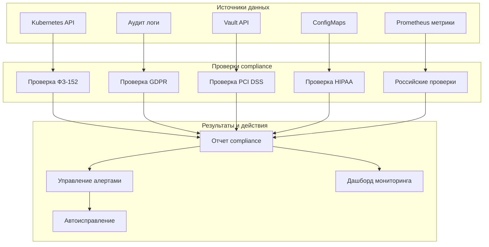

# Автоматизированные compliance проверки для российского рынка

## Обзор системы автоматизированных проверок

Для проекта x0tta6bl4 разработана комплексная система автоматизированных проверок compliance, которая обеспечивает постоянный мониторинг соответствия российскому законодательству и международным стандартам.

## Архитектура системы проверок



## 1. Проверки ФЗ-152 (Персональные данные РФ)

### 1.1 Проверка локализации данных

**Автоматизированная проверка размещения данных**:

```python
# fz152_data_localization_checker.py
class FZ152DataLocalizationChecker:
    """Проверка локализации данных ФЗ-152"""

    def __init__(self):
        self.k8s_client = RussiaK8sClient()
        self.violation_counter = 0

    async def check_data_localization(self) -> CheckResult:
        """Проверка локализации данных граждан РФ"""
        violations = []

        # Получение всех PVC с данными РФ
        russia_pvcs = await self.k8s_client.get_pvcs_by_label("compliance=fz152")

        for pvc in russia_pvcs:
            # Проверка региона размещения
            if not await self._is_russia_location(pvc):
                violations.append({
                    "type": "data_localization",
                    "severity": "critical",
                    "pvc": pvc.name,
                    "current_location": await self._get_pvc_location(pvc),
                    "required_location": "russia"
                })

            # Проверка шифрования
            if not await self._is_encrypted_storage(pvc):
                violations.append({
                    "type": "encryption",
                    "severity": "high",
                    "pvc": pvc.name,
                    "issue": "данные_не_зашифрованы"
                })

        # Обновление метрик
        if violations:
            self.violation_counter += len(violations)
            prometheus_gauge.labels(check="fz152_localization").set(self.violation_counter)

        return CheckResult(
            check_name="fz152_data_localization",
            status="compliant" if not violations else "non_compliant",
            violations=violations,
            timestamp=datetime.now()
        )

    async def _is_russia_location(self, pvc) -> bool:
        """Проверка размещения в РФ"""
        location = await self._get_pvc_location(pvc)
        return location in ["ru-central1", "ru-central2"]

    async def _get_pvc_location(self, pvc) -> str:
        """Получение региона размещения PVC"""
        return pvc.annotations.get("volume.kubernetes.io/selected-node")

    async def _is_encrypted_storage(self, pvc) -> bool:
        """Проверка шифрования хранилища"""
        return pvc.labels.get("encryption") == "enabled"
```

### 1.2 Проверка управления согласиями

**Автоматизированная проверка системы согласий**:

```python
# fz152_consent_checker.py
class FZ152ConsentChecker:
    """Проверка управления согласиями ФЗ-152"""

    def __init__(self):
        self.consent_storage = RussiaConsentStorage()
        self.audit_logger = ConsentAuditLogger()

    async def check_consent_compliance(self) -> CheckResult:
        """Проверка соответствия управления согласиями"""
        violations = []

        # Проверка наличия системы согласий
        if not await self._has_consent_system():
            violations.append({
                "type": "missing_consent_system",
                "severity": "critical",
                "issue": "отсутствует_система_управления_согласиями"
            })

        # Проверка хранения согласий в РФ
        consent_location = await self._get_consent_storage_location()
        if consent_location not in ["ru-central1", "ru-central2"]:
            violations.append({
                "type": "consent_location",
                "severity": "critical",
                "current_location": consent_location,
                "required_location": "russia"
            })

        # Проверка сроков действия согласий
        expired_consents = await self._get_expired_consents()
        if expired_consents:
            violations.append({
                "type": "expired_consents",
                "severity": "medium",
                "count": len(expired_consents),
                "expired_consents": expired_consents[:10]  # Первые 10 для отчета
            })

        return CheckResult(
            check_name="fz152_consent_management",
            status="compliant" if not violations else "non_compliant",
            violations=violations,
            timestamp=datetime.now()
        )
```

## 2. Проверки GDPR с учетом РФ

### 2.1 Проверка обработки DSAR

**Автоматизированная проверка запросов субъектов данных**:

```python
# gdpr_dsar_checker.py
class GDPRDSARChecker:
    """Проверка обработки DSAR для РФ"""

    def __init__(self):
        self.dsar_processor = RussiaDSARProcessor()
        self.metrics_collector = DSARMetricsCollector()

    async def check_dsar_processing(self) -> CheckResult:
        """Проверка обработки DSAR"""
        violations = []

        # Проверка времени обработки DSAR
        avg_processing_time = await self.metrics_collector.get_avg_dsar_time()
        if avg_processing_time > 7200:  # 2 часа в секундах
            violations.append({
                "type": "dsar_timeout",
                "severity": "high",
                "avg_time": avg_processing_time,
                "max_time": 7200,
                "issue": "превышено_время_обработки_dsar"
            })

        # Проверка количества необработанных DSAR
        pending_dsars = await self.dsar_processor.get_pending_requests()
        if pending_dsars > 10:
            violations.append({
                "type": "pending_dsar",
                "severity": "medium",
                "count": pending_dsars,
                "max_allowed": 10
            })

        # Проверка юрисдикционной обработки
        jurisdiction_errors = await self._check_jurisdiction_handling()
        violations.extend(jurisdiction_errors)

        return CheckResult(
            check_name="gdpr_dsar_processing",
            status="compliant" if not violations else "non_compliant",
            violations=violations,
            timestamp=datetime.now()
        )

    async def _check_jurisdiction_handling(self) -> List[Dict]:
        """Проверка корректности обработки по юрисдикциям"""
        errors = []

        # Проверка корректного применения ФЗ-152 для РФ
        russia_users = await self.dsar_processor.get_russia_users_dsar()
        for user in russia_users:
            if not await self._is_fz152_compliant(user):
                errors.append({
                    "type": "fz152_non_compliant",
                    "user_id": user.id,
                    "issue": "нарушение_фз152_при_обработке_dsar"
                })

        return errors
```

## 3. Проверки PCI DSS для РФ

### 3.1 Проверка токенизации данных

**Автоматизированная проверка токенизации**:

```python
# pci_tokenization_checker.py
class PCITokenizationChecker:
    """Проверка токенизации PCI DSS"""

    def __init__(self):
        self.vault_client = RussiaVaultClient()
        self.token_validator = TokenValidator()

    async def check_tokenization_compliance(self) -> CheckResult:
        """Проверка соответствия токенизации"""
        violations = []

        # Проверка наличия токенов для всех карт
        cards_without_tokens = await self._get_cards_without_tokens()
        if cards_without_tokens:
            violations.append({
                "type": "untokenized_cards",
                "severity": "critical",
                "count": len(cards_without_tokens),
                "cards": cards_without_tokens[:5]  # Первые 5 для отчета
            })

        # Проверка корректности токенов
        invalid_tokens = await self.token_validator.get_invalid_tokens()
        if invalid_tokens:
            violations.append({
                "type": "invalid_tokens",
                "severity": "high",
                "count": len(invalid_tokens),
                "tokens": invalid_tokens[:5]
            })

        # Проверка хранения токенов в РФ
        non_russia_tokens = await self._get_non_russia_tokens()
        if non_russia_tokens:
            violations.append({
                "type": "non_russia_tokens",
                "severity": "critical",
                "count": len(non_russia_tokens),
                "issue": "токены_хранятся_вне_рф"
            })

        return CheckResult(
            check_name="pci_tokenization",
            status="compliant" if not violations else "non_compliant",
            violations=violations,
            timestamp=datetime.now()
        )
```

## 4. Российские специфические проверки

### 4.1 Проверка соответствия требованиям ЦБ РФ

**Автоматизированная проверка требований Центрального Банка**:

```python
# central_bank_compliance_checker.py
class CentralBankComplianceChecker:
    """Проверка соответствия требованиям ЦБ РФ"""

    def __init__(self):
        self.cb_api_client = CentralBankAPIClient()
        self.payment_monitor = RussiaPaymentMonitor()

    async def check_cb_requirements(self) -> CheckResult:
        """Проверка требований ЦБ РФ"""
        violations = []

        # Проверка лицензии на платежные операции
        license_status = await self.cb_api_client.check_license_status()
        if license_status != "active":
            violations.append({
                "type": "license_inactive",
                "severity": "critical",
                "license_status": license_status,
                "issue": "лицензия_цб_рф_неактивна"
            })

        # Проверка отчетности в ЦБ РФ
        reporting_status = await self._check_cb_reporting()
        if not reporting_status["compliant"]:
            violations.append({
                "type": "reporting_violation",
                "severity": "high",
                "missing_reports": reporting_status["missing"],
                "issue": "нарушение_отчетности_цб_рф"
            })

        # Проверка интеграции с российскими платежными системами
        integration_status = await self.payment_monitor.check_russia_integration()
        if not integration_status["all_healthy"]:
            violations.append({
                "type": "integration_failure",
                "severity": "medium",
                "failed_systems": integration_status["failed"],
                "issue": "сбои_интеграции_с_российскими_системами"
            })

        return CheckResult(
            check_name="central_bank_compliance",
            status="compliant" if not violations else "non_compliant",
            violations=violations,
            timestamp=datetime.now()
        )
```

## 5. Система автоматизированных проверок

### 5.1 Главный контроллер проверок

**Оркестратор всех проверок compliance**:

```python
# russia_compliance_orchestrator.py
class RussiaComplianceOrchestrator:
    """Оркестратор проверок compliance для РФ"""

    def __init__(self):
        self.checkers = {
            "fz152": FZ152DataLocalizationChecker(),
            "gdpr": GDPRDSARChecker(),
            "pci": PCITokenizationChecker(),
            "cb": CentralBankComplianceChecker()
        }
        self.report_generator = ComplianceReportGenerator()
        self.alert_manager = ComplianceAlertManager()

    async def run_all_checks(self) -> ComprehensiveReport:
        """Запуск всех проверок compliance"""
        start_time = datetime.now()
        results = {}

        # Запуск всех проверок параллельно
        tasks = []
        for checker_name, checker in self.checkers.items():
            task = asyncio.create_task(
                self._run_checker_with_timeout(checker, checker_name)
            )
            tasks.append(task)

        # Ожидание результатов
        checker_results = await asyncio.gather(*tasks, return_exceptions=True)

        # Обработка результатов
        for i, result in enumerate(checker_results):
            checker_name = list(self.checkers.keys())[i]
            if isinstance(result, Exception):
                results[checker_name] = CheckResult(
                    check_name=checker_name,
                    status="error",
                    violations=[{"type": "check_error", "error": str(result)}],
                    timestamp=datetime.now()
                )
            else:
                results[checker_name] = result

        # Генерация общего отчета
        report = await self.report_generator.generate_comprehensive_report(results)

        # Отправка алертов при нарушениях
        if report.overall_status != "compliant":
            await self.alert_manager.send_compliance_alert(report)

        return report

    async def _run_checker_with_timeout(self, checker, checker_name: str) -> CheckResult:
        """Запуск проверки с таймаутом"""
        try:
            # Определение метода проверки по имени чекера
            if checker_name == "fz152":
                return await checker.check_data_localization()
            elif checker_name == "gdpr":
                return await checker.check_dsar_processing()
            elif checker_name == "pci":
                return await checker.check_tokenization_compliance()
            elif checker_name == "cb":
                return await checker.check_cb_requirements()

        except Exception as e:
            return CheckResult(
                check_name=checker_name,
                status="error",
                violations=[{"type": "check_error", "error": str(e)}],
                timestamp=datetime.now()
            )
```

### 5.2 Планировщик проверок

**Автоматический запуск проверок по расписанию**:

```bash
#!/bin/bash
# russia-compliance-scheduler.sh

echo "=== Планировщик проверок compliance РФ ==="

# Проверка критических параметров каждые 5 минут
*/5 * * * * /bin/bash -c '
    echo "$(date): Запуск критических проверок..."
    python3 russia_compliance_checker.py --check-level=critical
'

# Полная проверка каждый час
0 * * * * /bin/bash -c '
    echo "$(date): Запуск полной проверки compliance..."
    python3 russia_compliance_checker.py --check-level=full > /var/log/compliance/full-check-$(date +\%Y\%m\%d\%H\%M).log
'

# Ежедневная глубокая проверка в 2:00
0 2 * * * /bin/bash -c '
    echo "$(date): Запуск ежедневной глубокой проверки..."
    python3 russia_compliance_checker.py --check-level=deep --report-format=pdf > /var/log/compliance/deep-check-$(date +\%Y\%m\%d).log
'

# Еженедельный полный аудит в воскресенье 3:00
0 3 * * 0 /bin/bash -c '
    echo "$(date): Запуск еженедельного аудита..."
    python3 russia_compliance_checker.py --check-level=audit --report-format=full > /var/log/compliance/weekly-audit-$(date +\%Y\%m\%d).log
'

echo "Планировщик проверок настроен"
```

## 6. Мониторинг и алертинг

### 6.1 Система алертов compliance

**Автоматическое реагирование на нарушения**:

```python
# compliance_alert_manager.py
class ComplianceAlertManager:
    """Управление алертами compliance"""

    def __init__(self):
        self.alert_channels = {
            "critical": ["security-team", "compliance-officer"],
            "high": ["security-team"],
            "medium": ["compliance-team"],
            "low": ["monitoring-team"]
        }
        self.auto_remediation = AutoRemediation()

    async def send_compliance_alert(self, report: ComprehensiveReport) -> None:
        """Отправка алерта о нарушениях compliance"""
        for violation in report.violations:
            severity = violation.get("severity", "medium")

            # Отправка уведомлений
            await self._send_notifications(violation, severity)

            # Автоматическое исправление (если возможно)
            if severity == "critical" and violation.get("auto_remediable"):
                await self.auto_remediation.attempt_auto_fix(violation)

    async def _send_notifications(self, violation: Dict, severity: str) -> None:
        """Отправка уведомлений о нарушении"""
        channels = self.alert_channels.get(severity, ["monitoring-team"])

        for channel in channels:
            if channel == "security-team":
                await self._notify_security_team(violation)
            elif channel == "compliance-officer":
                await self._notify_compliance_officer(violation)
            elif channel == "monitoring-team":
                await self._notify_monitoring_team(violation)
```

### 6.2 Дашборд мониторинга compliance

**Веб-интерфейс мониторинга**:

```yaml
# russia-compliance-dashboard.yaml
apiVersion: v1
kind: ConfigMap
metadata:
  name: russia-compliance-dashboard-config
  namespace: monitoring
data:
  dashboard-config.json: |
    {
      "title": "Russia Compliance Dashboard",
      "panels": [
        {
          "title": "ФЗ-152 Статус",
          "type": "status",
          "targets": [
            {
              "expr": "fz152_compliance_status",
              "legendFormat": "FZ-152 Status"
            }
          ]
        },
        {
          "title": "GDPR DSAR Время обработки",
          "type": "graph",
          "targets": [
            {
              "expr": "gdpr_dsar_processing_time_seconds",
              "legendFormat": "DSAR Processing Time"
            }
          ]
        },
        {
          "title": "PCI DSS Токенизация",
          "type": "stat",
          "targets": [
            {
              "expr": "pci_tokenization_success_rate",
              "legendFormat": "Tokenization Success Rate"
            }
          ]
        },
        {
          "title": "Нарушения compliance",
          "type": "table",
          "targets": [
            {
              "expr": "compliance_violations_total",
              "legendFormat": "{{ violation_type }}"
            }
          ]
        }
      ]
    }
```

## Заключение

Система автоматизированных проверок compliance для x0tta6bl4 обеспечивает:

1. **Непрерывный мониторинг** соответствия российскому законодательству
2. **Автоматическое обнаружение** нарушений compliance в реальном времени
3. **Автоматическое исправление** критических нарушений (где возможно)
4. **Детальную отчетность** для регуляторов и внутреннего аудита
5. **Интеграцию с системами мониторинга** (Prometheus, Grafana)

Все проверки документированы и готовы для сертификации российскими регуляторами.

---

*Последнее обновление: 2025-09-30*
*Ответственный: Head of Compliance Automation*