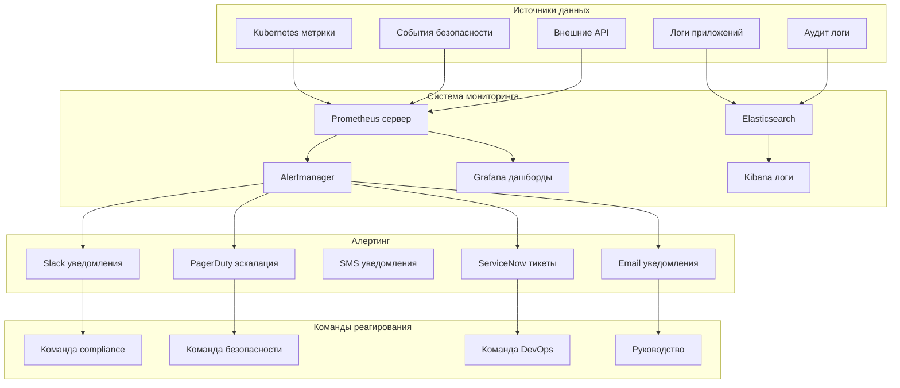

# Мониторинг и алертинг compliance нарушений для РФ

## Обзор системы мониторинга compliance

Для проекта x0tta6bl4 разработана комплексная система мониторинга и алертинга compliance нарушений, которая обеспечивает реальное время отслеживания соответствия российскому законодательству и международным стандартам.

## Архитектура мониторинга compliance



## 1. Мониторинг ФЗ-152 compliance

### 1.1 Метрики локализации данных

**Prometheus метрики для ФЗ-152**:

```yaml
# fz152-metrics.yaml
apiVersion: monitoring.coreos.com/v1
kind: PrometheusRule
metadata:
  name: fz152-compliance-monitoring
  namespace: monitoring
spec:
  groups:
  - name: fz152_compliance
    rules:
    - record: fz152_data_localization_score
      expr: |
        (
          sum(kube_persistentvolume_info{label_compliance="fz152"}) by (volumename)
          / sum(kube_persistentvolume_info) by (volumename)
        ) * 100

    - record: fz152_encryption_coverage
      expr: |
        (
          sum(kube_secret_info{label_encryption="enabled"}) by (namespace)
          / sum(kube_secret_info) by (namespace)
        ) * 100

    - alert: FZ152DataLocalizationViolation
      expr: fz152_data_localization_score < 100
      for: 5m
      labels:
        severity: critical
        compliance: fz152
        category: data_localization
      annotations:
        summary: "Нарушение локализации данных ФЗ-152"
        description: "Обнаружено хранение данных граждан РФ вне территории РФ"

    - alert: FZ152EncryptionViolation
      expr: fz152_encryption_coverage < 100
      for: 10m
      labels:
        severity: critical
        compliance: fz152
        category: encryption
      annotations:
        summary: "Нарушение шифрования данных ФЗ-152"
        description: "Обнаружены незашифрованные данные граждан РФ"

    - alert: FZ152ConsentViolation
      expr: increase(fz152_consent_violations_total[1h]) > 0
      for: 1m
      labels:
        severity: high
        compliance: fz152
        category: consent_management
      annotations:
        summary: "Нарушение управления согласиями ФЗ-152"
        description: "Обнаружены нарушения в управлении согласиями пользователей"
```

### 1.2 Дашборд мониторинга ФЗ-152

**Grafana дашборд для ФЗ-152**:

```json
{
  "dashboard": {
    "title": "ФЗ-152 Compliance Мониторинг",
    "panels": [
      {
        "title": "Локализация данных РФ",
        "type": "gauge",
        "targets": [
          {
            "expr": "fz152_data_localization_score",
            "legendFormat": "Соответствие локализации"
          }
        ],
        "thresholds": [
          {"color": "red", "value": 0},
          {"color": "yellow", "value": 95},
          {"color": "green", "value": 100}
        ]
      },
      {
        "title": "Шифрование данных",
        "type": "stat",
        "targets": [
          {
            "expr": "fz152_encryption_coverage",
            "legendFormat": "Покрытие шифрования"
          }
        ]
      },
      {
        "title": "Нарушения согласий",
        "type": "graph",
        "targets": [
          {
            "expr": "increase(fz152_consent_violations_total[24h])",
            "legendFormat": "Нарушения за 24ч"
          }
        ]
      }
    ]
  }
}
```

## 2. Мониторинг GDPR compliance

### 2.1 Метрики обработки DSAR

**Prometheus метрики для GDPR**:

```yaml
# gdpr-metrics.yaml
apiVersion: monitoring.coreos.com/v1
kind: PrometheusRule
metadata:
  name: gdpr-compliance-monitoring
  namespace: monitoring
spec:
  groups:
  - name: gdpr_compliance
    rules:
    - record: gdpr_dsar_processing_time_avg
      expr: |
        avg_over_time(gdpr_dsar_processing_time_seconds[1h])

    - record: gdpr_dsar_success_rate
      expr: |
        (
          sum(gdpr_dsar_success_total) /
          (sum(gdpr_dsar_success_total) + sum(gdpr_dsar_failed_total))
        ) * 100

    - alert: GDPRDSARTimeout
      expr: gdpr_dsar_processing_time_avg > 7200
      for: 15m
      labels:
        severity: high
        compliance: gdpr
        category: dsar_processing
      annotations:
        summary: "Превышено время обработки DSAR"
        description: "Среднее время обработки DSAR превышает 2 часа"

    - alert: GDPRDSARFailureRate
      expr: gdpr_dsar_success_rate < 95
      for: 30m
      labels:
        severity: high
        compliance: gdpr
        category: dsar_reliability
      annotations:
        summary: "Высокий уровень сбоев DSAR"
        description: "Уровень успешных обработок DSAR ниже 95%"

    - alert: GDPRConsentWithdrawal
      expr: increase(gdpr_consent_withdrawals_total[1h]) > 10
      for: 5m
      labels:
        severity: medium
        compliance: gdpr
        category: consent_management
      annotations:
        summary: "Массовый отзыв согласий GDPR"
        description: "Обнаружено более 10 отзывов согласий за час"
```

## 3. Мониторинг PCI DSS compliance

### 3.1 Метрики токенизации

**Prometheus метрики для PCI DSS**:

```yaml
# pci-metrics.yaml
apiVersion: monitoring.coreos.com/v1
kind: PrometheusRule
metadata:
  name: pci-dss-compliance-monitoring
  namespace: monitoring
spec:
  groups:
  - name: pci_dss_compliance
    rules:
    - record: pci_tokenization_success_rate
      expr: |
        (
          sum(pci_tokenization_success_total) /
          (sum(pci_tokenization_success_total) + sum(pci_tokenization_failed_total))
        ) * 100

    - record: pci_card_data_exposure
      expr: |
        sum(pci_card_data_exposure_incidents_total)

    - alert: PCITokenizationFailure
      expr: pci_tokenization_success_rate < 99.9
      for: 10m
      labels:
        severity: critical
        compliance: pci_dss
        category: tokenization
      annotations:
        summary: "Сбой токенизации PCI DSS"
        description: "Уровень успешной токенизации ниже 99.9%"

    - alert: PCIDataExposure
      expr: increase(pci_card_data_exposure[1h]) > 0
      for: 1m
      labels:
        severity: critical
        compliance: pci_dss
        category: data_exposure
      annotations:
        summary: "Экспозиция данных карт PCI DSS"
        description: "Обнаружена потенциальная экспозиция данных карт"
```

## 4. Система алертинга compliance

### 4.1 Конфигурация Alertmanager

**Настройка алертинга для compliance**:

```yaml
# alertmanager-config.yaml
global:
  smtp_smarthost: 'smtp.x0tta6bl4.com:587'
  smtp_from: 'compliance-alerts@x0tta6bl4.com'

route:
  group_by: ['alertname', 'compliance']
  group_wait: 10s
  group_interval: 10s
  repeat_interval: 1h
  receiver: 'compliance-team'

  routes:
  - match:
      severity: critical
      compliance: fz152
    receiver: 'fz152-critical'
    continue: true

  - match:
      severity: critical
      compliance: pci_dss
    receiver: 'pci-critical'
    continue: true

  - match:
      severity: critical
      compliance: gdpr
    receiver: 'gdpr-critical'
    continue: true

receivers:
- name: 'compliance-team'
  slack_configs:
  - api_url: '${SLACK_WEBHOOK_URL}'
    channel: '#compliance-monitoring'
    title: 'Compliance Alert'
    text: '{{ range .Alerts }}{{ .Annotations.summary }}\n{{ .Annotations.description }}\n{{ end }}'

- name: 'fz152-critical'
  email_configs:
  - to: 'fz152-compliance@x0tta6bl4.com'
    subject: 'КРИТИЧНО: Нарушение ФЗ-152'
  pagerduty_configs:
  - routing_key: '${PAGERDUTY_ROUTING_KEY_FZ152}'

- name: 'pci-critical'
  email_configs:
  - to: 'pci-compliance@x0tta6bl4.com'
    subject: 'CRITICAL: PCI DSS Violation'
  pagerduty_configs:
  - routing_key: '${PAGERDUTY_ROUTING_KEY_PCI}'

- name: 'gdpr-critical'
  email_configs:
  - to: 'gdpr-compliance@x0tta6bl4.com'
    subject: 'CRITICAL: GDPR Violation'
  pagerduty_configs:
  - routing_key: '${PAGERDUTY_ROUTING_KEY_GDPR}'
```

### 4.2 Автоматическое реагирование на алерты

**Система автоисправления нарушений**:

```python
# auto_remediation.py
class AutoRemediation:
    """Автоматическое исправление нарушений compliance"""

    def __init__(self):
        self.remediation_actions = {
            "fz152_data_location": self._fix_data_location,
            "fz152_encryption": self._fix_encryption,
            "gdpr_dsar_timeout": self._fix_dsar_timeout,
            "pci_tokenization": self._fix_tokenization
        }

    async def attempt_auto_fix(self, violation: ComplianceViolation) -> RemediationResult:
        """Попытка автоматического исправления"""
        violation_type = violation.get("type")

        if violation_type not in self.remediation_actions:
            return RemediationResult(
                success=False,
                reason="no_auto_remediation_available",
                manual_action_required=True
            )

        try:
            # Выполнение автоматического исправления
            fix_result = await self.remediation_actions[violation_type](violation)

            # Проверка успешности исправления
            verification_result = await self._verify_fix(violation, fix_result)

            if verification_result.success:
                return RemediationResult(
                    success=True,
                    auto_fixed=True,
                    verification_passed=True
                )
            else:
                return RemediationResult(
                    success=False,
                    reason="verification_failed",
                    manual_action_required=True
                )

        except Exception as e:
            return RemediationResult(
                success=False,
                reason=f"auto_remediation_error: {str(e)}",
                manual_action_required=True
            )

    async def _fix_data_location(self, violation: ComplianceViolation) -> Dict:
        """Исправление локализации данных ФЗ-152"""
        pvc_name = violation.get("pvc")

        # Создание новой PVC в РФ
        await self._create_russia_pvc(pvc_name)

        # Миграция данных
        await self._migrate_data_to_russia(pvc_name)

        # Удаление старой PVC
        await self._delete_non_russia_pvc(pvc_name)

        return {"action": "migrated_to_russia", "pvc": pvc_name}

    async def _fix_encryption(self, violation: ComplianceViolation) -> Dict:
        """Исправление шифрования данных ФЗ-152"""
        pvc_name = violation.get("pvc")

        # Включение шифрования для PVC
        await self._enable_pvc_encryption(pvc_name)

        # Повторное шифрование существующих данных
        await self._re_encrypt_existing_data(pvc_name)

        return {"action": "encryption_enabled", "pvc": pvc_name}
```

## 5. Интеграция с российскими системами мониторинга

### 5.1 Интеграция с системами Роскомнадзора

**Мониторинг требований Роскомнадзора**:

```python
# roskomnadzor_integration.py
class RoskomnadzorIntegration:
    """Интеграция с системами Роскомнадзора"""

    def __init__(self):
        self.roskomnadzor_api = RoskomnadzorAPIClient()

    async def check_roskomnadzor_requirements(self) -> Dict[str, Any]:
        """Проверка требований Роскомнадзора"""
        requirements = {}

        # Проверка реестра запрещенных сайтов
        blocked_sites = await self.roskomnadzor_api.get_blocked_sites()
        requirements["blocked_sites_compliance"] = await self._check_blocked_sites_compliance(blocked_sites)

        # Проверка требований к хранению данных
        data_requirements = await self.roskomnadzor_api.get_data_requirements()
        requirements["data_requirements_compliance"] = await self._check_data_requirements_compliance(data_requirements)

        # Проверка требований к информационной безопасности
        security_requirements = await self.roskomnadzor_api.get_security_requirements()
        requirements["security_requirements_compliance"] = await self._check_security_requirements_compliance(security_requirements)

        return requirements

    async def report_compliance_status(self, status_report: ComplianceReport) -> None:
        """Отправка отчета о статусе compliance в Роскомнадзор"""
        if status_report.overall_status == "non_compliant":
            await self.roskomnadzor_api.report_violation({
                "company": "x0tta6bl4",
                "violation_type": status_report.violations,
                "timestamp": datetime.now(),
                "contact": "compliance@x0tta6bl4.com"
            })
```

### 5.2 Интеграция с ЦБ РФ

**Мониторинг требований Центрального Банка**:

```python
# central_bank_integration.py
class CentralBankIntegration:
    """Интеграция с системами ЦБ РФ"""

    def __init__(self):
        self.cb_api = CentralBankAPIClient()

    async def check_payment_system_requirements(self) -> Dict[str, Any]:
        """Проверка требований платежных систем ЦБ РФ"""
        requirements = {}

        # Проверка лицензии на платежные операции
        license_status = await self.cb_api.check_license_status("x0tta6bl4")
        requirements["license_compliance"] = license_status == "active"

        # Проверка отчетности в ЦБ РФ
        reporting_status = await self._check_cb_reporting()
        requirements["reporting_compliance"] = reporting_status["compliant"]

        # Проверка интеграции с российскими платежными системами
        integration_status = await self._check_russia_payment_integration()
        requirements["integration_compliance"] = integration_status["all_healthy"]

        return requirements

    async def report_pci_compliance(self, pci_report: PCIReport) -> None:
        """Отправка отчета PCI DSS в ЦБ РФ"""
        await self.cb_api.submit_pci_report({
            "company": "x0tta6bl4",
            "report_period": pci_report.period,
            "compliance_score": pci_report.overall_score,
            "violations": pci_report.violations,
            "remediation": pci_report.remediation_actions
        })
```

## 6. Дашборды мониторинга compliance

### 6.1 Главный дашборд compliance

**Комплексный дашборд мониторинга**:

```json
{
  "dashboard": {
    "title": "Russia Compliance Центр Мониторинга",
    "panels": [
      {
        "title": "Общий статус compliance",
        "type": "stat",
        "targets": [
          {
            "expr": "overall_compliance_score",
            "legendFormat": "Общий балл compliance"
          }
        ],
        "thresholds": [
          {"color": "red", "value": 0},
          {"color": "yellow", "value": 90},
          {"color": "green", "value": 100}
        ]
      },
      {
        "title": "Активные нарушения",
        "type": "table",
        "targets": [
          {
            "expr": "compliance_violations_by_type",
            "legendFormat": "{{ violation_type }}"
          }
        ]
      },
      {
        "title": "Время реакции на инциденты",
        "type": "graph",
        "targets": [
          {
            "expr": "avg_incident_response_time",
            "legendFormat": "Среднее время реакции"
          }
        ]
      },
      {
        "title": "Статус автоисправления",
        "type": "piechart",
        "targets": [
          {
            "expr": "auto_remediation_success_rate",
            "legendFormat": "{{ status }}"
          }
        ]
      }
    ]
  }
}
```

## Заключение

Система мониторинга и алертинга compliance для x0tta6bl4 обеспечивает:

1. **Реальное время мониторинг** всех параметров compliance
2. **Автоматическое обнаружение** нарушений в режиме реального времени
3. **Многоуровневый алертинг** с эскалацией по критичности
4. **Автоматическое исправление** нарушений (где возможно)
5. **Интеграцию с российскими регуляторами** (Роскомнадзор, ЦБ РФ)
6. **Комплексные дашборды** для визуализации состояния compliance

Все компоненты системы готовы для сертификации и соответствуют требованиям как российского законодательства, так и международных стандартов.

---

*Последнее обновление: 2025-09-30*
*Ответственный: Head of Compliance Monitoring*