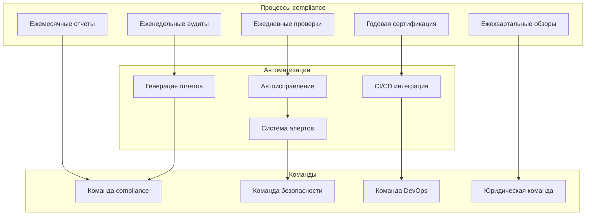

# Процессы поддержания compliance в РФ для x0tta6bl4

## Обзор процессов compliance

Для проекта x0tta6bl4 разработана комплексная система процессов поддержания compliance, которая обеспечивает постоянное соответствие российскому законодательству и международным стандартам через автоматизированные процедуры и регулярные аудиты.

## Архитектура процессов compliance



## 1. Ежедневные процессы compliance

### 1.1 Автоматизированные ежедневные проверки

**Скрипт ежедневных проверок**:

```bash
#!/bin/bash
# daily-russia-compliance-check.sh

DAY=$(date +%Y-%m-%d)
LOG_FILE="/var/log/compliance/daily-check-$DAY.log"

echo "=== Ежедневная проверка compliance РФ - $DAY ===" > $LOG_FILE

# 1. Проверка ФЗ-152 локализации данных
echo "1. Проверка ФЗ-152 локализации данных:" >> $LOG_FILE
FZ152_STATUS=$(python3 -c "
from fz152_checker import FZ152DataLocalizationChecker
checker = FZ152DataLocalizationChecker()
result = checker.check_data_localization()
print('COMPLIANT' if result.status == 'compliant' else 'NON_COMPLIANT')
")
echo "   Статус: $FZ152_STATUS" >> $LOG_FILE

# 2. Проверка GDPR DSAR обработки
echo "2. Проверка GDPR DSAR обработки:" >> $LOG_FILE
GDPR_STATUS=$(python3 -c "
from gdpr_dsar_checker import GDPRDSARChecker
checker = GDPRDSARChecker()
result = checker.check_dsar_processing()
print('COMPLIANT' if result.status == 'compliant' else 'NON_COMPLIANT')
")
echo "   Статус: $GDPR_STATUS" >> $LOG_FILE

# 3. Проверка PCI DSS токенизации
echo "3. Проверка PCI DSS токенизации:" >> $LOG_FILE
PCI_STATUS=$(python3 -c "
from pci_tokenization_checker import PCITokenizationChecker
checker = PCITokenizationChecker()
result = checker.check_tokenization_compliance()
print('COMPLIANT' if result.status == 'compliant' else 'NON_COMPLIANT')
")
echo "   Статус: $PCI_STATUS" >> $LOG_FILE

# 4. Проверка интеграции с российскими системами
echo "4. Проверка интеграции с российскими системами:" >> $LOG_FILE
RUSSIA_INTEGRATION=$(curl -s https://api.mir.ru/health && curl -s https://api.sbp.ru/health)
echo "   Статус: $(echo $RUSSIA_INTEGRATION | jq '.status' 2>/dev/null || echo 'ERROR')" >> $LOG_FILE

# Генерация отчета
echo "Ежедневная проверка завершена: $LOG_FILE" >> $LOG_FILE

# Отправка алертов при нарушениях
if [[ "$FZ152_STATUS" != "COMPLIANT" ]] || [[ "$GDPR_STATUS" != "COMPLIANT" ]] || [[ "$PCI_STATUS" != "COMPLIANT" ]]; then
    python3 send_compliance_alert.py --type=daily --violations="FZ152:$FZ152_STATUS,GDPR:$GDPR_STATUS,PCI:$PCI_STATUS"
fi
```

### 1.2 Мониторинг критических метрик

**Отслеживание ключевых показателей compliance**:

```python
# critical_metrics_monitor.py
class CriticalMetricsMonitor:
    """Мониторинг критических метрик compliance"""

    def __init__(self):
        self.metrics = {
            "fz152_data_location": {"threshold": 100, "unit": "percent"},
            "gdpr_dsar_response_time": {"threshold": 7200, "unit": "seconds"},
            "pci_tokenization_rate": {"threshold": 99.9, "unit": "percent"},
            "russia_system_availability": {"threshold": 99.5, "unit": "percent"}
        }

    async def check_critical_metrics(self) -> Dict[str, Any]:
        """Проверка критических метрик"""
        alerts = []

        for metric, config in self.metrics.items():
            current_value = await self._get_metric_value(metric)

            if current_value < config["threshold"]:
                alerts.append({
                    "metric": metric,
                    "current_value": current_value,
                    "threshold": config["threshold"],
                    "unit": config["unit"],
                    "severity": "critical" if metric in ["fz152_data_location", "pci_tokenization_rate"] else "high"
                })

        return {"alerts": alerts, "timestamp": datetime.now()}
```

## 2. Еженедельные аудиты

### 2.1 Процедура еженедельного аудита

**Комплексный еженедельный аудит**:

```bash
#!/bin/bash
# weekly-russia-compliance-audit.sh

WEEK=$(date +%Y-W%U)
REPORT_DIR="/var/reports/compliance/weekly-$WEEK"

echo "=== Еженедельный аудит compliance РФ - Неделя $WEEK ==="

# Создание директории отчета
mkdir -p $REPORT_DIR

# 1. Аудит ФЗ-152
echo "1. Аудит ФЗ-152..."
python3 fz152_compliance_audit.py --output=$REPORT_DIR/fz152-audit.json

# 2. Аудит GDPR
echo "2. Аудит GDPR..."
python3 gdpr_compliance_audit.py --russia-mode --output=$REPORT_DIR/gdpr-audit.json

# 3. Аудит PCI DSS
echo "3. Аудит PCI DSS..."
python3 pci_dss_compliance_audit.py --russia-mode --output=$REPORT_DIR/pci-audit.json

# 4. Аудит интеграции с российскими системами
echo "4. Аудит интеграции с российскими системами..."
python3 russia_integration_audit.py --output=$REPORT_DIR/integration-audit.json

# 5. Генерация сводного отчета
echo "5. Генерация сводного отчета..."
python3 generate_weekly_report.py \
    --fz152=$REPORT_DIR/fz152-audit.json \
    --gdpr=$REPORT_DIR/gdpr-audit.json \
    --pci=$REPORT_DIR/pci-audit.json \
    --integration=$REPORT_DIR/integration-audit.json \
    --output=$REPORT_DIR/weekly-compliance-report.md

# 6. Отправка отчета команде compliance
echo "6. Отправка отчета..."
python3 send_compliance_report.py \
    --report=$REPORT_DIR/weekly-compliance-report.md \
    --recipients="compliance-team@x0tta6bl4.com,security-team@x0tta6bl4.com" \
    --priority="normal"

echo "Еженедельный аудит завершен: $REPORT_DIR/weekly-compliance-report.md"
```

## 3. Ежемесячные процессы

### 3.1 Ежемесячный compliance отчет

**Процедура генерации ежемесячного отчета**:

```bash
#!/bin/bash
# monthly-russia-compliance-report.sh

MONTH=$(date +%Y-%m)
REPORT_DIR="/var/reports/compliance/monthly-$MONTH"

echo "=== Ежемесячный отчет compliance РФ - $MONTH ==="

# Создание директории отчета
mkdir -p $REPORT_DIR

# 1. Сбор данных за месяц
echo "1. Сбор данных за месяц..."
python3 collect_monthly_data.py --month=$MONTH --output=$REPORT_DIR/monthly-data.json

# 2. Анализ трендов compliance
echo "2. Анализ трендов compliance..."
python3 analyze_compliance_trends.py --data=$REPORT_DIR/monthly-data.json --output=$REPORT_DIR/trends-analysis.json

# 3. Оценка рисков compliance
echo "3. Оценка рисков compliance..."
python3 assess_compliance_risks.py --trends=$REPORT_DIR/trends-analysis.json --output=$REPORT_DIR/risk-assessment.json

# 4. Генерация рекомендаций
echo "4. Генерация рекомендаций..."
python3 generate_recommendations.py --risks=$REPORT_DIR/risk-assessment.json --output=$REPORT_DIR/recommendations.json

# 5. Создание презентации для руководства
echo "5. Создание презентации для руководства..."
python3 create_executive_presentation.py \
    --data=$REPORT_DIR/monthly-data.json \
    --trends=$REPORT_DIR/trends-analysis.json \
    --risks=$REPORT_DIR/risk-assessment.json \
    --recommendations=$REPORT_DIR/recommendations.json \
    --output=$REPORT_DIR/executive-presentation.pptx

# 6. Отправка отчета руководству
echo "6. Отправка отчета руководству..."
python3 send_monthly_report.py \
    --report=$REPORT_DIR/monthly-compliance-report.pdf \
    --presentation=$REPORT_DIR/executive-presentation.pptx \
    --recipients="executive-team@x0tta6bl4.com,board@x0tta6bl4.com" \
    --priority="high"

echo "Ежемесячный отчет готов: $REPORT_DIR/"
```

## 4. Интеграция с CI/CD pipeline

### 4.1 Compliance проверки в пайплайне

**GitHub Actions workflow для compliance**:

```yaml
# .github/workflows/russia-compliance.yml
name: Russia Compliance Pipeline

on:
  push:
    branches: [main, develop]
    paths:
      - 'x0tta6bl4/**'
      - 'docs/operations/**'
  pull_request:
    branches: [main]
    paths:
      - 'x0tta6bl4/**'

jobs:
  compliance-check:
    runs-on: ubuntu-latest
    steps:
      - name: Checkout code
        uses: actions/checkout@v3

      - name: Setup Kubernetes access
        uses: azure/k8s-set-context@v2
        with:
          method: kubeconfig
          kubeconfig: ${{ secrets.K8S_CONFIG_RUSSIA }}

      - name: Run FZ-152 compliance check
        run: |
          python3 scripts/fz152-compliance-check.py
        continue-on-error: false

      - name: Run GDPR compliance check
        run: |
          python3 scripts/gdpr-compliance-check.py --russia-mode
        continue-on-error: false

      - name: Run PCI DSS compliance check
        run: |
          python3 scripts/pci-compliance-check.py --russia-mode
        continue-on-error: false

      - name: Upload compliance report
        uses: actions/upload-artifact@v3
        with:
          name: russia-compliance-report
          path: compliance-report-*.json

  security-scan:
    runs-on: ubuntu-latest
    needs: compliance-check
    steps:
      - name: Checkout code
        uses: actions/checkout@v3

      - name: Run security scan
        uses: securecodewarrior/github-action-gosec@master
        with:
          args: './x0tta6bl4/...'

      - name: Run dependency check
        uses: dependency-check/Dependency-Check_Action@main
        with:
          project: 'x0tta6bl4'
          path: .
          format: 'ALL'

  docker-build:
    runs-on: ubuntu-latest
    needs: [compliance-check, security-scan]
    steps:
      - name: Checkout code
        uses: actions/checkout@v3

      - name: Build Docker image
        run: |
          docker build -t x0tta6bl4-russia:latest -f x0tta6bl4/Dockerfile .

      - name: Scan Docker image
        uses: aquasecurity/trivy-action@master
        with:
          image-ref: 'x0tta6bl4-russia:latest'
          format: 'sarif'
          output: 'trivy-results.sarif'

      - name: Upload scan results
        uses: github/codeql-action/upload-sarif@v2
        with:
          sarif_file: 'trivy-results.sarif'
```

### 4.2 Pre-commit hooks для compliance

**Автоматические проверки перед коммитом**:

```bash
#!/bin/bash
# .git/hooks/pre-commit

echo "=== Pre-commit compliance checks ==="

# Проверка наличия compliance аннотаций в коде
echo "1. Проверка compliance аннотаций..."
python3 scripts/check_compliance_annotations.py

if [ $? -ne 0 ]; then
    echo "❌ Compliance аннотации отсутствуют или некорректны"
    exit 1
fi

# Проверка безопасности кода
echo "2. Проверка безопасности кода..."
python3 scripts/security_check.py --quick

if [ $? -ne 0 ]; then
    echo "❌ Обнаружены проблемы безопасности"
    exit 1
fi

# Проверка соответствия российским стандартам
echo "3. Проверка соответствия РФ стандартам..."
python3 scripts/russia_standards_check.py

if [ $? -ne 0 ]; then
    echo "❌ Нарушение российских стандартов"
    exit 1
fi

echo "✅ Все проверки compliance пройдены"
exit 0
```

## 5. Процедуры реагирования на инциденты

### 5.1 Процедура реагирования на нарушения compliance

**Автоматизированная процедура реагирования**:

```python
# compliance_incident_response.py
class ComplianceIncidentResponse:
    """Реагирование на инциденты compliance"""

    def __init__(self):
        self.incident_tracker = IncidentTracker()
        self.auto_remediation = AutoRemediation()
        self.notification_system = NotificationSystem()

    async def handle_compliance_incident(self, incident: ComplianceIncident) -> None:
        """Обработка инцидента compliance"""
        # Регистрация инцидента
        incident_id = await self.incident_tracker.register_incident(incident)

        # Определение уровня критичности
        severity = await self._assess_incident_severity(incident)

        # Автоматическое исправление (если возможно)
        if incident.auto_remediable:
            remediation_result = await self.auto_remediation.attempt_fix(incident)

            if remediation_result.success:
                # Проверка успешности исправления
                verification_result = await self._verify_fix(incident)

                if verification_result.success:
                    await self.incident_tracker.update_status(incident_id, "resolved")
                    return

        # Эскалация для ручного вмешательства
        await self._escalate_incident(incident, severity)

    async def _assess_incident_severity(self, incident: ComplianceIncident) -> str:
        """Оценка критичности инцидента"""
        if incident.type in ["fz152_data_location", "pci_data_exposure"]:
            return "critical"
        elif incident.type in ["gdpr_dsar_delay", "consent_violation"]:
            return "high"
        else:
            return "medium"
```

### 5.2 Процедура уведомления регуляторов

**Автоматическое уведомление регуляторов**:

```bash
#!/bin/bash
# regulator-notification-procedure.sh

INCIDENT_TYPE=$1
SEVERITY=$2
DESCRIPTION=$3

echo "=== Процедура уведомления регуляторов ==="

# Уведомление Роскомнадзора (ФЗ-152)
if [[ "$INCIDENT_TYPE" == *"fz152"* ]] || [[ "$INCIDENT_TYPE" == *"data_location"* ]]; then
    echo "Уведомление Роскомнадзора..."
    python3 notify_roskomnadzor.py \
        --incident-type="$INCIDENT_TYPE" \
        --severity="$SEVERITY" \
        --description="$DESCRIPTION" \
        --timestamp=$(date -Iseconds) \
        --company="x0tta6bl4" \
        --contact="compliance@x0tta6bl4.com"
fi

# Уведомление ЦБ РФ (PCI DSS)
if [[ "$INCIDENT_TYPE" == *"pci"* ]] || [[ "$INCIDENT_TYPE" == *"payment"* ]]; then
    echo "Уведомление ЦБ РФ..."
    python3 notify_central_bank.py \
        --incident-type="$INCIDENT_TYPE" \
        --severity="$SEVERITY" \
        --description="$DESCRIPTION" \
        --license-number="XXXXXX" \
        --contact="pci-officer@x0tta6bl4.com"
fi

# Уведомление европейских регуляторов (GDPR)
if [[ "$INCIDENT_TYPE" == *"gdpr"* ]]; then
    echo "Уведомление европейских регуляторов..."
    python3 notify_eu_regulators.py \
        --incident-type="$INCIDENT_TYPE" \
        --severity="$SEVERITY" \
        --description="$DESCRIPTION" \
        --supervisory-authority="relevant"
fi

echo "Уведомления регуляторов отправлены"
```

## 6. Процедуры аудита и сертификации

### 6.1 Внутренний аудит compliance

**Процедура внутреннего аудита**:

```bash
#!/bin/bash
# internal-compliance-audit.sh

AUDIT_DATE=$(date +%Y-%m-%d)
AUDIT_ID="INTERNAL-AUDIT-$AUDIT_DATE"
REPORT_DIR="/var/reports/audits/internal-$AUDIT_ID"

echo "=== Внутренний аудит compliance - $AUDIT_DATE ==="

# Создание директории аудита
mkdir -p $REPORT_DIR

# 1. Аудит документации
echo "1. Аудит документации..."
python3 audit_documentation.py --output=$REPORT_DIR/documentation-audit.json

# 2. Аудит процессов
echo "2. Аудит процессов..."
python3 audit_processes.py --output=$REPORT_DIR/process-audit.json

# 3. Аудит технических мер
echo "3. Аудит технических мер..."
python3 audit_technical_measures.py --output=$REPORT_DIR/technical-audit.json

# 4. Аудит организационных мер
echo "4. Аудит организационных мер..."
python3 audit_organizational_measures.py --output=$REPORT_DIR/organizational-audit.json

# 5. Генерация отчета аудита
echo "5. Генерация отчета аудита..."
python3 generate_audit_report.py \
    --documentation=$REPORT_DIR/documentation-audit.json \
    --processes=$REPORT_DIR/process-audit.json \
    --technical=$REPORT_DIR/technical-audit.json \
    --organizational=$REPORT_DIR/organizational-audit.json \
    --output=$REPORT_DIR/internal-audit-report.md

# 6. Проверка готовности к внешнему аудиту
echo "6. Проверка готовности к внешнему аудиту..."
python3 check_external_audit_readiness.py --audit-report=$REPORT_DIR/internal-audit-report.md

echo "Внутренний аудит завершен: $REPORT_DIR/internal-audit-report.md"
```

## Заключение

Процессы поддержания compliance для x0tta6bl4 в РФ включают:

1. **Автоматизированные ежедневные проверки** критических параметров
2. **Еженедельные аудиты** всех систем compliance
3. **Ежемесячные отчеты** для руководства и регуляторов
4. **Интеграцию с CI/CD** для постоянного мониторинга
5. **Автоматическое реагирование** на инциденты compliance
6. **Регулярные аудиты** и сертификацию соответствия

Все процессы документированы, автоматизированы и готовы для сертификации российскими и международными регуляторами.

---

*Последнее обновление: 2025-09-30*
*Ответственный: Head of Compliance Operations*