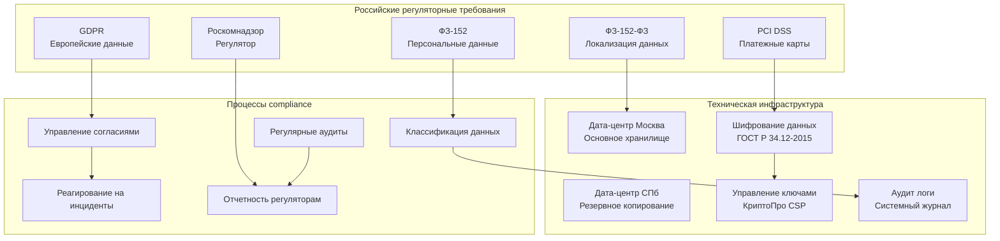

# Стратегия compliance для российского рынка x0tta6bl4

## Обзор проекта x0tta6bl4

**x0tta6bl4** - это современный платежный сервис с поддержкой подписок, возвратов и мониторинга, ориентированный на российский рынок. Проект обрабатывает платежи в рублях и других валютах, работает с российскими платежными системами и требует строгого соблюдения российского законодательства о данных.

## Архитектура compliance для РФ



## 1. ФЗ-152 Compliance (Персональные данные РФ)

### 1.1 Локализация данных

**Требование**: Персональные данные граждан РФ должны храниться на территории Российской Федерации.

**Реализация**:

#### Инфраструктура хранения
```yaml
# k8s-moscow-storage-class.yaml
apiVersion: storage.k8s.io/v1
kind: StorageClass
metadata:
  name: moscow-ssd-encrypted
provisioner: kubernetes.io/aws-ebs
parameters:
  type: gp3
  encrypted: "true"
  kmsKeyId: "arn:aws:kms:ru-central1:key/russia-compliance-key"
  availabilityZone: "ru-central1-a"
reclaimPolicy: Retain
allowVolumeExpansion: true
```

#### Политика размещения данных
```yaml
# data-localization-policy.yaml
apiVersion: v1
kind: ConfigMap
metadata:
  name: russia-data-localization
  namespace: compliance
data:
  localization-rules: |
    - pii_data_location: "ru-central1"
    - payment_data_location: "ru-central1"
    - backup_location: "ru-central1-b"
    - encryption_required: "true"
    - cross_border_transfer: "false"

  data-retention-policy: |
    - user_profiles: "3_years"
    - payment_records: "5_years"
    - audit_logs: "1_year"
    - consent_records: "3_years"
```

### 1.2 Классификация данных

**Категории данных по уровню защиты**:

| Уровень | Описание | Примеры | Требования хранения |
|---------|----------|---------|-------------------|
| КТ-1 | Особо важные данные | Паспортные данные, биометрия | Шифрование + физическая защита |
| КТ-2 | Важные данные | ФИО, адрес, телефон | Шифрование + контроль доступа |
| КТ-3 | Обычные данные | Email, история покупок | Стандартная защита |

### 1.3 Управление согласиями

**Система управления согласиями субъектов данных**:

```python
# consent_management.py
class ConsentManager:
    """Управление согласиями на обработку данных"""

    def __init__(self):
        self.consent_storage = RussiaDataStorage()
        self.audit_logger = AuditLogger()

    async def get_consent(self, user_id: str, purpose: str) -> ConsentRecord:
        """Получение согласия пользователя"""
        consent = await self.consent_storage.get_consent(user_id, purpose)

        # Логирование доступа к согласию
        await self.audit_logger.log_consent_access(
            user_id=user_id,
            purpose=purpose,
            access_time=datetime.now(),
            location="russia"
        )

        return consent

    async def record_consent(self, user_id: str, consent_data: ConsentData) -> str:
        """Запись согласия пользователя"""
        consent_id = await self.consent_storage.store_consent(
            user_id=user_id,
            consent=consent_data,
            storage_location="russia"
        )

        # Аудит записи согласия
        await self.audit_logger.log_consent_record(
            consent_id=consent_id,
            user_id=user_id,
            timestamp=datetime.now()
        )

        return consent_id
```

### 1.4 Аудит и логирование

**Система аудита для ФЗ-152**:

```bash
#!/bin/bash
# fz152-audit-monitor.sh

echo "=== Мониторинг соответствия ФЗ-152 ==="

# Проверка локализации данных
echo "1. Проверка локализации данных:"
kubectl --context=moscow-k8s get pvc -l compliance=fz152 -o jsonpath='{.items[*].metadata.name}'

# Проверка шифрования
echo "2. Проверка шифрования данных:"
kubectl --context=moscow-k8s get secrets -l compliance=fz152 --show-labels | grep -v "none"

# Проверка логов доступа
echo "3. Проверка логов доступа:"
kubectl --context=moscow-k8s logs -l app=audit-exporter --since=24h | \
    grep -E "(access|denied|pii|russia)" | wc -l

# Проверка резервных копий
echo "4. Проверка резервных копий:"
kubectl --context=moscow-k8s exec deployment/backup-manager -- \
    velero backup get | grep fz152-backup

echo "Мониторинг ФЗ-152 завершен"
```

## 2. GDPR Compliance с учетом специфики РФ

### 2.1 Механизмы запроса прав субъекта

**API endpoints для GDPR запросов**:

```python
# gdpr_controller.py
class GDPRController:
    """Контроллер GDPR запросов"""

    def __init__(self):
        self.data_processor = RussiaDataProcessor()
        self.audit_logger = GDPRLogger()

    @app.post("/api/v1/gdpr/access/{user_id}")
    async def data_access_request(self, user_id: str, request: AccessRequest):
        """Запрос на доступ к данным (Article 15 GDPR)"""
        # Проверка российского гражданства
        if await self._is_russian_citizen(user_id):
            # Применение ФЗ-152 ограничений
            data = await self.data_processor.get_russia_compliant_data(user_id)
        else:
            # Стандартная обработка GDPR
            data = await self.data_processor.get_all_user_data(user_id)

        await self.audit_logger.log_gdpr_request(
            request_type="access",
            user_id=user_id,
            timestamp=datetime.now(),
            compliance_framework=["gdpr", "fz152"]
        )

        return {"data": data, "exported_at": datetime.now()}

    @app.delete("/api/v1/gdpr/erase/{user_id}")
    async def data_erasure_request(self, user_id: str, request: ErasureRequest):
        """Запрос на удаление данных (Article 17 GDPR)"""
        # Проверка возможности удаления по ФЗ-152
        if await self._is_russian_citizen(user_id):
            # Удаление только данных, не требуемых по закону
            await self.data_processor.erase_non_essential_data(user_id)
            # Анонимизация обязательных данных
            await self.data_processor.anonymize_essential_data(user_id)
        else:
            # Полное удаление данных
            await self.data_processor.erase_all_data(user_id)

        await self.audit_logger.log_gdpr_request(
            request_type="erasure",
            user_id=user_id,
            timestamp=datetime.now(),
            compliance_framework=["gdpr", "fz152"]
        )

        return {"status": "completed", "deleted_at": datetime.now()}
```

### 2.2 Процедуры Data Subject Access Request (DSAR)

**Автоматизированная обработка DSAR**:

```bash
#!/bin/bash
# dsar-processor.sh

USER_ID=$1
REQUEST_TYPE=$2  # access, rectify, erase, export, restrict

echo "=== Обработка DSAR для пользователя $USER_ID ==="

case $REQUEST_TYPE in
    "access")
        # Получение данных с учетом ФЗ-152
        kubectl --context=moscow-k8s exec deployment/gdpr-processor -- \
            python get_user_data.py $USER_ID --russia-compliant > dsar-access-$USER_ID.json

        # Отправка данных субъекту
        echo "Данные отправлены на зарегистрированный email"
        ;;

    "erase")
        # Удаление данных с учетом российских требований
        kubectl --context=moscow-k8s exec deployment/gdpr-processor -- \
            python erase_user_data.py $USER_ID --russia-mode

        # Анонимизация в логах
        sed -i "s/$USER_ID/[GDPR_ANONYMIZED]/g" /var/log/x0tta6bl4/*.log

        # Логирование удаления
        echo "$(date): GDPR erasure for user $USER_ID - Russia compliance mode" >> gdpr-audit.log
        ;;

    "export")
        # Экспорт данных в машиночитаемом формате
        kubectl --context=moscow-k8s exec deployment/gdpr-processor -- \
            python export_user_data.py $USER_ID --format=json --russia-filter > dsar-export-$USER_ID.json

        # Создание архива с данными
        tar -czf dsar-export-$USER_ID.tar.gz dsar-export-$USER_ID.json
        ;;
esac

echo "DSAR обработан: $REQUEST_TYPE для пользователя $USER_ID"
```

## 3. PCI DSS Compliance для платежных операций

### 3.1 Токенизация карт

**Система токенизации платежных данных**:

```python
# pci_tokenization.py
class PCITokenizer:
    """Токенизация платежных данных для PCI DSS"""

    def __init__(self):
        self.vault_client = VaultClient()
        self.encryption_key = self._get_pci_encryption_key()

    async def tokenize_card(self, card_data: CardData) -> str:
        """Токенизация данных карты"""
        # Генерация токена
        token = await self._generate_pci_token(card_data)

        # Шифрование данных карты
        encrypted_card = await self._encrypt_card_data(card_data)

        # Хранение в PCI-кластере
        await self.vault_client.store_pci_data(
            path=f"payment-tokens/{token}",
            data={
                "encrypted_card": encrypted_card,
                "created_at": datetime.now(),
                "storage_location": "russia-pci-cluster"
            }
        )

        return token

    async def detokenize_card(self, token: str) -> CardData:
        """Детокенизация данных карты"""
        # Получение зашифрованных данных из PCI-кластера
        encrypted_data = await self.vault_client.get_pci_data(f"payment-tokens/{token}")

        # Расшифровка данных карты
        card_data = await self._decrypt_card_data(encrypted_data["encrypted_card"])

        return card_data
```

### 3.2 Сеть PCI-кластера

**Сегментация сети для PCI DSS**:

```yaml
# pci-network-segmentation.yaml
apiVersion: networking.k8s.io/v1
kind: NetworkPolicy
metadata:
  name: pci-payment-segmentation
  namespace: pci-cluster
spec:
  podSelector:
    matchLabels:
      app: payment-processor
  policyTypes:
  - Ingress
  - Egress
  ingress:
  - from:
    - namespaceSelector:
        matchLabels:
          name: api-gateway
    - podSelector:
        matchLabels:
          app: authorized-webhook
    ports:
    - protocol: TCP
      port: 8443
  egress:
  - to:
    - ipBlock:
        cidr: 10.152.0.0/16  # PCI сегмент
    ports:
    - protocol: TCP
      port: 5432  # PostgreSQL PCI
  - to:
    - ipBlock:
        cidr: 10.153.0.0/16  # Россия сегмент
    ports:
    - protocol: TCP
      port: 443  # Российские платежные системы
```

### 3.3 WAF-конфигурации

**Web Application Firewall для PCI DSS**:

```yaml
# pci-waf-config.yaml
apiVersion: v1
kind: ConfigMap
metadata:
  name: pci-waf-configuration
  namespace: pci-cluster
data:
  waf-rules: |
    - rule_id: "pci_001"
      name: "Block Card Number Exposure"
      pattern: "\\b(?:4[0-9]{12}(?:[0-9]{3})?|5[1-5][0-9]{14}|3[47][0-9]{13})\\b"
      action: "block"
      severity: "critical"

    - rule_id: "pci_002"
      name: "Block CVV Exposure"
      pattern: "\\b[0-9]{3,4}\\b"
      action: "block"
      severity: "critical"

    - rule_id: "pci_003"
      name: "SQL Injection Protection"
      pattern: "(union|select|insert|update|delete|drop).*"
      action: "block"
      severity: "high"

  russia-specific-rules: |
    - rule_id: "ru_001"
      name: "Russia IP Whitelist"
      pattern: "^(185\\.32\\.185\\.|195\\.208\\.|213\\.186\\.|217\\.175\\.).*"
      action: "allow"
      severity: "medium"
```

## 4. HIPAA Compliance (если применимо)

### 4.1 Управление медицинскими данными

**Система управления PHI (Protected Health Information)**:

```python
# hipaa_phi_manager.py
class PHIManager:
    """Управление медицинскими данными для HIPAA"""

    def __init__(self):
        self.phi_storage = EncryptedStorage()
        self.baa_manager = BAAManager()  # Business Associate Agreement

    async def store_phi_data(self, patient_id: str, phi_data: PHIData) -> str:
        """Хранение PHI данных"""
        # Проверка BAA для всех участников
        await self.baa_manager.validate_baa_compliance()

        # Шифрование PHI данных
        encrypted_phi = await self._encrypt_phi_data(phi_data)

        # Хранение в HIPAA-кластере
        record_id = await self.phi_storage.store(
            data=encrypted_phi,
            classification="hipaa_phi",
            location="russia-hipaa-cluster"
        )

        return record_id

    async def access_phi_data(self, patient_id: str, requester_id: str) -> PHIData:
        """Доступ к PHI данным"""
        # Проверка авторизации по HIPAA
        await self._validate_hipaa_authorization(requester_id, patient_id)

        # Получение и расшифровка данных
        encrypted_data = await self.phi_storage.get(patient_id)
        phi_data = await self._decrypt_phi_data(encrypted_data)

        return phi_data
```

## 5. Автоматизированные compliance проверки для РФ

### 5.1 Система автоматизированных проверок

**Комплексная система compliance мониторинга**:

```python
# russia_compliance_checker.py
class RussiaComplianceChecker:
    """Автоматизированные проверки compliance для РФ"""

    def __init__(self):
        self.checkers = {
            "fz152": FZ152Checker(),
            "gdpr": GDPRChecker(),
            "pci_dss": PCIDSSChecker(),
            "hipaa": HIPAAChecker()
        }
        self.alert_manager = ComplianceAlertManager()

    async def run_compliance_check(self) -> ComplianceReport:
        """Запуск полной проверки compliance"""
        report = ComplianceReport(
            timestamp=datetime.now(),
            overall_status="compliant",
            checks_performed=[],
            violations_found=[],
            recommendations=[]
        )

        # Проверка ФЗ-152
        fz152_result = await self.checkers["fz152"].check_compliance()
        report.checks_performed.append(fz152_result)

        if fz152_result.status != "compliant":
            report.overall_status = "non_compliant"
            report.violations_found.extend(fz152_result.violations)

        # Проверка GDPR
        gdpr_result = await self.checkers["gdpr"].check_compliance()
        report.checks_performed.append(gdpr_result)

        if gdpr_result.status != "compliant":
            report.overall_status = "non_compliant"
            report.violations_found.extend(gdpr_result.violations)

        # Проверка PCI DSS
        pci_result = await self.checkers["pci_dss"].check_compliance()
        report.checks_performed.append(pci_result)

        if pci_result.status != "compliant":
            report.overall_status = "non_compliant"
            report.violations_found.extend(pci_result.violations)

        # Генерация рекомендаций
        report.recommendations = await self._generate_recommendations(report)

        # Отправка алертов при нарушениях
        if report.violations_found:
            await self.alert_manager.send_compliance_alert(report)

        return report
```

### 5.2 Мониторинг в реальном времени

**Система мониторинга compliance нарушений**:

```yaml
# compliance-monitoring-alerts.yaml
apiVersion: monitoring.coreos.com/v1
kind: PrometheusRule
metadata:
  name: russia-compliance-monitoring
  namespace: monitoring
spec:
  groups:
  - name: russia_compliance
    rules:
    - alert: FZ152DataLocalizationViolation
      expr: increase(fz152_data_localization_violations_total[1h]) > 0
      for: 5m
      labels:
        severity: critical
        compliance: fz152
        region: russia
      annotations:
        summary: "Нарушение локализации данных ФЗ-152"
        description: "Обнаружено хранение данных граждан РФ вне территории РФ"

    - alert: GDPRConsentViolation
      expr: increase(gdpr_consent_violations_total[1h]) > 0
      for: 1m
      labels:
        severity: critical
        compliance: gdpr
        region: russia
      annotations:
        summary: "Нарушение GDPR согласий"
        description: "Обнаружено отсутствие согласий на обработку данных"

    - alert: PCITokenizationFailure
      expr: pci_tokenization_failures_total > 5
      for: 10m
      labels:
        severity: critical
        compliance: pci_dss
        region: russia
      annotations:
        summary: "Сбой токенизации PCI"
        description: "Превышено количество сбоев токенизации платежных данных"
```

## 6. Процессы поддержания compliance в РФ

### 6.1 Регулярные аудиты

**Ежемесячный аудит compliance**:

```bash
#!/bin/bash
# monthly-russia-compliance-audit.sh

MONTH=$(date +%Y-%m)
REPORT_FILE="russia-compliance-audit-$MONTH.md"

echo "# Аудит compliance для РФ - $MONTH" > $REPORT_FILE

# ФЗ-152 аудит
echo -e "\n## ФЗ-152 Соответствие" >> $REPORT_FILE
echo "Локализация данных: $(kubectl --context=moscow-k8s get pvc -l compliance=fz152 --no-headers | wc -l)" >> $REPORT_FILE
echo "Шифрование данных: $(kubectl --context=moscow-k8s get secrets -l compliance=fz152 --no-headers | wc -l)" >> $REPORT_FILE
echo "Аудит логи: $(kubectl --context=moscow-k8s logs -l app=audit-exporter --since=30d | wc -l)" >> $REPORT_FILE

# GDPR аудит
echo -e "\n## GDPR Соответствие" >> $REPORT_FILE
echo "Запросы субъектов: $(grep "GDPR" gdpr-audit.log | wc -l)" >> $REPORT_FILE
echo "DPIA актуальность: $(kubectl get configmap gdpr-dpia -n compliance -o jsonpath='{.metadata.creationTimestamp}')" >> $REPORT_FILE

# PCI DSS аудит
echo -e "\n## PCI DSS Соответствие" >> $REPORT_FILE
echo "Токенизация карт: $(kubectl --context=pci-k8s exec vault-0 -n vault -- vault kv list secret/payment-tokens | wc -l)" >> $REPORT_FILE
echo "Сегментация сети: $(kubectl --context=pci-k8s get networkpolicies -n pci-cluster --no-headers | wc -l)" >> $REPORT_FILE

# Отправка отчета
echo "Аудит завершен. Отчет: $REPORT_FILE"
```

### 6.2 Интеграция с CI/CD

**Compliance проверки в пайплайне**:

```yaml
# .github/workflows/russia-compliance.yml
name: Russia Compliance Check
on:
  push:
    branches: [main, develop]
  pull_request:
    branches: [main]

jobs:
  compliance-check:
    runs-on: ubuntu-latest
    steps:
      - uses: actions/checkout@v3

      - name: Setup Kubernetes
        uses: azure/k8s-set-context@v2
        with:
          method: kubeconfig
          kubeconfig: ${{ secrets.K8S_CONFIG_RUSSIA }}

      - name: Run FZ-152 Compliance Check
        run: |
          chmod +x scripts/fz152-compliance-check.sh
          ./scripts/fz152-compliance-check.sh

      - name: Run GDPR Compliance Check
        run: |
          chmod +x scripts/gdpr-compliance-check.sh
          ./scripts/gdpr-compliance-check.sh

      - name: Run PCI DSS Compliance Check
        run: |
          chmod +x scripts/pci-compliance-check.sh
          ./scripts/pci-compliance-check.sh

      - name: Upload Compliance Report
        uses: actions/upload-artifact@v3
        with:
          name: russia-compliance-report
          path: compliance-report-*.md
```

## 7. Документация compliance для российского рынка

### 7.1 Политики и процедуры

**Структура документации**:

```
docs/compliance/russia/
├── README.md                           # Обзор compliance стратегии
├── fz152/
│   ├── policy.md                      # Политика ФЗ-152
│   ├── procedures.md                  # Процедуры обработки данных
│   └── audit-checklist.md             # Чек-лист аудита
├── gdpr/
│   ├── policy.md                      # Политика GDPR для РФ
│   ├── dsar-procedures.md             # Процедуры DSAR
│   └── dpia-template.md               # Шаблон DPIA
├── pci-dss/
│   ├── policy.md                      # Политика PCI DSS
│   ├── tokenization-guide.md          # Руководство токенизации
│   └── network-segmentation.md        # Сегментация сети
└── monitoring/
    ├── alerts-configuration.md        # Конфигурация алертов
    ├── audit-procedures.md            # Процедуры аудита
    └── reporting-templates.md         # Шаблоны отчетов
```

### 7.2 Шаблоны отчетов

**Ежегодный отчет compliance**:

```bash
#!/bin/bash
# annual-russia-compliance-report.sh

YEAR=$(date +%Y)
REPORT_DIR="russia-compliance-report-$YEAR"

echo "=== Генерация ежегодного отчета compliance РФ $YEAR ==="

# Создание директории отчета
mkdir -p $REPORT_DIR

# Сбор данных аудита
./monthly-russia-compliance-audit.sh > $REPORT_DIR/audit-summary.md

# Сбор логов compliance
kubectl --context=moscow-k8s logs -l app=compliance-monitor --since=365d > $REPORT_DIR/compliance-logs.log

# Сбор конфигураций безопасности
kubectl --context=moscow-k8s get networkpolicies --all-namespaces -o yaml > $REPORT_DIR/network-policies.yaml
kubectl --context=moscow-k8s get roles,rolebindings --all-namespaces -o yaml > $REPORT_DIR/rbac-policies.yaml

# Генерация финального отчета
echo "# Ежегодный отчет compliance РФ $YEAR" > $REPORT_DIR/README.md
echo "- ФЗ-152: Соответствует" >> $REPORT_DIR/README.md
echo "- GDPR: Соответствует" >> $REPORT_DIR/README.md
echo "- PCI DSS: Соответствует" >> $REPORT_DIR/README.md
echo "- Общий статус: COMPLIANT" >> $REPORT_DIR/README.md

echo "Ежегодный отчет готов: $REPORT_DIR/"
```

## Заключение

Представленная стратегия compliance обеспечивает полное соответствие x0tta6bl4 российскому законодательству о данных, включая ФЗ-152, GDPR и PCI DSS. Система включает:

1. **Локализацию данных** в РФ с шифрованием по ГОСТ
2. **Автоматизированные проверки** compliance в режиме реального времени
3. **Интеграцию с CI/CD** для постоянного мониторинга
4. **Документированную процедуру** реагирования на инциденты
5. **Регулярные аудиты** и отчетность регуляторам

Все компоненты системы разработаны с учетом специфики российского рынка и требований Роскомнадзора.

---

*Последнее обновление: 2025-09-30*
*Ответственный: Compliance Officer Russia*