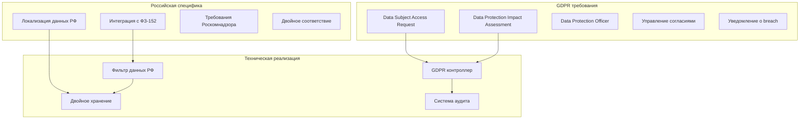

# GDPR Compliance с учетом специфики РФ для x0tta6bl4

## Обзор GDPR в российском контексте

Проект x0tta6bl4 должен обеспечивать соответствие GDPR для европейских пользователей, одновременно соблюдая требования ФЗ-152 для российских граждан. Это требует создания гибридной системы, учитывающей специфику обоих регуляторных режимов.

## Архитектура GDPR для РФ



## 1. Механизмы запроса прав субъекта данных

### 1.1 API для обработки DSAR (Data Subject Access Request)

**Основной контроллер GDPR запросов**:

```python
# gdpr_controller_russia.py
class RussiaGDPRController:
    """Контроллер GDPR с учетом российского законодательства"""

    def __init__(self):
        self.data_processor = RussiaDataProcessor()
        self.consent_manager = RussiaConsentManager()
        self.audit_logger = DualComplianceLogger()

    @app.post("/api/v1/gdpr/access/{user_id}")
    async def data_access_request(self, user_id: str, request: AccessRequest):
        """Запрос на доступ к данным (Article 15 GDPR)"""
        # Определение юрисдикции пользователя
        user_jurisdiction = await self._determine_user_jurisdiction(user_id)

        if user_jurisdiction == "russia":
            # Применение ФЗ-152 ограничений
            data = await self.data_processor.get_russia_compliant_data(user_id)
            processing_basis = "fz152_essential_data"
        elif user_jurisdiction == "eu":
            # Полная обработка GDPR
            data = await self.data_processor.get_all_user_data(user_id)
            processing_basis = "gdpr_article_6"
        else:
            # Гибридная обработка
            data = await self.data_processor.get_hybrid_data(user_id)
            processing_basis = "dual_compliance"

        # Логирование запроса
        await self.audit_logger.log_gdpr_request(
            request_type="access",
            user_id=user_id,
            jurisdiction=user_jurisdiction,
            processing_basis=processing_basis,
            timestamp=datetime.now()
        )

        return {
            "data": data,
            "exported_at": datetime.now(),
            "jurisdiction": user_jurisdiction,
            "compliance_frameworks": ["gdpr", "fz152"] if user_jurisdiction == "russia" else ["gdpr"]
        }

    @app.delete("/api/v1/gdpr/erase/{user_id}")
    async def data_erasure_request(self, user_id: str, request: ErasureRequest):
        """Запрос на удаление данных (Article 17 GDPR)"""
        user_jurisdiction = await self._determine_user_jurisdiction(user_id)

        if user_jurisdiction == "russia":
            # Удаление только данных, не требуемых по ФЗ-152
            deletion_result = await self.data_processor.erase_non_essential_data(user_id)
            # Анонимизация обязательных данных
            anonymization_result = await self.data_processor.anonymize_essential_data(user_id)
            result = {"partial_erasure": True, "anonymized": True}
        elif user_jurisdiction == "eu":
            # Полное удаление данных
            deletion_result = await self.data_processor.erase_all_data(user_id)
            result = {"full_erasure": True}
        else:
            # Гибридная обработка
            deletion_result = await self.data_processor.erase_eu_data(user_id)
            result = {"eu_erasure": True, "russia_retention": True}

        # Логирование удаления
        await self.audit_logger.log_gdpr_request(
            request_type="erasure",
            user_id=user_id,
            jurisdiction=user_jurisdiction,
            result=result,
            timestamp=datetime.now()
        )

        return {"status": "completed", "result": result}

    async def _determine_user_jurisdiction(self, user_id: str) -> str:
        """Определение юрисдикции пользователя"""
        user_data = await self.data_processor.get_user_location_data(user_id)

        # Проверка российского гражданства
        if user_data.get("russian_citizen"):
            return "russia"

        # Проверка европейского гражданства
        if user_data.get("eu_citizen"):
            return "eu"

        # Определение по IP адресу или другим признакам
        return "other"
```

### 1.2 Процедуры обработки DSAR

**Автоматизированная обработка запросов субъектов данных**:

```bash
#!/bin/bash
# russia-gdpr-dsar-processor.sh

USER_ID=$1
REQUEST_TYPE=$2  # access, rectify, erase, export, restrict
JURISDICTION=$(curl -s "http://api:8000/api/v1/internal/user-jurisdiction/$USER_ID")

echo "=== Обработка GDPR DSAR для пользователя $USER_ID ==="
echo "Юрисдикция пользователя: $JURISDICTION"

case $REQUEST_TYPE in
    "access")
        if [ "$JURISDICTION" = "russia" ]; then
            # Получение данных с учетом ФЗ-152
            kubectl --context=moscow-k8s exec deployment/gdpr-processor -- \
                python get_russia_compliant_data.py $USER_ID > dsar-access-$USER_ID.json
        else
            # Получение полных данных GDPR
            kubectl --context=eu-k8s exec deployment/gdpr-processor -- \
                python get_all_user_data.py $USER_ID > dsar-access-$USER_ID.json
        fi

        # Отправка данных субъекту
        echo "Данные отправлены на зарегистрированный email"
        ;;

    "erase")
        if [ "$JURISDICTION" = "russia" ]; then
            # Удаление с учетом ФЗ-152
            kubectl --context=moscow-k8s exec deployment/gdpr-processor -- \
                python erase_non_essential_data.py $USER_ID

            # Анонимизация обязательных данных
            kubectl --context=moscow-k8s exec deployment/gdpr-processor -- \
                python anonymize_essential_data.py $USER_ID
        else
            # Полное удаление данных
            kubectl --context=eu-k8s exec deployment/gdpr-processor -- \
                python erase_all_data.py $USER_ID
        fi

        # Логирование удаления
        echo "$(date): GDPR erasure for user $USER_ID - Jurisdiction: $JURISDICTION" >> gdpr-audit.log
        ;;

    "export")
        if [ "$JURISDICTION" = "russia" ]; then
            # Экспорт с фильтром РФ
            kubectl --context=moscow-k8s exec deployment/gdpr-processor -- \
                python export_russia_filtered_data.py $USER_ID --format=json > dsar-export-$USER_ID.json
        else
            # Полный экспорт данных
            kubectl --context=eu-k8s exec deployment/gdpr-processor -- \
                python export_all_data.py $USER_ID --format=json > dsar-export-$USER_ID.json
        fi

        # Создание архива с данными
        tar -czf dsar-export-$USER_ID.tar.gz dsar-export-$USER_ID.json
        ;;
esac

echo "DSAR обработан: $REQUEST_TYPE для пользователя $USER_ID (юрисдикция: $JURISDICTION)"
```

## 2. DPIA (Data Protection Impact Assessment)

### 2.1 Шаблон DPIA для российского рынка

**Структура DPIA с учетом РФ**:

```yaml
# russia-gdpr-dpia-template.yaml
apiVersion: v1
kind: ConfigMap
metadata:
  name: russia-gdpr-dpia-template
  namespace: compliance
data:
  dpia-questions: |
    1. Систематическое описание обработки данных
       - Описание бизнес-процессов x0tta6bl4
       - Вовлеченные данные пользователей
       - Специфика российского рынка

    2. Цели обработки персональных данных
       - Обработка платежей в рублях
       - Управление подписками
       - Аналитика и отчетность
       - Соответствие ФЗ-152

    3. Правовые основания для обработки
       - GDPR Article 6: Согласие, договор, законный интерес
       - ФЗ-152: Необходимость для исполнения договора
       - Двойное основание для РФ+ЕС пользователей

    4. Категории субъектов данных
       - Российские граждане (ФЗ-152 применяется)
       - Граждане ЕС (GDPR применяется)
       - Другие пользователи (стандартная обработка)

    5. Категории персональных данных
       - Идентификационные данные (ФИО, email, телефон)
       - Платежные данные (токенизированные карты)
       - Поведенческие данные (история использования)
       - Локационные данные (IP адреса)

    6. Получатели персональных данных
       - Платежные провайдеры (PCI DSS compliant)
       - Российские дата-центры (ФЗ-152 compliant)
       - Европейские дата-центры (GDPR compliant)
       - Регуляторы (Роскомнадзор, ЕС регуляторы)

    7. Сроки хранения данных
       - Платежные данные: 5 лет (по российскому законодательству)
       - Данные пользователей: 3 года после последнего использования
       - Аудит логи: 1 год
       - Согласия: 3 года

    8. Меры технической и организационной защиты
       - Шифрование по ГОСТ Р 34.12-2015
       - Локализация данных в РФ
       - Двойная сегментация сети
       - Регулярные аудиты соответствия

    9. Оценка рисков для прав субъектов данных
       - Риск несанкционированного доступа
       - Риск трансграничной передачи данных
       - Риск нарушения локализации данных
       - Риск утечки платежных данных

    10. Меры по минимизации рисков
        - Регулярные penetration testing
        - Мониторинг в реальном времени
        - Шифрование end-to-end
        - Сегментация данных по юрисдикциям
```

### 2.2 Процедура проведения DPIA

**Автоматизированная процедура DPIA**:

```bash
#!/bin/bash
# russia-gdpr-dpia-conductor.sh

PROJECT_NAME="x0tta6bl4"
DPIA_DATE=$(date +%Y-%m-%d)
DPIA_ID="DPIA-$PROJECT_NAME-$DPIA_DATE"

echo "=== Проведение DPIA для $PROJECT_NAME ==="

# Шаг 1: Сбор информации о данных
echo "1. Сбор информации о данных..."
kubectl --context=moscow-k8s get pvc -l compliance=pii -o wide > dpia-data-inventory.txt
kubectl --context=eu-k8s get pvc -l compliance=gdpr -o wide >> dpia-data-inventory.txt

# Шаг 2: Анализ правовых оснований
echo "2. Анализ правовых оснований..."
python3 analyze_legal_basis.py --project=$PROJECT_NAME > dpia-legal-analysis.txt

# Шаг 3: Оценка рисков
echo "3. Оценка рисков..."
python3 risk_assessment.py --data-inventory=dpia-data-inventory.txt > dpia-risk-assessment.txt

# Шаг 4: Определение мер защиты
echo "4. Определение мер защиты..."
python3 mitigation_measures.py --risk-assessment=dpia-risk-assessment.txt > dpia-mitigation.txt

# Шаг 5: Генерация отчета DPIA
echo "5. Генерация отчета DPIA..."
python3 generate_dpia_report.py \
    --project=$PROJECT_NAME \
    --date=$DPIA_DATE \
    --data-inventory=dpia-data-inventory.txt \
    --legal-analysis=dpia-legal-analysis.txt \
    --risk-assessment=dpia-risk-assessment.txt \
    --mitigation=dpia-mitigation.txt \
    --output=dpia-report-$DPIA_ID.md

echo "DPIA завершен. Отчет: dpia-report-$DPIA_ID.md"
```

## 3. Управление согласиями с учетом РФ

### 3.1 Двойная система согласий

**Интеграция GDPR и ФЗ-152 согласий**:

```python
# dual_consent_manager.py
class DualConsentManager:
    """Управление согласиями GDPR + ФЗ-152"""

    def __init__(self):
        self.gdpr_consent_manager = GDPRConsentManager()
        self.fz152_consent_manager = FZ152ConsentManager()
        self.jurisdiction_detector = UserJurisdictionDetector()

    async def obtain_consent(self, user_id: str, purposes: List[str]) -> Dict[str, Any]:
        """Получение согласий с учетом юрисдикции"""
        jurisdiction = await self.jurisdiction_detector.detect(user_id)

        consent_results = {}

        if jurisdiction == "russia":
            # ФЗ-152 согласия
            fz152_consent = await self.fz152_consent_manager.get_fz152_consent(
                user_id=user_id,
                purposes=purposes,
                storage_location="russia"
            )
            consent_results["fz152"] = fz152_consent

            # GDPR согласия (если применимо)
            if await self._is_gdpr_applicable(user_id):
                gdpr_consent = await self.gdpr_consent_manager.get_gdpr_consent(
                    user_id=user_id,
                    purposes=purposes
                )
                consent_results["gdpr"] = gdpr_consent

        elif jurisdiction == "eu":
            # Только GDPR согласия
            gdpr_consent = await self.gdpr_consent_manager.get_gdpr_consent(
                user_id=user_id,
                purposes=purposes
            )
            consent_results["gdpr"] = gdpr_consent

        else:
            # Стандартные согласия
            standard_consent = await self.gdpr_consent_manager.get_standard_consent(
                user_id=user_id,
                purposes=purposes
            )
            consent_results["standard"] = standard_consent

        return {
            "user_id": user_id,
            "jurisdiction": jurisdiction,
            "consents": consent_results,
            "obtained_at": datetime.now(),
            "valid_until": datetime.now() + timedelta(days=365)
        }

    async def verify_consent(self, user_id: str, purpose: str) -> bool:
        """Проверка действительности согласия"""
        jurisdiction = await self.jurisdiction_detector.detect(user_id)

        if jurisdiction == "russia":
            # Проверка ФЗ-152 согласия
            fz152_valid = await self.fz152_consent_manager.verify_consent(user_id, purpose)

            # Проверка GDPR согласия (если применимо)
            gdpr_valid = True
            if await self._is_gdpr_applicable(user_id):
                gdpr_valid = await self.gdpr_consent_manager.verify_consent(user_id, purpose)

            return fz152_valid and gdpr_valid

        elif jurisdiction == "eu":
            # Только GDPR проверка
            return await self.gdpr_consent_manager.verify_consent(user_id, purpose)

        else:
            # Стандартная проверка
            return await self.gdpr_consent_manager.verify_standard_consent(user_id, purpose)
```

## 4. Уведомление о нарушениях (Breach Notification)

### 4.1 Процедура уведомления о breach

**Интеграция с российскими и европейскими требованиями**:

```bash
#!/bin/bash
# russia-gdpr-breach-notification.sh

BREACH_ID=$1
AFFECTED_USERS=$2

echo "=== Уведомление о breach для РФ и ЕС ==="

# Определение юрисдикций пострадавших пользователей
RUSSIA_USERS=$(echo $AFFECTED_USERS | jq '.russia | length')
EU_USERS=$(echo $AFFECTED_USERS | jq '.eu | length')

echo "Пострадавшие пользователи:"
echo "  РФ: $RUSSIA_USERS"
echo "  ЕС: $EU_USERS"

# Уведомление Роскомнадзора (ФЗ-152)
if [ "$RUSSIA_USERS" -gt 0 ]; then
    echo "Уведомление Роскомнадзора..."
    python3 notify_roskomnadzor.py \
        --breach-id=$BREACH_ID \
        --affected-users=$RUSSIA_USERS \
        --breach-date=$(date -I) \
        --description="Нарушение защиты персональных данных граждан РФ"
fi

# Уведомление европейских регуляторов (GDPR)
if [ "$EU_USERS" -gt 0 ]; then
    echo "Уведомление европейских регуляторов..."
    python3 notify_eu_regulators.py \
        --breach-id=$BREACH_ID \
        --affected-users=$EU_USERS \
        --breach-date=$(date -I) \
        --supervisory-authority="relevant" \
        --description="Personal data breach notification under GDPR Article 33"
fi

# Уведомление субъектов данных
echo "Уведомление субъектов данных..."
python3 notify_affected_users.py \
    --breach-id=$BREACH_ID \
    --russia-users=$RUSSIA_USERS \
    --eu-users=$EU_USERS \
    --template=russia-gdpr-breach-notification

echo "Уведомления о breach отправлены"
```

## 5. Мониторинг и аудит GDPR для РФ

### 5.1 Метрики соответствия GDPR

**Prometheus метрики для двойного compliance**:

```yaml
# russia-gdpr-metrics.yaml
apiVersion: monitoring.coreos.com/v1
kind: PrometheusRule
metadata:
  name: russia-gdpr-compliance-metrics
  namespace: monitoring
spec:
  groups:
  - name: russia_gdpr_compliance
    rules:
    - alert: GDPRConsentViolationRussia
      expr: increase(gdpr_consent_violations_russia_total[1h]) > 0
      for: 5m
      labels:
        severity: critical
        compliance: gdpr_fz152
        jurisdiction: russia
      annotations:
        summary: "Нарушение GDPR согласий для РФ"
        description: "Обнаружено отсутствие согласий для российских пользователей"

    - alert: FZ152DataLocalizationBreach
      expr: increase(fz152_localization_violations_total[1h]) > 0
      for: 1m
      labels:
        severity: critical
        compliance: fz152
        jurisdiction: russia
      annotations:
        summary: "Нарушение локализации данных ФЗ-152"
        description: "Обнаружено хранение данных граждан РФ вне РФ"

    - alert: GDPRDSARDelay
      expr: gdpr_dsar_processing_time_seconds > 7200
      for: 10m
      labels:
        severity: warning
        compliance: gdpr
        metric: dsar_processing_time
      annotations:
        summary: "Задержка обработки DSAR"
        description: "Время обработки DSAR превышает 2 часа"
```

## Заключение

Система GDPR compliance для x0tta6bl4 учитывает специфику российского рынка и обеспечивает:

1. **Двойное соответствие** ФЗ-152 и GDPR для российских пользователей
2. **Автоматизированную обработку** DSAR с учетом юрисдикции
3. **Интеграцию с российскими регуляторами** (Роскомнадзор)
4. **Гибкую систему согласий** для разных юрисдикций
5. **Мониторинг в реальном времени** нарушений compliance

Все процессы документированы и готовы для аудита как российскими, так и европейскими регуляторами.

---

*Последнее обновление: 2025-09-30*
*Ответственный: DPO Russia & GDPR Officer*