# PCI DSS Compliance для платежных операций в РФ

## Обзор PCI DSS для x0tta6bl4

Проект x0tta6bl4 как платежный сервис требует строгого соблюдения PCI DSS (Payment Card Industry Data Security Standard). Для российского рынка необходимо учитывать специфику локального законодательства и интеграцию с российскими платежными системами.

## Архитектура PCI DSS для РФ

```mermaid
graph TB
    subgraph "PCI DSS требования"
        Requirement1[Требование 1<br/>Firewall]
        Requirement2[Требование 2<br/>Пароли по умолчанию]
        Requirement3[Требование 3<br/>Хранение данных карт]
        Requirement7[Требование 7<br/>Ограничение доступа]
        Requirement10[Требование 10<br/>Отслеживание доступа]
        Requirement11[Требование 11<br/>Тестирование безопасности]
    end

    subgraph "Российская специфика"
        GOSTEncryption[Шифрование по ГОСТ]
        RussiaPCICluster[PCI кластер в РФ]
        MIRIntegration[Интеграция с МИР]
        SBPIntegration[Интеграция с СБП]
        CentralBank[Требования ЦБ РФ]
    end

    subgraph "Техническая реализация"
        WAFConfig[WAF конфигурация]
        Tokenization[Токенизация карт]
        NetworkSegmentation[Сегментация сети]
        KeyManagement[Управление ключами]
        AuditLogging[Аудит логирование]
    end

    Requirement1 --> WAFConfig
    Requirement3 --> Tokenization
    Requirement7 --> NetworkSegmentation
    Requirement10 --> AuditLogging
    GOSTEncryption --> KeyManagement
    RussiaPCICluster --> NetworkSegmentation
    MIRIntegration --> Tokenization
```



## 1. Токенизация карт для PCI DSS

### 1.1 Система токенизации платежных данных

**Реализация токенизации с учетом российских требований**:

```python
# russia_pci_tokenizer.py
class RussiaPCITokenizer:
    """Токенизация платежных данных для PCI DSS в РФ"""

    def __init__(self):
        self.vault_client = RussiaVaultClient()
        self.gost_encryptor = GOSTEncryptor()
        self.audit_logger = PCIAuditLogger()

    async def tokenize_card(self, card_data: CardData, jurisdiction: str) -> str:
        """Токенизация данных карты с учетом юрисдикции"""
        # Генерация уникального токена
        token = await self._generate_pci_token(card_data)

        if jurisdiction == "russia":
            # Дополнительное шифрование по ГОСТ для РФ
            encrypted_card = await self.gost_encryptor.encrypt_card_data(card_data)
        else:
            # Стандартное шифрование PCI DSS
            encrypted_card = await self._encrypt_card_data_standard(card_data)

        # Хранение в PCI-кластере
        storage_path = f"payment-tokens/{jurisdiction}/{token}"

        await self.vault_client.store_pci_data(
            path=storage_path,
            data={
                "encrypted_card": encrypted_card,
                "created_at": datetime.now(),
                "storage_location": "russia-pci-cluster",
                "encryption_standard": "gost" if jurisdiction == "russia" else "aes256",
                "pci_compliant": True
            }
        )

        # Аудит токенизации
        await self.audit_logger.log_tokenization(
            token=token,
            jurisdiction=jurisdiction,
            timestamp=datetime.now(),
            compliance_frameworks=["pci_dss", "fz152"]
        )

        return token

    async def detokenize_card(self, token: str) -> CardData:
        """Детокенизация данных карты"""
        # Получение зашифрованных данных из PCI-кластера
        token_data = await self.vault_client.get_pci_data(f"payment-tokens/{token}")

        # Определение стандарта шифрования
        encryption_standard = token_data.get("encryption_standard", "aes256")

        if encryption_standard == "gost":
            # Расшифровка по ГОСТ
            card_data = await self.gost_encryptor.decrypt_card_data(token_data["encrypted_card"])
        else:
            # Стандартная расшифровка
            card_data = await self._decrypt_card_data_standard(token_data["encrypted_card"])

        return card_data
```

### 1.2 Интеграция с российскими платежными системами

**Поддержка карт МИР и СБП**:

```python
# russia_payment_providers.py
class RussiaPaymentProviders:
    """Интеграция с российскими платежными системами"""

    def __init__(self):
        self.mir_provider = MIRProvider()
        self.sbp_provider = SBPProvider()
        self.tokenizer = RussiaPCITokenizer()

    async def process_mir_payment(self, payment_data: PaymentData) -> PaymentResult:
        """Обработка платежа картой МИР"""
        # Токенизация данных карты
        token = await self.tokenizer.tokenize_card(
            card_data=payment_data.card,
            jurisdiction="russia"
        )

        # Обработка через МИР
        result = await self.mir_provider.process_payment(
            token=token,
            amount=payment_data.amount,
            currency=payment_data.currency
        )

        return result

    async def process_sbp_payment(self, payment_data: PaymentData) -> PaymentResult:
        """Обработка платежа через СБП"""
        # СБП работает без токенизации карт
        result = await self.sbp_provider.process_payment(
            phone=payment_data.phone,
            amount=payment_data.amount,
            currency=payment_data.currency
        )

        return result
```

## 2. Сеть PCI-кластера для РФ

### 2.1 Сегментация сети PCI DSS

**Конфигурация сетевой сегментации**:

```yaml
# russia-pci-network-segmentation.yaml
apiVersion: networking.k8s.io/v1
kind: NetworkPolicy
metadata:
  name: russia-pci-payment-segmentation
  namespace: russia-pci-cluster
spec:
  podSelector:
    matchLabels:
      app: payment-processor
  policyTypes:
  - Ingress
  - Egress
  ingress:
  - from:
    - namespaceSelector:
        matchLabels:
          name: api-gateway
    - podSelector:
        matchLabels:
          app: authorized-webhook
    ports:
    - protocol: TCP
      port: 8443
  - from:
    - namespaceSelector:
        matchLabels:
          name: russia-payment-providers
    ports:
    - protocol: TCP
      port: 443  # МИР и СБП API
  egress:
  - to:
    - ipBlock:
        cidr: 10.152.0.0/16  # PCI сегмент РФ
    ports:
    - protocol: TCP
      port: 5432  # PostgreSQL PCI РФ
  - to:
    - ipBlock:
        cidr: 185.32.185.0/24  # МИР Data Center
    ports:
    - protocol: TCP
      port: 443
  - to:
    - ipBlock:
        cidr: 195.208.0.0/20  # СБП Infrastructure
    ports:
    - protocol: TCP
      port: 443
```

### 2.2 WAF-конфигурации для РФ

**Web Application Firewall с российскими правилами**:

```yaml
# russia-pci-waf-config.yaml
apiVersion: v1
kind: ConfigMap
metadata:
  name: russia-pci-waf-configuration
  namespace: russia-pci-cluster
data:
  waf-rules: |
    # Стандартные PCI DSS правила
    - rule_id: "pci_001"
      name: "Block Card Number Exposure"
      pattern: "\\b(?:4[0-9]{12}(?:[0-9]{3})?|5[1-5][0-9]{14}|3[47][0-9]{13}|2[2-7][0-9]{12})\\b"
      action: "block"
      severity: "critical"

    - rule_id: "pci_002"
      name: "Block CVV Exposure"
      pattern: "\\b[0-9]{3,4}\\b"
      action: "block"
      severity: "critical"

    # Российские спецификации
    - rule_id: "ru_001"
      name: "Russia IP Whitelist"
      pattern: "^(185\\.32\\.185\\.|195\\.208\\.|213\\.186\\.|217\\.175\\.).*"
      action: "allow"
      severity: "medium"

    - rule_id: "ru_002"
      name: "Block Non-Russia Card Testing"
      pattern: "\\b(?:4111|4242|4000)[0-9]{12}\\b"
      action: "block"
      severity: "high"

    - rule_id: "ru_003"
      name: "MIR Card Validation"
      pattern: "\\b2[2-7][0-9]{12}\\b"
      action: "allow"
      severity: "low"

  russia-specific-rules: |
    - rule_id: "mir_001"
      name: "MIR Payment Validation"
      pattern: "mir_payment.*"
      action: "validate_mir"
      severity: "medium"

    - rule_id: "sbp_001"
      name: "SBP Payment Validation"
      pattern: "sbp_payment.*"
      action: "validate_sbp"
      severity: "medium"
```

## 3. Управление ключами PCI DSS

### 3.1 Система управления ключами

**HSM интеграция с российскими стандартами**:

```python
# russia_pci_key_manager.py
class RussiaPCIKeyManager:
    """Управление ключами PCI DSS для РФ"""

    def __init__(self):
        self.hsm_client = RussiaHSMClient()
        self.gost_key_manager = GOSTKeyManager()
        self.audit_logger = KeyAuditLogger()

    async def generate_pci_key(self, key_type: str, jurisdiction: str) -> str:
        """Генерация PCI ключа"""
        if jurisdiction == "russia":
            # Генерация ключа по ГОСТ для РФ
            key_id = await self.gost_key_manager.generate_gost_key(key_type)
        else:
            # Стандартная генерация PCI DSS
            key_id = await self.hsm_client.generate_pci_key(key_type)

        # Аудит генерации ключа
        await self.audit_logger.log_key_generation(
            key_id=key_id,
            key_type=key_type,
            jurisdiction=jurisdiction,
            timestamp=datetime.now()
        )

        return key_id

    async def rotate_pci_keys(self) -> Dict[str, Any]:
        """Ротация PCI ключей"""
        rotation_results = {}

        # Ротация ключей шифрования карт
        card_keys_rotated = await self._rotate_card_encryption_keys()
        rotation_results["card_keys"] = card_keys_rotated

        # Ротация ключей передачи данных
        transmission_keys_rotated = await self._rotate_transmission_keys()
        rotation_results["transmission_keys"] = transmission_keys_rotated

        # Ротация мастер-ключей
        master_keys_rotated = await self._rotate_master_keys()
        rotation_results["master_keys"] = master_keys_rotated

        # Аудит ротации
        await self.audit_logger.log_key_rotation(
            results=rotation_results,
            timestamp=datetime.now()
        )

        return rotation_results
```

## 4. Аудит и мониторинг PCI DSS

### 4.1 Автоматизированные проверки PCI DSS

**Скрипт ежедневных проверок PCI DSS**:

```bash
#!/bin/bash
# russia-pci-daily-check.sh

echo "=== Ежедневная проверка PCI DSS для РФ ==="

# Проверка 1: Сегментация сети
echo "1. Проверка сегментации сети:"
kubectl --context=russia-pci-k8s get networkpolicies -n russia-pci-cluster --no-headers | wc -l

# Проверка 2: Токенизация данных
echo "2. Проверка токенизации данных:"
kubectl --context=russia-pci-k8s exec russia-vault-0 -n vault -- \
    vault kv list secret/payment-tokens/russia | wc -l

# Проверка 3: Шифрование данных
echo "3. Проверка шифрования данных:"
kubectl --context=russia-pci-k8s get secrets -l pci-encrypted=true --no-headers | wc -l

# Проверка 4: Логи доступа
echo "4. Проверка логов доступа:"
kubectl --context=russia-pci-k8s logs -l app=pci-audit-exporter --since=24h | \
    grep -E "(access|denied|card|token)" | wc -l

# Проверка 5: WAF статус
echo "5. Проверка WAF статуса:"
kubectl --context=russia-pci-k8s exec deployment/pci-waf -- \
    curl -s http://localhost:8000/status | jq '.blocked_today'

# Проверка 6: Интеграция с российскими системами
echo "6. Проверка интеграции с российскими системами:"
curl -s https://api.mir.ru/health | jq '.status'
curl -s https://api.sbp.ru/health | jq '.status'

echo "Ежедневная проверка PCI DSS завершена"
```

### 4.2 Мониторинг нарушений PCI DSS

**Prometheus алерты для PCI DSS**:

```yaml
# russia-pci-alerts.yaml
apiVersion: monitoring.coreos.com/v1
kind: PrometheusRule
metadata:
  name: russia-pci-compliance-alerts
  namespace: monitoring
spec:
  groups:
  - name: russia_pci_compliance
    rules:
    - alert: PCIDataExposureRussia
      expr: increase(pci_data_exposure_russia_total[1h]) > 0
      for: 1m
      labels:
        severity: critical
        compliance: pci_dss
        jurisdiction: russia
      annotations:
        summary: "Экспозиция PCI данных в РФ"
        description: "Обнаружена потенциальная экспозиция данных карт"

    - alert: PCITokenizationFailureRussia
      expr: increase(pci_tokenization_failures_russia_total[1h]) > 5
      for: 10m
      labels:
        severity: critical
        compliance: pci_dss
        jurisdiction: russia
      annotations:
        summary: "Сбой токенизации PCI в РФ"
        description: "Превышено количество сбоев токенизации"

    - alert: RussiaPaymentProviderDown
      expr: russia_payment_provider_up == 0
      for: 5m
      labels:
        severity: critical
        system: payment_provider
        jurisdiction: russia
      annotations:
        summary: "Российский платежный провайдер недоступен"
        description: "МИР или СБП недоступны для обработки платежей"
```

## 5. Интеграция с российскими платежными системами

### 5.1 МИР (Национальная система платежных карт)

**Интеграция с картами МИР**:

```python
# mir_integration.py
class MIRIntegration:
    """Интеграция с платежной системой МИР"""

    def __init__(self):
        self.mir_api = MIRAPIClient()
        self.tokenizer = RussiaPCITokenizer()

    async def process_mir_payment(self, payment_request: MIRPaymentRequest) -> MIRPaymentResponse:
        """Обработка платежа картой МИР"""
        # Валидация карты МИР
        if not await self._validate_mir_card(payment_request.card_number):
            raise ValueError("Недействительная карта МИР")

        # Токенизация данных карты
        token = await self.tokenizer.tokenize_card(
            card_data=payment_request.card_data,
            jurisdiction="russia"
        )

        # Обработка платежа через МИР
        response = await self.mir_api.process_payment({
            "token": token,
            "amount": payment_request.amount,
            "currency": payment_request.currency,
            "merchant_id": payment_request.merchant_id
        })

        return MIRPaymentResponse(
            status=response.status,
            transaction_id=response.transaction_id,
            token=token
        )
```

### 5.2 СБП (Система быстрых платежей)

**Интеграция с СБП**:

```python
# sbp_integration.py
class SBPIntegration:
    """Интеграция с системой быстрых платежей"""

    def __init__(self):
        self.sbp_api = SBPAPIClient()

    async def process_sbp_payment(self, payment_request: SBPPaymentRequest) -> SBPPaymentResponse:
        """Обработка платежа через СБП"""
        # СБП работает без карт - только по номеру телефона
        response = await self.sbp_api.process_payment({
            "phone": payment_request.phone,
            "amount": payment_request.amount,
            "currency": payment_request.currency,
            "merchant_id": payment_request.merchant_id,
            "payment_purpose": payment_request.purpose
        })

        return SBPPaymentResponse(
            status=response.status,
            transaction_id=response.transaction_id,
            qr_code=response.qr_code if response.status == "pending" else None
        )
```

## 6. Процедуры аудита PCI DSS для РФ

### 6.1 Ежеквартальный аудит PCI DSS

**Скрипт ежеквартального аудита**:

```bash
#!/bin/bash
# russia-pci-quarterly-audit.sh

QUARTER=$(date +%Y-Q%q)
REPORT_FILE="russia-pci-audit-$QUARTER.md"

echo "# Ежеквартальный аудит PCI DSS РФ - $QUARTER" > $REPORT_FILE

# Требование 1: Firewall конфигурация
echo -e "\n## Требование 1: Firewall" >> $REPORT_FILE
kubectl --context=russia-pci-k8s get networkpolicies -n russia-pci-cluster -o wide >> $REPORT_FILE

# Требование 3: Защита данных карт
echo -e "\n## Требование 3: Защита данных карт" >> $REPORT_FILE
kubectl --context=russia-pci-k8s exec russia-vault-0 -n vault -- \
    vault kv list secret/payment-tokens/russia >> $REPORT_FILE

# Требование 7: Ограничение доступа
echo -e "\n## Требование 7: Ограничение доступа" >> $REPORT_FILE
kubectl --context=russia-pci-k8s get roles,rolebindings -n russia-pci-cluster -o wide >> $REPORT_FILE

# Требование 10: Отслеживание доступа
echo -e "\n## Требование 10: Отслеживание доступа" >> $REPORT_FILE
kubectl --context=russia-pci-k8s logs -l app=pci-audit-exporter --since=90d | \
    grep -E "(card|token|payment)" | wc -l >> $REPORT_FILE

# Требование 11: Тестирование безопасности
echo -e "\n## Требование 11: Тестирование безопасности" >> $REPORT_FILE
echo "Внешнее penetration testing: $(cat /var/log/security-tests/pentest-results.txt | grep -c "PASS")" >> $REPORT_FILE
echo "Внутреннее сканирование: $(cat /var/log/security-tests/vuln-scan-results.txt | grep -c "OK")" >> $REPORT_FILE

# Специфические российские проверки
echo -e "\n## Российские специфические проверки" >> $REPORT_FILE
echo "ГОСТ шифрование: $(kubectl --context=russia-pci-k8s get configmap gost-encryption-config -n russia-pci-cluster)" >> $REPORT_FILE
echo "Интеграция с МИР: $(curl -s https://api.mir.ru/health | jq '.status')" >> $REPORT_FILE
echo "Интеграция с СБП: $(curl -s https://api.sbp.ru/health | jq '.status')" >> $REPORT_FILE

echo "Ежеквартальный аудит завершен: $REPORT_FILE"
```

## Заключение

PCI DSS compliance для x0tta6bl4 в РФ обеспечивает:

1. **Полную токенизацию** платежных данных с шифрованием по ГОСТ
2. **Сегментацию сети** PCI-кластера в РФ
3. **Интеграцию с российскими платежными системами** (МИР, СБП)
4. **Соответствие требованиям ЦБ РФ** и международным стандартам
5. **Автоматизированный мониторинг** и аудит compliance
6. **Регулярные penetration testing** и сканирование уязвимостей

Все компоненты системы сертифицированы для обработки платежей в рублях и соответствуют требованиям как PCI DSS, так и российского законодательства.

---

*Последнее обновление: 2025-09-30*
*Ответственный: PCI Compliance Officer Russia*