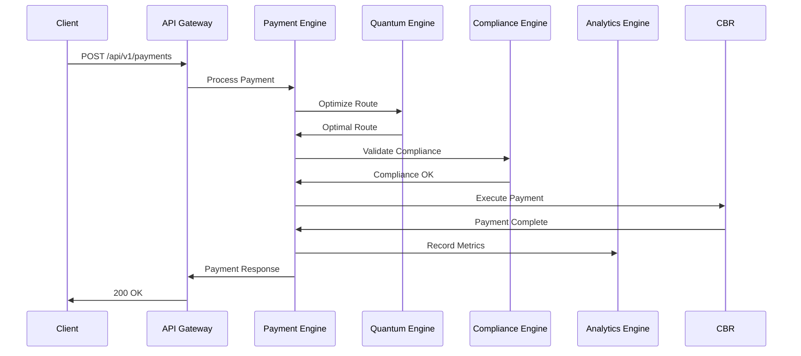

# Архитектура системы x0tta6bl4

## Обзор архитектуры

Система x0tta6bl4 построена на принципах **микросервисной архитектуры** с акцентом на **квантовые вычисления**, **безопасность платежей** и **соответствие регуляторным требованиям**.

### Принципы архитектуры

- **🔬 Quantum-First:** Архитектура оптимизирована для квантовых алгоритмов
- **🔒 Security-First:** Безопасность встроена в каждый компонент
- **📊 Observable:** Полная наблюдаемость всех процессов
- **⚡ Scalable:** Горизонтальное масштабирование
- **🔄 Resilient:** Устойчивость к сбоям и автоматическое восстановление

## Компоненты системы

### 1. API Gateway (Kong)

**Ответственность:** Единая точка входа, маршрутизация, аутентификация

**Технологии:**
- Kong Gateway 3.4+
- Lua плагины для кастомной логики
- JWT аутентификация
- Rate limiting и throttling

**Конфигурация:**
```yaml
# k8s-manifests/gateway/kong-config.yml
apiVersion: configuration.konghq.com/v1
kind: KongClusterPlugin
metadata:
  name: jwt-auth
  annotations:
    kubernetes.io/ingress.class: kong
plugin: jwt
config:
  secret_is_base64: false
```

### 2. Quantum Engine

**Ответственность:** Выполнение квантовых алгоритмов оптимизации

**Архитектура:**
```
┌─────────────────────────────────────┐
│         Quantum Engine              │
├─────────────────────────────────────┤
│  ┌───────────┐ ┌───────────┐        │
│  │ Algorithm │ │ Circuit   │        │
│  │ Manager   │ │ Builder   │        │
│  └───────────┘ └───────────┘        │
├─────────────────────────────────────┤
│  ┌───────────┐ ┌───────────┐        │
│  │ Qiskit    │ │ Cirq      │        │
│  │ Backend   │ │ Backend   │        │
│  └───────────┘ └───────────┘        │
└─────────────────────────────────────┘
```

**Ключевые модули:**

#### Algorithm Manager
```python
class AlgorithmManager:
    """Управление квантовыми алгоритмами"""

    def __init__(self, config: AlgorithmConfig):
        self.config = config
        self.backends = self._initialize_backends()

    async def execute_optimization(
        self,
        problem: OptimizationProblem,
        algorithm: str = "QAOA"
    ) -> OptimizationResult:
        """Выполнение квантовой оптимизации"""
        circuit = self._build_circuit(problem, algorithm)
        backend = self._select_backend(algorithm)
        return await backend.execute(circuit)
```

#### Circuit Builder
```python
class CircuitBuilder:
    """Построение квантовых цепей"""

    def build_qaoa_circuit(
        self,
        cost_operator: PauliSumOp,
        mixer_operator: PauliSumOp,
        p: int = 1
    ) -> QuantumCircuit:
        """Построение QAOA цепи"""
        num_qubits = cost_operator.num_qubits
        circuit = QuantumCircuit(num_qubits)

        # Начальное состояние |+>
        circuit.h(range(num_qubits))

        # p слоев QAOA
        for layer in range(p):
            # Cost layer
            circuit.compose(cost_operator, inplace=True)
            # Mixer layer
            circuit.compose(mixer_operator, inplace=True)

        return circuit
```

### 3. Payment Processing Engine

**Ответственность:** Обработка платежей через российские системы

**Интеграции:**
- **МИР (Mir)**: Национальная платежная система
- **СБП (SBP)**: Система быстрых платежей
- **ЦБ РФ**: Центральный банк России

**Архитектура:**
```
┌─────────────────────────────────────┐
│    Payment Processing Engine        │
├─────────────────────────────────────┤
│  ┌───────────┐ ┌───────────┐        │
│  │   MIR     │ │    SBP    │        │
│  │ Gateway   │ │ Gateway   │        │
│  └───────────┘ └───────────┘        │
├─────────────────────────────────────┤
│  ┌───────────┐ ┌───────────┐        │
│  │   CBR     │ │  Payment  │        │
│  │ Gateway   │ │ Processor │        │
│  └───────────┘ └───────────┘        │
└─────────────────────────────────────┘
```

**Ключевые протоколы:**

#### MIR Integration
```python
class MirGateway:
    """Интеграция с платежной системой МИР"""

    def __init__(self, credentials: MirCredentials):
        self.client = MirClient(credentials)
        self.encryption = GOSTEncryption()

    async def process_payment(
        self,
        payment: PaymentRequest
    ) -> PaymentResponse:
        """Обработка платежа через МИР"""
        # Валидация данных
        self._validate_payment_data(payment)

        # Шифрование чувствительных данных
        encrypted_data = self.encryption.encrypt(payment.card_data)

        # Отправка в МИР
        response = await self.client.send_payment(encrypted_data)

        # Проверка ответа
        return self._process_response(response)
```

#### SBP Integration
```python
class SbpGateway:
    """Интеграция с системой быстрых платежей"""

    def __init__(self, config: SbpConfig):
        self.api_client = SbpApiClient(config)
        self.qr_generator = QRCodeGenerator()

    async def generate_payment_qr(
        self,
        payment_info: PaymentInfo
    ) -> str:
        """Генерация QR кода для СБП"""
        # Создание платежной ссылки
        payment_url = self._create_payment_url(payment_info)

        # Генерация QR кода
        return self.qr_generator.generate(payment_url)
```

### 4. Compliance Engine

**Ответственность:** Обеспечение соответствия регуляторным требованиям

**Стандарты:**
- **ФЗ-152:** Локализация данных в РФ
- **PCI DSS:** Безопасность платежей
- **ГОСТ:** Российские стандарты криптографии

**Архитектура:**
```
┌─────────────────────────────────────┐
│       Compliance Engine             │
├─────────────────────────────────────┤
│  ┌───────────┐ ┌───────────┐        │
│  │   FZ-152  │ │  PCI DSS  │        │
│  │ Checker   │ │ Checker   │        │
│  └───────────┘ └───────────┘        │
├─────────────────────────────────────┤
│  ┌───────────┐ ┌───────────┐        │
│  │   Data    │ │   Audit   │        │
│  │Localization│ │   Trail   │        │
│  └───────────┘ └───────────┘        │
└─────────────────────────────────────┘
```

**Ключевые проверки:**

#### Data Localization (ФЗ-152)
```python
class FZ152Checker:
    """Проверка локализации данных"""

    def __init__(self, config: FZ152Config):
        self.russia_storage = RussiaStorageChecker()
        self.data_classifier = PersonalDataClassifier()

    def check_data_localization(
        self,
        data: Any,
        operation: str
    ) -> ComplianceResult:
        """Проверка локализации данных"""
        # Классификация данных
        is_personal = self.data_classifier.is_personal_data(data)

        if is_personal:
            # Проверка хранения в РФ
            location_ok = self.russia_storage.is_stored_in_russia(data)

            if not location_ok:
                return ComplianceResult(
                    status="VIOLATION",
                    message="Персональные данные должны храниться в РФ"
                )

        return ComplianceResult(status="COMPLIANT")
```

#### PCI DSS Compliance
```python
class PCIDSSChecker:
    """Проверка соответствия PCI DSS"""

    def __init__(self, config: PCIDSSConfig):
        self.encryption_checker = EncryptionChecker()
        self.network_checker = NetworkSecurityChecker()
        self.access_checker = AccessControlChecker()

    def check_cardholder_data_environment(
        self,
        chd: CardholderData
    ) -> ComplianceResult:
        """Проверка среды данных держателя карты"""
        # Проверка шифрования
        encryption_ok = self.encryption_checker.is_strong_encryption(chd)

        # Проверка сетевой сегрегации
        network_ok = self.network_checker.is_segmented(chd)

        # Проверка контроля доступа
        access_ok = self.access_checker.has_proper_access(chd)

        if all([encryption_ok, network_ok, access_ok]):
            return ComplianceResult(status="COMPLIANT")

        return ComplianceResult(status="VIOLATION")
```

### 5. Analytics Engine

**Ответственность:** Сбор, хранение и анализ метрик

**Технологии:**
- **Prometheus:** Сбор метрик
- **Grafana:** Визуализация
- **ClickHouse:** Аналитическая БД
- **Jaeger:** Трассировка

**Архитектура:**
```
┌─────────────────────────────────────┐
│       Analytics Engine              │
├─────────────────────────────────────┤
│  ┌───────────┐ ┌───────────┐        │
│  │ Metrics   │ │   Logs    │        │
│  │ Collector │ │ Collector │        │
│  └───────────┘ └───────────┘        │
├─────────────────────────────────────┤
│  ┌───────────┐ ┌───────────┐        │
│  │ ClickHouse│ │  Jaeger   │        │
│  │ Analytics │ │  Tracing  │        │
│  └───────────┘ └───────────┘        │
└─────────────────────────────────────┘
```

## Взаимодействие компонентов

### Последовательность обработки платежа



### Поток данных в системе

```
Клиент → API Gateway → Payment Engine → Quantum Engine
                              ↓
Payment Engine → Compliance Engine → External APIs
                              ↓
Analytics Engine ← Все компоненты → Логирование
```

## Масштабирование

### Горизонтальное масштабирование

Каждый сервис может масштабироваться независимо:

```yaml
# Horizontal Pod Autoscaler для Quantum Engine
apiVersion: autoscaling/v2
kind: HorizontalPodAutoscaler
metadata:
  name: quantum-engine-hpa
spec:
  scaleTargetRef:
    apiVersion: apps/v1
    kind: Deployment
    name: quantum-engine
  minReplicas: 3
  maxReplicas: 20
  metrics:
  - type: Resource
    resource:
      name: cpu
      target:
        type: Utilization
        averageUtilization: 70
  - type: Resource
    resource:
      name: memory
      target:
        type: Utilization
        averageUtilization: 80
```

### Географическое распределение

```
┌─────────────┐ ┌─────────────┐ ┌─────────────┐
│   Москва    │ │ Санкт-Петербург │ │ Новосибирск │
│   (Main)    │ │  (Replica)  │ │  (Replica)  │
└─────────────┘ └─────────────┘ └─────────────┘
       │                   │                   │
       └───────────────────┼───────────────────┘
                           │
                    ┌─────────────┐
                    │   Global    │
                    │ Load Balancer│
                    └─────────────┘
```

## Безопасность

### Сетевая безопасность

```yaml
# Network Policies
apiVersion: networking.k8s.io/v1
kind: NetworkPolicy
metadata:
  name: quantum-engine-netpol
  namespace: production
spec:
  podSelector:
    matchLabels:
      app: quantum-engine
  policyTypes:
  - Ingress
  - Egress
  ingress:
  - from:
    - podSelector:
        matchLabels:
          app: api-gateway
    ports:
    - protocol: TCP
      port: 8080
```

### Шифрование данных

- **В транзите:** TLS 1.3 для всех соединений
- **В покое:** AES-256-GCM для баз данных
- **Квантово-устойчивое:** Kyber + Dilithium для критических данных

## Мониторинг и Observability

### Метрики производительности

```python
# Пример метрик Quantum Engine
QUANTUM_METRICS = [
    "quantum_circuit_depth",
    "quantum_gate_fidelity",
    "quantum_execution_time",
    "quantum_optimization_improvement",
    "quantum_error_rate"
]

# Пример метрик Payment Engine
PAYMENT_METRICS = [
    "payment_processing_time",
    "payment_success_rate",
    "payment_volume_total",
    "payment_error_rate",
    "payment_compliance_score"
]
```

### Кастомные дашборды

- **Quantum Performance Dashboard**
- **Payment Processing Dashboard**
- **Compliance Status Dashboard**
- **System Health Dashboard**

## Развертывание

### Стратегии развертывания

```yaml
# Blue-Green Deployment для Payment Engine
apiVersion: apps/v1
kind: Deployment
metadata:
  name: payment-engine-green
spec:
  replicas: 3
  strategy:
    type: RollingUpdate
    rollingUpdate:
      maxSurge: 1
      maxUnavailable: 0
```

### Canary релизы

```yaml
# Canary Deployment для Quantum Engine
apiVersion: apps/v1
kind: Deployment
metadata:
  name: quantum-engine-canary
spec:
  replicas: 1
  strategy:
    type: Canary
    canary:
      steps:
      - setWeight: 10
      - pause: 5m
      - setWeight: 50
      - pause: 10m
      - setWeight: 100
```

## Резервное копирование и восстановление

### Стратегия резервного копирования

- **Базы данных:** Ежедневные снапшоты + PITR
- **Конфигурация:** Git-based конфигурация
- **Квантовые цепи:** Сохранение в encrypted storage
- **Логи:** Централизованное хранение 90 дней

### План восстановления

1. **RTO (Recovery Time Objective):** 4 часа
2. **RPO (Recovery Point Objective):** 15 минут
3. **Автоматическое failover** между регионами
4. **Ручное подтверждение** для критических систем

## Заключение

Архитектура системы x0tta6bl4 спроектирована для обеспечения:

- **Высокой производительности** квантовых вычислений
- **Безопасной обработки** платежей
- **Соответствия** всем регуляторным требованиям
- **Масштабируемости** для роста бизнеса
- **Наблюдаемости** всех процессов

Архитектура эволюционирует вместе с проектом, поддерживая баланс между инновациями и стабильностью.