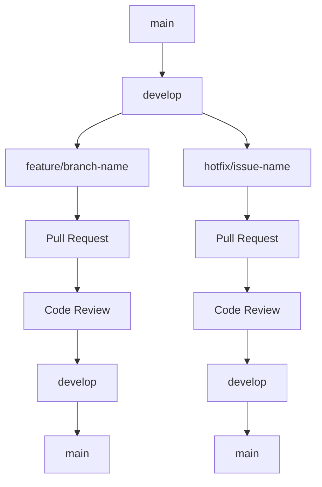

# Руководство по разработке x0tta6bl4

## Введение

Это руководство предназначено для разработчиков, работающих над проектом x0tta6bl4. Здесь описаны стандарты разработки, рабочие процессы и лучшие практики.

## Структура команды разработки

### Роли и ответственности

| Роль | Ответственность | Навыки |
|------|------------------|---------|
| **Tech Lead** | Архитектура, техническое руководство | System Design, Leadership |
| **Senior Quantum Developer** | Квантовые алгоритмы, оптимизация | Qiskit, Cirq, Quantum ML |
| **Senior Backend Developer** | API, микросервисы, базы данных | Python, FastAPI, PostgreSQL |
| **DevOps Engineer** | Инфраструктура, CI/CD, мониторинг | Kubernetes, Docker, Terraform |
| **Security Engineer** | Безопасность, compliance | Cryptography, PCI DSS, ФЗ-152 |
| **QA Engineer** | Тестирование, качество | pytest, Selenium, Performance Testing |
| **Product Manager** | Требования, приоритизация | Product Strategy, Analytics |

## Среда разработки

### Локальная настройка

#### Минимальные требования

- **Операционная система:** Ubuntu 22.04+ / macOS 13+ / Windows 10+ с WSL2
- **Процессор:** 4+ ядер, поддержка AVX2
- **Оперативная память:** 16 ГБ минимум, 32 ГБ рекомендуется
- **Диск:** SSD 100 ГБ свободного пространства
- **Сеть:** Стабильное интернет-соединение

#### Установка зависимостей

```bash
# 1. Клонирование репозитория
git clone https://github.com/your-org/x0tta6bl4.git
cd x0tta6bl4

# 2. Настройка окружения
./infrastructure/development/scripts/setup-dev-environment.sh

# 3. Активация виртуального окружения
source venv/bin/activate

# 4. Установка зависимостей
make install

# 5. Проверка установки
make test
```

### IDE и инструменты

#### Рекомендуемые IDE

1. **Visual Studio Code**
   - Расширения: Python, Docker, Kubernetes, GitLens
   - Настройки: `.vscode/settings.json`

2. **PyCharm Professional**
   - Поддержка удаленных интерпретаторов
   - Встроенные инструменты для Docker и Kubernetes

3. **Vim/Neovim**
   - Конфигурация: `.vimrc` или `.config/nvim/init.vim`

#### Дополнительные инструменты

```bash
# Kubernetes инструменты
kubectl krew install <plugin>

# Мониторинг разработки
k9s  # Terminal UI для Kubernetes

# API тестирование
curl, httpie, postman

# Документирование API
swagger-codegen, openapi-generator
```

## Рабочий процесс разработки

### Git Workflow

#### Ветвление



#### Стратегия ветвления

1. **main** - стабильная версия, готовая к production
2. **develop** - основная ветка разработки
3. **feature/*** - новые функции
4. **bugfix/*** - исправление ошибок
5. **hotfix/*** - критические исправления для production

#### Работа с ветками

```bash
# Создание новой ветки функции
git checkout -b feature/new-quantum-algorithm

# Разработка и коммиты
git add .
git commit -m "feat: implement QAOA algorithm for payment optimization"

# Публикация ветки
git push origin feature/new-quantum-algorithm

# Создание Pull Request через GitHub interface
```

### Code Review процесс

#### Критерии принятия

- [ ] **Функциональность** - код работает как ожидается
- [ ] **Тесты** - покрытие > 90%, все тесты проходят
- [ ] **Документация** - обновлена документация
- [ ] **Безопасность** - проверка на уязвимости
- [ ] **Производительность** - нет деградации
- [ ] **Стиль кода** - соответствует стандартам

#### Процесс review

1. Создание Pull Request с описанием изменений
2. Назначение reviewers (минимум 2)
3. Автоматическая проверка CI pipeline
4. Обсуждение и внесение правок
5. Одобрение reviewers
6. Merge в develop ветку

### Continuous Integration

#### Автоматические проверки

```yaml
# .github/workflows/ci.yml
stages:
  - lint: flake8, black, isort
  - type-check: mypy
  - test: pytest with coverage
  - security: trivy, safety
  - build: docker build
```

#### Качество кода

```bash
# Локальная проверка качества
make lint        # Проверка стиля кода
make type-check  # Проверка типов
make test        # Запуск тестов
make security    # Проверка безопасности
```

## Стандарты кодирования

### Python стандарты

#### Стиль кода

```python
# Правильно
from typing import Optional, Dict, Any
from dataclasses import dataclass

@dataclass
class PaymentRequest:
    """Запрос на обработку платежа."""

    amount: float
    currency: str = "RUB"
    description: Optional[str] = None
    metadata: Optional[Dict[str, Any]] = None

    def __post_init__(self) -> None:
        """Валидация после инициализации."""
        if self.amount <= 0:
            raise ValueError("Amount must be positive")

# Неправильно
class payment_request:
    def __init__(self, amount, currency="RUB", description=None, metadata=None):
        self.amount = amount
        # ...
```

#### Асинхронное программирование

```python
# Правильно
class PaymentService:
    """Сервис обработки платежей."""

    async def process_payment(
        self,
        request: PaymentRequest
    ) -> PaymentResponse:
        """Асинхронная обработка платежа."""
        # Валидация
        await self._validate_request(request)

        # Обработка
        result = await self._process_with_quantum_optimization(request)

        # Логирование
        await self._log_payment_result(result)

        return result

# Неправильно - блокирующие операции
class BadPaymentService:
    def process_payment(self, request):
        time.sleep(5)  # Блокирует event loop!
        return result
```

#### Обработка ошибок

```python
# Правильно
class PaymentService:
    """Сервис с правильной обработкой ошибок."""

    async def process_payment(
        self,
        request: PaymentRequest
    ) -> PaymentResponse:
        """Обработка платежа с корректной обработкой ошибок."""
        try:
            # Бизнес-логика
            result = await self._execute_payment(request)
            return PaymentResponse.success(result)

        except ValidationError as e:
            logger.warning(f"Validation failed: {e}")
            return PaymentResponse.validation_error(str(e))

        except PaymentGatewayError as e:
            logger.error(f"Payment gateway error: {e}")
            return PaymentResponse.gateway_error(str(e))

        except Exception as e:
            logger.critical(f"Unexpected error: {e}")
            return PaymentResponse.system_error("Internal error")

# Неправильно - голые except
class BadPaymentService:
    def process_payment(self, request):
        try:
            # Бизнес-логика
            return result
        except:
            return "Error"  # Неинформативно!
```

### Стандарты для квантового кода

#### Структура квантового модуля

```python
# x0tta6bl4/quantum/algorithms/qaoa.py
from typing import List, Optional, Union
from abc import ABC, abstractmethod
import numpy as np
from qiskit import QuantumCircuit
from qiskit.quantum_info import SparsePauliOp

class QuantumAlgorithm(ABC):
    """Базовый класс для квантовых алгоритмов."""

    @abstractmethod
    def build_circuit(self, *args, **kwargs) -> QuantumCircuit:
        """Построение квантовой цепи."""
        pass

    @abstractmethod
    def execute(self, *args, **kwargs) -> dict:
        """Выполнение алгоритма."""
        pass

class QAOAAlgorithm(QuantumAlgorithm):
    """Алгоритм квантовой аппроксимации для оптимизации."""

    def __init__(
        self,
        cost_operator: SparsePauliOp,
        mixer_operator: SparsePauliOp,
        p_layers: int = 1
    ):
        self.cost_operator = cost_operator
        self.mixer_operator = mixer_operator
        self.p_layers = p_layers

    def build_circuit(self) -> QuantumCircuit:
        """Построение QAOA цепи."""
        num_qubits = self.cost_operator.num_qubits
        circuit = QuantumCircuit(num_qubits)

        # Начальное состояние |+>
        circuit.h(range(num_qubits))

        # p слоев QAOA
        for layer in range(self.p_layers):
            # Cost Hamiltonian evolution
            circuit.compose(self.cost_operator, inplace=True)

            # Mixer Hamiltonian evolution
            circuit.compose(self.mixer_operator, inplace=True)

        return circuit

    def execute(self, backend, shots: int = 1024) -> dict:
        """Выполнение QAOA алгоритма."""
        circuit = self.build_circuit()

        # Трансляция для backend
        transpiled = transpile(circuit, backend)

        # Выполнение
        job = backend.run(transpiled, shots=shots)
        result = job.result()

        return {
            "counts": result.get_counts(),
            "circuit_depth": transpiled.depth(),
            "gate_count": len(transpiled.data)
        }
```

### Стандарты для платежного кода

#### Обработка платежей

```python
# Правильно
class PaymentProcessor:
    """Процессор платежей с правильной обработкой."""

    def __init__(self, gateway: PaymentGateway):
        self.gateway = gateway
        self.metrics = MetricsCollector()

    async def process(
        self,
        payment: PaymentRequest,
        idempotency_key: str
    ) -> PaymentResult:
        """Обработка платежа с идемпотентностью."""
        # Проверка идемпотентности
        existing = await self._get_existing_payment(idempotency_key)
        if existing:
            return existing

        # Валидация платежа
        await self._validate_payment(payment)

        # Обработка через gateway
        try:
            result = await self.gateway.charge(payment)
            await self._save_payment_result(result, idempotency_key)
            return result

        except GatewayError as e:
            await self._handle_gateway_error(e, payment)
            raise

# Неправильно
class BadPaymentProcessor:
    def process(self, payment):
        # Нет валидации
        # Нет идемпотентности
        # Нет обработки ошибок
        return gateway.charge(payment)
```

## Тестирование

### Виды тестов

#### Unit тесты

```python
# tests/quantum/test_qaoa.py
import pytest
from unittest.mock import Mock, patch
from x0tta6bl4.quantum.algorithms.qaoa import QAOAAlgorithm

class TestQAOAAlgorithm:
    """Тесты для QAOA алгоритма."""

    def test_circuit_construction(self):
        """Тест построения квантовой цепи."""
        cost_op = SparsePauliOp.from_list([("ZZ", 1.0)])
        mixer_op = SparsePauliOp.from_list([("XX", 1.0)])

        qaoa = QAOAAlgorithm(cost_op, mixer_op, p_layers=2)
        circuit = qaoa.build_circuit()

        assert circuit.num_qubits == 2
        assert circuit.depth() > 0

    @patch('qiskit.Aer.get_backend')
    async def test_algorithm_execution(self, mock_backend):
        """Тест выполнения алгоритма."""
        # Arrange
        mock_backend.return_value.run.return_value.result.return_value.get_counts.return_value = {
            '00': 512, '11': 512
        }

        cost_op = SparsePauliOp.from_list([("ZZ", 1.0)])
        mixer_op = SparsePauliOp.from_list([("XX", 1.0)])

        qaoa = QAOAAlgorithm(cost_op, mixer_op)

        # Act
        result = await qaoa.execute(mock_backend, shots=1024)

        # Assert
        assert 'counts' in result
        assert 'circuit_depth' in result
        assert result['counts']['00'] == 512

    def test_invalid_parameters(self):
        """Тест валидации параметров."""
        with pytest.raises(ValueError):
            QAOAAlgorithm(None, None, p_layers=-1)
```

#### Integration тесты

```python
# tests/integration/test_payment_flow.py
import pytest
from httpx import AsyncClient
from x0tta6bl4.main import app

class TestPaymentFlow:
    """Интеграционные тесты платежного процесса."""

    @pytest.fixture
    async def client(self):
        async with AsyncClient(app=app, base_url="http://test") as ac:
            yield ac

    async def test_complete_payment_flow(self, client):
        """Тест полного процесса платежа."""
        # Создание платежа
        payment_data = {
            "amount": 1000.0,
            "currency": "RUB",
            "card_token": "test_token"
        }

        response = await client.post("/api/v1/payments", json=payment_data)

        assert response.status_code == 201
        payment_id = response.json()["id"]

        # Проверка статуса
        status_response = await client.get(f"/api/v1/payments/{payment_id}")
        assert status_response.status_code == 200

        # Проверка webhook уведомления
        # ... тесты webhook обработки

    async def test_payment_idempotency(self, client):
        """Тест идемпотентности платежей."""
        payment_data = {
            "amount": 1000.0,
            "currency": "RUB",
            "idempotency_key": "test_key_123"
        }

        # Два одинаковых запроса
        response1 = await client.post("/api/v1/payments", json=payment_data)
        response2 = await client.post("/api/v1/payments", json=payment_data)

        assert response1.status_code == 201
        assert response2.status_code == 200  # Дубликат
        assert response1.json()["id"] == response2.json()["id"]
```

#### Performance тесты

```python
# tests/performance/test_quantum_performance.py
import pytest
import time
import asyncio
from x0tta6bl4.quantum.benchmark import QuantumBenchmark

class TestQuantumPerformance:
    """Производительные тесты квантовых алгоритмов."""

    @pytest.mark.asyncio
    async def test_qaoa_performance(self):
        """Тест производительности QAOA."""
        benchmark = QuantumBenchmark()

        # Тест с различными размерами задач
        sizes = [4, 8, 16, 32]

        for size in sizes:
            start_time = time.time()

            result = await benchmark.run_qaoa_benchmark(
                num_qubits=size,
                depth=3,
                shots=1000
            )

            execution_time = time.time() - start_time

            # Проверка что выполнение укладывается в лимиты
            assert execution_time < 30.0, f"QAOA {size} qubits too slow: {execution_time}s"

            # Проверка качества решения
            assert result["success_rate"] > 0.8

    @pytest.mark.asyncio
    async def test_concurrent_quantum_execution(self):
        """Тест параллельного выполнения квантовых алгоритмов."""
        benchmark = QuantumBenchmark()

        # Запуск нескольких алгоритмов параллельно
        tasks = [
            benchmark.run_qaoa_benchmark(num_qubits=8, depth=2)
            for _ in range(5)
        ]

        start_time = time.time()
        results = await asyncio.gather(*tasks)
        total_time = time.time() - start_time

        # Проверка что параллельное выполнение эффективно
        assert total_time < 60.0  # Менее 60 секунд для 5 задач

        # Проверка результатов
        assert all(result["success_rate"] > 0.7 for result in results)
```

## Документирование

### Docstrings

```python
def optimize_payment_route(
    payments: List[PaymentRequest],
    constraints: Optional[Dict[str, Any]] = None
) -> OptimizationResult:
    """
    Оптимизация маршрутов платежей с использованием квантовых алгоритмов.

    Args:
        payments: Список платежей для оптимизации
        constraints: Дополнительные ограничения оптимизации

    Returns:
        Результат оптимизации с оптимальными маршрутами

    Raises:
        OptimizationError: При ошибке оптимизации
        ValidationError: При некорректных входных данных

    Example:
        >>> payments = [PaymentRequest(...), PaymentRequest(...)]
        >>> result = optimize_payment_route(payments)
        >>> print(result.total_cost)
        0.05
    """
```

### API документация

#### OpenAPI спецификация

```yaml
# Автоматически генерируется из кода
openapi: 3.0.3
info:
  title: x0tta6bl4 API
  version: 1.0.0
  description: API для квантовой оптимизации платежей

paths:
  /api/v1/payments:
    post:
      summary: Создание платежа
      security:
        - bearerAuth: []
      requestBody:
        required: true
        content:
          application/json:
            schema:
              $ref: '#/components/schemas/PaymentRequest'
      responses:
        '201':
          description: Платеж создан
          content:
            application/json:
              schema:
                $ref: '#/components/schemas/PaymentResponse'
```

## Мониторинг разработки

### Локальный мониторинг

```bash
# Запуск локальных сервисов мониторинга
make up-monitoring

# Доступ к дашбордам
open http://localhost:3000  # Grafana
open http://localhost:9090  # Prometheus
open http://localhost:16686 # Jaeger
```

### Метрики разработки

```python
# Добавление метрик в код
from prometheus_client import Counter, Histogram, Gauge

# Счетчик запросов
payment_requests = Counter('payment_requests_total', 'Total payment requests', ['method', 'endpoint'])

# Гистограмма задержек
payment_duration = Histogram('payment_processing_duration_seconds', 'Payment processing time')

# Gauge для активных соединений
active_connections = Gauge('payment_active_connections', 'Active payment connections')
```

## Безопасность разработки

### Работа с секретами

```bash
# Никогда не коммитить секреты в код
git status  # Проверить что секреты не в staged
git diff    # Проверить что секреты не в изменениях

# Использовать .env файлы
cp .env.example .env
# Редактировать .env локально
# .env добавить в .gitignore
```

### Статический анализ безопасности

```bash
# Проверка зависимостей на уязвимости
make security-scan

# Проверка кода на security issues
bandit -r x0tta6bl4/ -f json -o security-report.json

# Проверка контейнеров
trivy image x0tta6bl4:latest
```

## Производительность

### Профилирование

```python
import cProfile
import pstats
from memory_profiler import profile

@profile
def memory_intensive_function():
    """Функция для профилирования памяти."""
    data = [i * 2 for i in range(1000000)]
    return sum(data)

# Профилирование CPU
def profile_function():
    pr = cProfile.Profile()
    pr.enable()

    # Код для профилирования
    result = some_heavy_computation()

    pr.disable()
    stats = pstats.Stats(pr)
    stats.sort_stats('cumulative')
    stats.print_stats(20)

    return result
```

### Оптимизация квантового кода

```python
# Оптимизация цепей
from qiskit import transpile
from qiskit.providers.fake_provider import FakeVigo

def optimize_circuit(circuit, backend):
    """Оптимизация квантовой цепи."""
    # Транспиляция для конкретного backend
    transpiled = transpile(
        circuit,
        backend=backend,
        optimization_level=3,  # Максимальная оптимизация
        seed_transpiler=42
    )

    # Метрики оптимизации
    original_depth = circuit.depth()
    optimized_depth = transpiled.depth()

    improvement = (original_depth - optimized_depth) / original_depth

    logger.info(f"Circuit optimization: {improvement:.2%} depth reduction")

    return transpiled
```

## Развертывание

### Локальное развертывание

```bash
# Сборка образа
make build

# Развертывание в локальном Kubernetes
make deploy-dev

# Проверка развертывания
kubectl get pods -n development
kubectl get services -n development
```

### Staging развертывание

```bash
# Создание PR в staging ветку
git checkout -b staging-v1.2.3

# Проверка в staging среде
make deploy-staging

# Мониторинг staging
kubectl get all -n staging
k9s -n staging
```

## Поддержка

### Полезные команды

```bash
# Очистка окружения
make clean

# Полная переустановка
make clean && make install

# Проверка здоровья всех сервисов
make health-check

# Логи всех сервисов
make logs

# Метрики приложения
make metrics
```

### Контакты команды

- **Технический чат:** #x0tta6bl4-dev
- **Экстренные проблемы:** #x0tta6bl4-alerts
- **Code Review:** GitHub Pull Requests
- **Документация:** GitHub Wiki

### Ресурсы обучения

- [Документация Qiskit](https://qiskit.org/documentation/)
- [Руководство по Kubernetes](https://kubernetes.io/docs/)
- [Документация FastAPI](https://fastapi.tiangolo.com/)
- [Стандарты PCI DSS](https://www.pcisecuritystandards.org/)

---

*Последнее обновление: Октябрь 2025*
*Версия документа: 1.0.0*